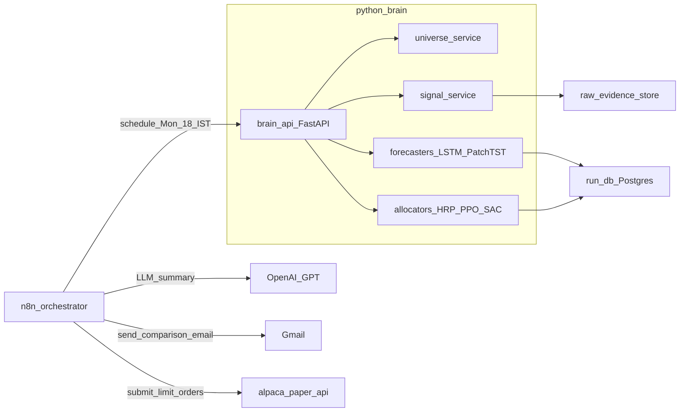
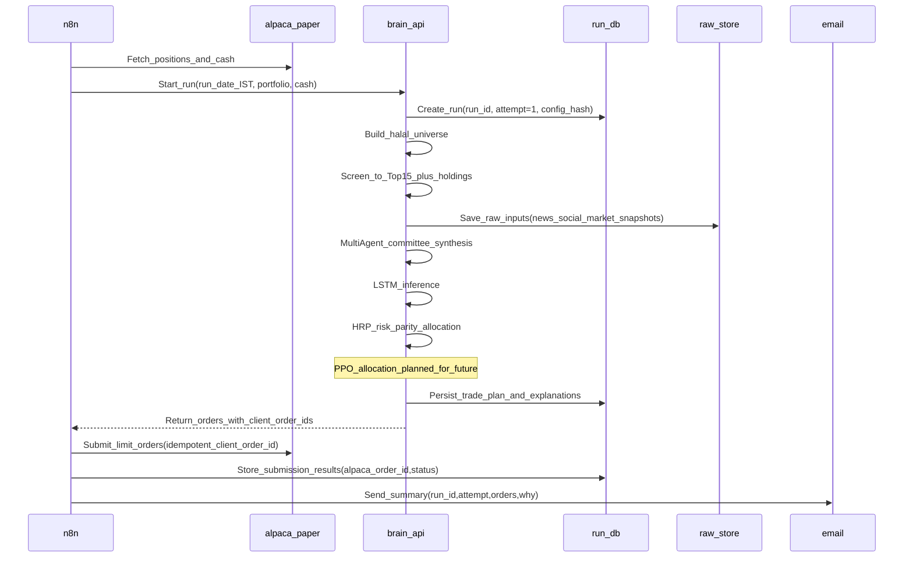
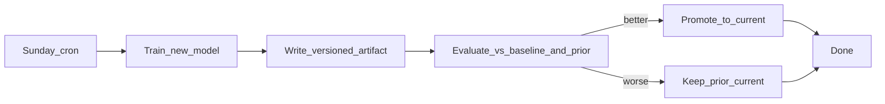

# LearnFinance-2025

A **learning-focused** weekly paper-trading portfolio system for **halal Nasdaq-500 stocks**. The goal is to **compare multiple approaches side-by-side** — not to pick a single "best" method.

**Architecture:**

- **n8n** for scheduling/orchestration and integrations (Alpaca + email + LLM summary)
- A Python "AI brain" for **LSTM price forecasting** (pure price), **PatchTST forecasting** (multi-signal, future), **HRP allocation** (math baseline), and **RL portfolio decisions** (PPO + SAC for comparison)

This repo is designed to be **audit-friendly**, **idempotent**, and **safe-by-default**.

## What it does (weekly)

Every Monday **6:00 PM IST** (pre US open), the n8n workflow orchestrates:

1. **Universe & Signals**: Fetch halal universe, collect signals (news sentiment, fundamentals)
2. **Price Forecasting**: Run LSTM (price-only) and PatchTST (multi-signal, future)
3. **Portfolio Allocation**: Run multiple allocators for comparison:
   - **HRP** (Hierarchical Risk Parity) — math baseline ✅ Active
   - **PPO** (Proximal Policy Optimization) — RL agent 🔜 Planned
   - **SAC** (Soft Actor-Critic) — RL agent 🔜 Planned
4. **LLM Summary**: OpenAI/GPT synthesizes all signals into market insights
5. **Email**: Send comparison tables with all approaches for learning

The email shows **all allocations side-by-side** so you can learn which approach performs best over time.

## What it does NOT do

- It does **not** execute live trades (you can later add that with additional guardrails).
- It is **not** financial advice.

## High-level architecture



## Model hierarchy (learning comparison)

This repo compares multiple approaches at each stage:

**Price Forecasters** (predict weekly returns):

| Model | Input | Notes |
|-------|-------|-------|
| LSTM | OHLCV only (pure price) | Simple baseline ✅ Active |
| PatchTST | OHLCV + All signals | Multi-signal transformer 🔜 Future |

**Portfolio Allocators** (decide weights):

| Model | Input | Notes |
|-------|-------|-------|
| HRP | Covariance matrix | Math baseline ✅ Active |
| PPO | State vector (all signals) | RL agent 🔜 Planned |
| SAC | State vector (all signals) | RL agent 🔜 Planned |

## Signal flow

Signals feed into both PatchTST (for forecasting) and PPO/SAC (for allocation):

```
┌─────────────────────────────────────┐
│           All Signals               │
│  (News, Twitter, Fundamentals, etc) │
└───────────┬───────────┬─────────────┘
            │           │
┌───────────┘           └───────────┐
▼                                   ▼
┌─────────────────┐       ┌─────────────────┐
│    PatchTST     │       │   RL State      │
│   (future)      │       │   Vector        │
│  OHLCV+Signals  │       └────────┬────────┘
└────────┬────────┘                │
         │                         │
         ▼                         ▼
┌─────────────────┐  ┌─────────────────┐  ┌─────────────────┐
│  Rich Forecast  │  │      LSTM       │  │   PPO / SAC     │
└─────────────────┘  │  OHLCV only     │  │   RL Agents     │
                     └────────┬────────┘  └────────┬────────┘
                              │                    │
                              ▼                    ▼
                     ┌─────────────────┐  ┌─────────────────┐
                     │ Simple Forecast │  │   Allocation    │
                     │ (feeds into RL) │  │    Weights      │
                     └─────────────────┘  └─────────────────┘
```

**Signals available:**

| Signal | Status | Endpoint |
|--------|--------|----------|
| News sentiment | ✅ Built | `/signals/news` |
| Fundamentals (5 ratios) | ✅ Built | `/signals/fundamentals` |
| Twitter/Social sentiment | 🔜 To build | — |
| Analyst ratings | 🔜 Optional | — |

## Weekly data flow (Monday run)



## Key design decisions (important)

### Paper auto-submit, live manual

- **Paper orders are auto-submitted** each Monday.
- Live trading is intentionally out of scope until safety, monitoring, and backtesting maturity is higher.

### Run identity (calendar date) + rerun behavior

- **Run date** is the Monday date in IST, e.g. `2025-12-29`.
- **Run ID**: `paper:YYYY-MM-DD` (example: `paper:2025-12-29`).
- **Attempt**: integer starting at `1`.

**Rerun is read-only** if the latest attempt has any order that is not canceled/expired/rejected.

If you manually cancel all active paper orders in Alpaca, the next run can create **attempt=2** and submit new orders.

### Order idempotency (no accidental duplicates)

Every order uses a deterministic `client_order_id`:

- `paper:YYYY-MM-DD:attempt-<N>:<SYMBOL>:<SIDE>`
- Example: `paper:2025-12-29:attempt-1:AAPL:BUY`

On submit:

- If an order with the same `client_order_id` was already submitted, reruns **do not** submit again.
- We also query Alpaca by `client_order_id` as a secondary guardrail.

### Screening stage (runtime control)

We start from all Nasdaq-500 stocks and apply the **halal filter across the full set**. From the resulting halal universe, we only run expensive pipelines (news/social/agents/models) for:

- **Always**: your current holdings
- **Plus**: a Top-15 candidate set chosen via cheap deterministic filters + ranking (liquidity, tradability, volatility/returns, simple momentum proxies, etc.)

This keeps the system reliable and cost-bounded.

### Limit orders + fractional sizing

- Default order type: **limit orders**
- Sizing: **fractional shares when supported**
- Limit pricing uses a configurable buffer from last price/quote:
  - Buy: `price * (1 + buffer)`
  - Sell: `price * (1 - buffer)`

## Data storage strategy (audit + reproducibility)

We store three kinds of data:

- **Run DB (local Postgres via Docker)**:
  - runs (run_id, attempt, timestamps, config_hash, status)
  - universe & screening decisions (why a symbol was included/excluded)
  - signals/features (as-of timestamps)
  - trade plan + explanations
  - orders (client_order_id, alpaca_order_id, status)
- **Raw evidence store (filesystem)**:
  - `data/raw/<run_id>/<attempt>/<source>/<symbol>.json`
  - Inputs used for the run (news results, social samples, market snapshots)
- **Derived feature snapshots**:
  - Stored in DB or as files under `data/features/<run_id>/<attempt>/...`

This makes every run reviewable and debuggable.

## Multi-agent requirement (where it lives)

Multi-agent workflows are used for **evidence synthesis**, not for numeric optimization:

- Agent roles example:
  - `MacroAnalyst`: global market/industry context
  - `NewsAnalyst`: news evidence + impact summary
  - `SocialAnalyst`: sentiment + anomalies
  - `RiskCritic`: challenges contradictions, flags weak evidence
  - `Synthesizer`: produces a structured per-ticker “dossier”

Recommended: use Microsoft’s newer **AutoGen workflow** (successor) inside the Python brain, while keeping **n8n** for orchestration.

## Safety caps (recommended defaults)

Even for paper, enforce hard limits (config):

- Max turnover (% of portfolio value traded)
- Max number of orders
- Max position size (% of portfolio)
- Minimum cash buffer
- Blocklist/allowlist overrides

## Model lifecycle (training vs inference)

Monday inference runs **do not retrain** models. Training happens separately.

### LSTM prediction target

The LSTM predicts **weekly returns** (not daily prices):

- **Input**: Last 60 trading days of OHLCV log-return features (pure price data)
- **Output**: Single scalar = `(Friday close - Monday open) / Monday open`

This directly aligns with the RL agent's weekly decision horizon and eliminates holiday edge cases:

| Week type | What "week" means | No special code needed |
|-----------|-------------------|------------------------|
| Normal 5-day | Mon → Fri | ✓ |
| Monday holiday | Tue → Fri | ✓ |
| Friday holiday | Mon → Thu | ✓ |
| Short week (3-4 days) | First → Last trading day | ✓ |

The training data groups by ISO week, so a "week" is simply whatever trading days fall within that calendar week. Weeks with fewer than 3 trading days are skipped.

### PatchTST (future) prediction target

PatchTST will predict **weekly returns** like LSTM, but with richer input:

- **Input**: OHLCV + News sentiment + Fundamentals + Twitter sentiment (all signals)
- **Output**: Same as LSTM — weekly return prediction

This allows comparing a simple price-only model (LSTM) vs a multi-signal transformer (PatchTST).

### Recommended weekly schedule

| Day | LSTM | PatchTST | PPO | SAC | HRP |
|-----|------|----------|-----|-----|-----|
| **Saturday (monthly, manual)** | Full retrain | Full retrain | Full retrain | Full retrain | N/A (no training) |
| **Sunday (weekly, cron)** | — | — | Fine-tune | Fine-tune | N/A |
| **Monday 6 PM IST (cron)** | Inference | Inference | Inference | Inference | Inference |

### Training triggers

| When | What | Trigger |
|------|------|---------|
| Monthly (Saturday) | Full retrain all models | Manual |
| Weekly (Sunday) | Fine-tune PPO + SAC on 26-week experience buffer | Cron |
| Monday 6 PM IST | Inference only (all models) | Cron (n8n) |

**Why separate training from inference?**

- Training can be slow, noisy, and fail; inference runs should be fast and reliable.
- Separating them lets you validate new models before promoting them.
- Monday runs remain deterministic and reproducible.

### Training workflow (Sunday)



### RL continual learning (PPO and SAC)

Both PPO and SAC learn over time via **weekly fine-tuning** on a rolling experience buffer, not by retraining from scratch. Running both allows comparison of on-policy (PPO) vs off-policy (SAC) RL.

**Experience collection (Monday)**

After each Monday run, store the experience tuple:

- State: features/signals at decision time (LSTM prediction, news sentiment, fundamentals, etc.)
- Action: portfolio weights chosen
- Reward: computed later (e.g., next-week return minus turnover cost)

Save to: `data/experience/<run_id>.json`

**Fine-tune loop (Sunday)**

1. Load last 26 weeks of experience (rolling window, ~6 months)
2. Run a small number of PPO update steps
3. Run a small number of SAC update steps (same experience buffer)
4. Evaluate both policies vs prior and baseline
5. **Promote only if better**; otherwise keep prior `current`

**Guardrails**

- **Evaluation gate**: new policy must beat prior + a baseline (e.g., equal-weight, HRP)
- **Rollback**: keep last known-good version; promotion is atomic pointer swap
- **Drift detection**: if performance degrades 4 weeks in a row, consider full retrain or manual review

## Where models are stored (local)

Trained models produce **artifact files** (weights, scalers, config) that inference loads each run.

### Local artifacts layout

```
data/
├── models/
│   ├── lstm/
│   │   ├── v2025-12-01T10-00-00/     # versioned artifact
│   │   │   ├── weights.pt            # model weights (PyTorch)
│   │   │   ├── scaler.pkl            # feature scaler/normalizer
│   │   │   ├── config.json           # hyperparams, feature schema
│   │   │   └── metadata.json         # training date, data window, metrics
│   │   └── current                   # text file containing version string
│   ├── patchtst/                     # (future) multi-signal forecaster
│   │   ├── v2025-12-01T10-00-00/
│   │   │   ├── weights.pt
│   │   │   ├── scaler.pkl
│   │   │   ├── config.json
│   │   │   └── metadata.json
│   │   └── current
│   ├── ppo/
│   │   ├── v2025-12-29T08-00-00/
│   │   │   ├── policy.pt
│   │   │   ├── env_config.json
│   │   │   └── metadata.json
│   │   └── current
│   └── sac/                          # SAC for comparison with PPO
│       ├── v2025-12-29T08-00-00/
│       │   ├── policy.pt
│       │   ├── env_config.json
│       │   └── metadata.json
│       └── current
├── experience/                        # RL experience buffer (shared by PPO/SAC)
│   ├── paper:2025-12-22.json
│   └── paper:2025-12-29.json
└── ...
```

### What's in a model artifact?

| File | Purpose |
|------|---------|
| `weights.pt` / `policy.pt` | Trained parameters (like a `.dll` in .NET) |
| `scaler.pkl` | Preprocessing transforms fitted on training data |
| `config.json` | Hyperparameters, feature list, model architecture |
| `metadata.json` | Training timestamp, data window, git commit, eval metrics |

### How inference loads models

1. Read `data/models/lstm/current` to get the active version string
2. Load artifacts from `data/models/lstm/<version>/`
3. Same pattern for PatchTST, PPO, and SAC

This means you can:

- **Roll back** by changing the `current` pointer
- **A/B test** by loading a different version
- **Audit** by inspecting exactly which version was used (logged in run DB)

### Persistence (local stack)

- Store under `data/` (add to `.gitignore` so large files aren't committed)
- When Python brain runs in Docker, mount `data/` as a volume for persistence
- Optionally back up to cloud storage (S3, GCS) for disaster recovery

## API design (local-first, cloud-ready)

Each ML operation is exposed as a **separate REST endpoint**, designed so it can later be deployed as an independent **Google Cloud Function** without code changes.

### Endpoint overview

**Inference endpoints** (called by Monday run via n8n):

| Endpoint | Purpose | Status |
|----------|---------|--------|
| `POST /inference/lstm` | Price predictions (OHLCV only) | ✅ Active |
| `POST /inference/patchtst` | Price predictions (multi-signal) | 🔜 Future |
| `POST /allocation/hrp` | HRP risk-parity allocation | ✅ Active |
| `POST /inference/ppo` | PPO RL-based allocation | 🔜 Planned |
| `POST /inference/sac` | SAC RL-based allocation | 🔜 Planned |

**Signal endpoints** (called by Monday run via n8n):

| Endpoint | Purpose | Status |
|----------|---------|--------|
| `POST /signals/news` | News sentiment (FinBERT) | ✅ Active |
| `POST /signals/fundamentals` | Financial ratios (5 metrics) | ✅ Active |
| `POST /signals/twitter` | Twitter/social sentiment | 🔜 To build |

**Training endpoints** (called by Saturday/Sunday cron or manual):

| Endpoint | Purpose | Trigger |
|----------|---------|---------|
| `POST /train/lstm` | Full LSTM retrain | Monthly (Saturday, manual) |
| `POST /train/patchtst` | Full PatchTST retrain | Monthly (Saturday, manual) |
| `POST /train/ppo/full` | Full PPO retrain | Monthly (Saturday, manual) |
| `POST /train/sac/full` | Full SAC retrain | Monthly (Saturday, manual) |
| `POST /train/ppo/finetune` | PPO fine-tune on 26-week buffer | Weekly (Sunday, cron) |
| `POST /train/sac/finetune` | SAC fine-tune on 26-week buffer | Weekly (Sunday, cron) |

**Model management endpoints**:

| Endpoint | Purpose |
|----------|---------|
| `GET /models/{model}/current` | Get active version + metadata |
| `POST /models/{model}/promote` | Promote a version to current |
| `POST /models/{model}/rollback` | Revert to previous known-good |

### Architecture pattern

```
┌─────────────────────────────────────────────────────────────┐
│  FastAPI endpoint (local)  OR  Cloud Function (later)       │
│  • Validates request                                        │
│  • Calls core function                                      │
│  • Returns JSON response                                    │
└─────────────────────────────────────────────────────────────┘
                              │
                              ▼
┌─────────────────────────────────────────────────────────────┐
│  Core function (pure Python, no framework dependency)       │
│  • lstm_inference(features, model_path) → predictions       │
│  • ppo_inference(state, policy_path) → allocation           │
│  • lstm_train(data_window, output_path) → metrics           │
│  • ppo_finetune(weeks, prior_path, output_path) → metrics   │
└─────────────────────────────────────────────────────────────┘
                              │
                              ▼
┌─────────────────────────────────────────────────────────────┐
│  Storage abstraction                                        │
│  • LocalStorage: reads/writes data/models/...               │
│  • GCSStorage: reads/writes gs://bucket/... (swap later)    │
└─────────────────────────────────────────────────────────────┘
```

### Request/response contracts

**LSTM inference**:

```json
// POST /inference/lstm
// Request
{ "symbols": ["AAPL", "MSFT"], "as_of_date": "2025-12-29" }
// Note: as_of_date is optional (defaults to today). API fetches price history from yfinance.

// Response
{
  "predictions": [
    {
      "symbol": "AAPL",
      "predicted_weekly_return_pct": 2.5,
      "direction": "UP",
      "has_enough_history": true,
      "history_days_used": 100,
      "data_end_date": "2025-12-26",
      "target_week_start": "2025-12-29",
      "target_week_end": "2026-01-03"
    }
  ],
  "model_version": "v2025-01-01-abc123",
  "as_of_date": "2025-12-29",
  "target_week_start": "2025-12-29",
  "target_week_end": "2026-01-03"
}
// Note: target_week_end is holiday-aware (Thu if Fri is a market holiday)
```

**PPO inference**:

```json
// POST /inference/ppo
// Request
{ "state": { "features": [...], "current_weights": {...}, "cash": 10000 }, "run_id": "paper:2025-12-29" }

// Response
{ "allocation": { "AAPL": 0.15, "MSFT": 0.10, "CASH": 0.05 }, "turnover": 0.12 }
```

**Training endpoints**:

```json
// POST /train/lstm
// Request
{ "data_window_start": "2023-01-01", "data_window_end": "2025-01-01" }

// Response
{ "version": "v2025-01-05T08-00-00", "metrics": { "val_loss": 0.023 }, "promoted": true }
```

```json
// POST /train/ppo/finetune
// Request
{ "weeks": 26 }

// Response
{ "version": "v2025-01-05T08-30-00", "metrics": { "sharpe": 1.2 }, "promoted": true, "prior_version": "v2024-12-29T08-00-00" }
```

### Design rules for cloud-readiness

1. **Stateless** — load model from storage on each request; no in-memory caching across requests
2. **Storage abstraction** — `storage.load_model(path)` works for local filesystem or GCS
3. **JSON in, JSON out** — no framework-specific objects in core functions
4. **Idempotent training** — version ID derived from `hash(data_window + config)`, so re-running produces same version
5. **Timeout-aware** — training endpoints support async pattern for Cloud Functions (HTTP: 9 min, event-driven: 60 min)

### Cloud Function migration path

When ready to move to GCP:

| Local | Cloud Function | Trigger |
|-------|----------------|---------|
| `POST /inference/lstm` | `lstm-inference` | HTTP (n8n or Cloud Workflows) |
| `POST /inference/patchtst` | `patchtst-inference` | HTTP |
| `POST /inference/ppo` | `ppo-inference` | HTTP |
| `POST /inference/sac` | `sac-inference` | HTTP |
| `POST /train/lstm` | `lstm-train` | Cloud Scheduler (monthly) |
| `POST /train/patchtst` | `patchtst-train` | Cloud Scheduler (monthly) |
| `POST /train/ppo/finetune` | `ppo-finetune` | Cloud Scheduler (weekly Sunday) |
| `POST /train/sac/finetune` | `sac-finetune` | Cloud Scheduler (weekly Sunday) |
| `POST /train/ppo/full` | `ppo-full-retrain` | Pub/Sub or manual HTTP |
| `POST /train/sac/full` | `sac-full-retrain` | Pub/Sub or manual HTTP |

**Migration steps**:

1. Extract endpoint handler → standalone `main.py` with `def handler(request):`
2. Swap `LocalStorage` → `GCSStorage` via environment variable
3. Deploy: `gcloud functions deploy lstm-inference --runtime python311 --trigger-http`
4. Update n8n to call Cloud Function URL instead of local FastAPI

## Quickstart: n8n hello email

Validate your n8n + email setup before adding trading logic.

### Prerequisites

- Docker & Docker Compose installed
- A Google account
- A Google Cloud project with OAuth credentials (see below)

### 1. Start n8n

```bash
docker compose up -d
```

n8n will be available at http://localhost:5678

### 2. Create Google OAuth credentials

1. Go to [Google Cloud Console](https://console.cloud.google.com/)
2. Create a project (or use an existing one)
3. Go to **APIs & Services → OAuth consent screen**
   - Choose **External** (or Internal if using Workspace)
   - Fill in app name, user support email, developer email
   - Add your email as a test user
4. Go to **APIs & Services → Credentials → Create Credentials → OAuth client ID**
   - Application type: **Web application**
   - Name: `n8n Gmail`
   - Authorized redirect URIs: `http://localhost:5678/rest/oauth2-credential/callback`
5. Copy the **Client ID** and **Client Secret**

### 3. Connect Gmail in n8n

1. Open http://localhost:5678 and create an account (local only)
2. Go to **Settings → Credentials → Add Credential → Gmail OAuth2**
3. Fill in:
   - **Credential Name**: `Gmail OAuth2`
   - **Client ID**: (from step 2)
   - **Client Secret**: (from step 2)
4. Click **Sign in with Google** and authorize
5. Save

### 4. Import and run the workflow

1. Go to **Workflows → Add Workflow → Import from File**
2. Select `n8n/workflows/hello-world-email.json`
3. Open the **Gmail** node and:
   - Select your `Gmail OAuth2` credential
   - Change `sendTo` to your recipient address
4. Save the workflow
5. Click **Execute Workflow**

You should receive a "Hello World from LearnFinance-2025" email with a timestamp and placeholder `run_id`.

## Weekly comparison email workflow (n8n)

The n8n workflow orchestrates Monday inference and sends a **comparison email** for learning.

### Workflow architecture

```
n8n cron trigger (Monday 6 PM IST)
  │
  ├─→ GET  /universe/halal              → Halal stock universe
  │
  └─→ Pick Top N Symbols
        │
        ├─→ POST /inference/lstm        → LSTM forecasts (price-only)
        ├─→ POST /inference/patchtst    → PatchTST forecasts (future)
        ├─→ POST /signals/news          → News sentiment
        ├─→ POST /signals/fundamentals  → Financial ratios
        ├─→ POST /inference/ppo         → PPO allocation (future)
        ├─→ POST /inference/sac         → SAC allocation (future)
        └─→ POST /allocation/hrp        → HRP allocation
              │
              └─→ Merge all data
                    │
                    └─→ OpenAI/LLM (GPT-4o-mini) → AI Summary
                          │
                          └─→ Format Email → Gmail Send
```

### Email sections (for learning/comparison)

| Section | Source | Purpose |
|---------|--------|---------|
| **AI Summary** | OpenAI/LLM | Market outlook, opportunities, risks |
| **LSTM Forecasts** | `/inference/lstm` | Simple price-only predictions |
| **PatchTST Forecasts** (future) | `/inference/patchtst` | Multi-signal predictions |
| **PPO Allocation** (future) | `/inference/ppo` | RL-based weights |
| **SAC Allocation** (future) | `/inference/sac` | RL-based weights |
| **HRP Allocation** | `/allocation/hrp` | Math baseline |

### Setup

**1. Start Brain API:**

```bash
cd brain_api
uv run uvicorn brain_api.main:app --reload --host 0.0.0.0 --port 8000
```

**2. Import the workflow:**

1. In n8n, go to **Workflows → Add Workflow → Import from File**
2. Select `n8n/workflows/weekly-lstm-forecast-email.json`
3. Configure Gmail credentials and recipient address
4. Save the workflow

**3. Enable the schedule:**

Toggle the workflow to **Active** in n8n. The cron runs every Monday at 18:00 IST.

### Environment variables (optional)

Copy and customize if needed:

```bash
# n8n configuration
N8N_HOST=localhost
N8N_PORT=5678
N8N_PROTOCOL=http
WEBHOOK_URL=http://localhost:5678/

# Timezone (IST for Monday 6 PM runs)
TZ=Asia/Kolkata
```

## Repo docs

- `README.md`: overview + architecture + ops
- `CLAUDE.md`: working agreement for contributors/AI (coding rules, invariants, testing policy)

## License

See `LICENSE`.
