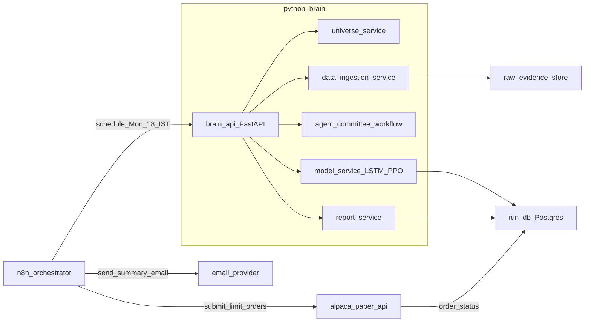
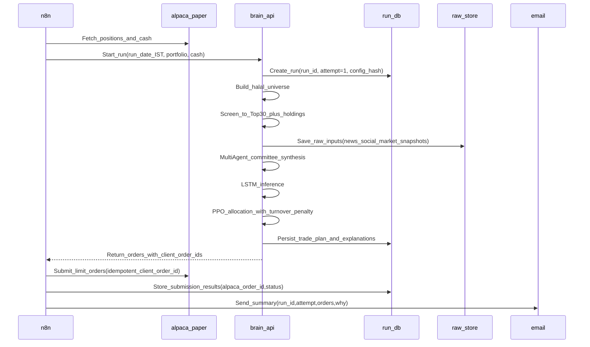
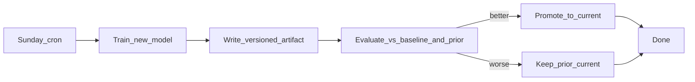

# LearnFinance-2025

Build a weekly, paper-trading portfolio-rebalancing system for **halal Nasdaq-500 stocks** using a hybrid architecture:

- **n8n** for scheduling/orchestration and integrations (Alpaca + email)
- A Python “AI brain” for **multi-agent evidence synthesis**, **LSTM price forecasting**, and **RL (PPO) portfolio decisions**

This is a learning repo, but the design aims to be **audit-friendly**, **idempotent**, and **safe-by-default**.

## What it does (weekly)

Every Monday **6:00 PM IST** (pre US open), the system:

- Fetches current portfolio + cash from **Alpaca (paper)**
- Builds the **Halal Nasdaq-500 universe**
- Runs a **screening stage** to pick a manageable candidate set (Top-30) while always including current holdings
- Collects signals per ticker (news, social sentiment, global industry/market context)
- Runs a **multi-agent “investment committee”** to synthesize evidence and resolve conflicts
- Uses **LSTM** to predict near-term price movement (with uncertainty/quality signals)
- Uses **RL (PPO / Proximal Policy Optimization)** to choose the portfolio actions while penalizing unnecessary turnover
- **Auto-submits limit orders to Alpaca paper**
- Emails you: what was submitted + rationale + run identifiers + links/IDs for audit

## What it does NOT do

- It does **not** execute live trades (you can later add that with additional guardrails).
- It is **not** financial advice.

## High-level architecture



## Weekly data flow (Monday run)



## Key design decisions (important)

### Paper auto-submit, live manual

- **Paper orders are auto-submitted** each Monday.
- Live trading is intentionally out of scope until safety, monitoring, and backtesting maturity is higher.

### Run identity (calendar date) + rerun behavior

- **Run date** is the Monday date in IST, e.g. `2025-12-29`.
- **Run ID**: `paper:YYYY-MM-DD` (example: `paper:2025-12-29`).
- **Attempt**: integer starting at `1`.

**Rerun is read-only** if the latest attempt has any order that is not canceled/expired/rejected.

If you manually cancel all active paper orders in Alpaca, the next run can create **attempt=2** and submit new orders.

### Order idempotency (no accidental duplicates)

Every order uses a deterministic `client_order_id`:

- `paper:YYYY-MM-DD:attempt-<N>:<SYMBOL>:<SIDE>`
- Example: `paper:2025-12-29:attempt-1:AAPL:BUY`

On submit:

- If an order with the same `client_order_id` was already submitted, reruns **do not** submit again.
- We also query Alpaca by `client_order_id` as a secondary guardrail.

### Screening stage (runtime control)

We start from all Nasdaq-500 stocks and apply the **halal filter across the full set**. From the resulting halal universe, we only run expensive pipelines (news/social/agents/models) for:

- **Always**: your current holdings
- **Plus**: a Top-30 candidate set chosen via cheap deterministic filters + ranking (liquidity, tradability, volatility/returns, simple momentum proxies, etc.)

This keeps the system reliable and cost-bounded.

### Limit orders + fractional sizing

- Default order type: **limit orders**
- Sizing: **fractional shares when supported**
- Limit pricing uses a configurable buffer from last price/quote:
  - Buy: `price * (1 + buffer)`
  - Sell: `price * (1 - buffer)`

## Data storage strategy (audit + reproducibility)

We store three kinds of data:

- **Run DB (local Postgres via Docker)**:
  - runs (run_id, attempt, timestamps, config_hash, status)
  - universe & screening decisions (why a symbol was included/excluded)
  - signals/features (as-of timestamps)
  - trade plan + explanations
  - orders (client_order_id, alpaca_order_id, status)
- **Raw evidence store (filesystem)**:
  - `data/raw/<run_id>/<attempt>/<source>/<symbol>.json`
  - Inputs used for the run (news results, social samples, market snapshots)
- **Derived feature snapshots**:
  - Stored in DB or as files under `data/features/<run_id>/<attempt>/...`

This makes every run reviewable and debuggable.

## Multi-agent requirement (where it lives)

Multi-agent workflows are used for **evidence synthesis**, not for numeric optimization:

- Agent roles example:
  - `MacroAnalyst`: global market/industry context
  - `NewsAnalyst`: news evidence + impact summary
  - `SocialAnalyst`: sentiment + anomalies
  - `RiskCritic`: challenges contradictions, flags weak evidence
  - `Synthesizer`: produces a structured per-ticker “dossier”

Recommended: use Microsoft’s newer **AutoGen workflow** (successor) inside the Python brain, while keeping **n8n** for orchestration.

## Safety caps (recommended defaults)

Even for paper, enforce hard limits (config):

- Max turnover (% of portfolio value traded)
- Max number of orders
- Max position size (% of portfolio)
- Minimum cash buffer
- Blocklist/allowlist overrides

## Model lifecycle (training vs inference)

Monday inference runs **do not retrain** models. Training happens separately on Sundays.

### Recommended schedule

| Day | LSTM | PPO |
|-----|------|-----|
| **First Sunday of month** | Full retrain on expanded history | Fine-tune (rolling 26-week experience buffer) |
| **Other Sundays** | No training | Fine-tune (rolling 26-week experience buffer) |
| **Monday 6 PM IST** | Inference only | Inference only |

**Why separate training from inference?**

- Training can be slow, noisy, and fail; inference runs should be fast and reliable.
- Separating them lets you validate new models before promoting them.
- Monday runs remain deterministic and reproducible.

### Training workflow (Sunday)



### PPO continual learning (local)

PPO learns over time via **weekly fine-tuning** on a rolling experience buffer, not by retraining from scratch.

**Experience collection (Monday)**

After each Monday run, store the experience tuple:

- State: features/signals at decision time
- Action: portfolio weights chosen
- Reward: computed later (e.g., next-week return minus turnover cost)

Save to: `data/experience/<run_id>.json`

**Fine-tune loop (Sunday)**

1. Load last 26 weeks of experience (rolling window, ~6 months)
2. Run a small number of PPO update steps (not full training)
3. Evaluate new policy vs prior policy on held-out data or replay
4. **Promote only if better**; otherwise keep prior `current`

**Guardrails**

- **Evaluation gate**: new policy must beat prior + a baseline (e.g., equal-weight, momentum)
- **Rollback**: keep last known-good version; promotion is atomic pointer swap
- **Drift detection**: if performance degrades 4 weeks in a row, consider full retrain or manual review

## Where models are stored (local)

Trained models produce **artifact files** (weights, scalers, config) that inference loads each run.

### Local artifacts layout

```
data/
├── models/
│   ├── lstm/
│   │   ├── v2025-12-01T10-00-00/     # versioned artifact
│   │   │   ├── weights.pt            # model weights (PyTorch example)
│   │   │   ├── scaler.pkl            # feature scaler/normalizer
│   │   │   ├── config.json           # hyperparams, feature schema
│   │   │   └── metadata.json         # training date, data window, metrics
│   │   └── current                   # text file containing "v2025-12-01T10-00-00"
│   └── ppo/
│       ├── v2025-12-29T08-00-00/
│       │   ├── policy.pt
│       │   ├── env_config.json
│       │   └── metadata.json
│       └── current
├── experience/                        # PPO experience buffer
│   ├── paper:2025-12-22.json
│   └── paper:2025-12-29.json
└── ...
```

### What's in a model artifact?

| File | Purpose |
|------|---------|
| `weights.pt` / `policy.pt` | Trained parameters (like a `.dll` in .NET) |
| `scaler.pkl` | Preprocessing transforms fitted on training data |
| `config.json` | Hyperparameters, feature list, model architecture |
| `metadata.json` | Training timestamp, data window, git commit, eval metrics |

### How inference loads models

1. Read `data/models/lstm/current` to get the active version string
2. Load artifacts from `data/models/lstm/<version>/`
3. Same for PPO

This means you can:

- **Roll back** by changing the `current` pointer
- **A/B test** by loading a different version
- **Audit** by inspecting exactly which version was used (logged in run DB)

### Persistence (local stack)

- Store under `data/` (add to `.gitignore` so large files aren't committed)
- When Python brain runs in Docker, mount `data/` as a volume for persistence
- Optionally back up to cloud storage (S3, GCS) for disaster recovery

## API design (local-first, cloud-ready)

Each ML operation is exposed as a **separate REST endpoint**, designed so it can later be deployed as an independent **Google Cloud Function** without code changes.

### Endpoint overview

**Inference endpoints** (called by Monday run):

| Endpoint | Purpose | Trigger |
|----------|---------|---------|
| `POST /inference/lstm` | Price movement predictions | n8n → brain API |
| `POST /inference/ppo` | Portfolio allocation | n8n → brain API |

**Training endpoints** (called by Sunday cron or manual):

| Endpoint | Purpose | Trigger |
|----------|---------|---------|
| `POST /train/lstm` | Full LSTM retrain | Cron (1st Sunday) or manual |
| `POST /train/ppo/finetune` | PPO fine-tune on 26-week buffer | Cron (every Sunday) |
| `POST /train/ppo/full` | PPO full retrain (drift recovery) | Manual |

**Model management endpoints**:

| Endpoint | Purpose |
|----------|---------|
| `GET /models/{model}/current` | Get active version + metadata |
| `POST /models/{model}/promote` | Promote a version to current |
| `POST /models/{model}/rollback` | Revert to previous known-good |

### Architecture pattern

```
┌─────────────────────────────────────────────────────────────┐
│  FastAPI endpoint (local)  OR  Cloud Function (later)       │
│  • Validates request                                        │
│  • Calls core function                                      │
│  • Returns JSON response                                    │
└─────────────────────────────────────────────────────────────┘
                              │
                              ▼
┌─────────────────────────────────────────────────────────────┐
│  Core function (pure Python, no framework dependency)       │
│  • lstm_inference(features, model_path) → predictions       │
│  • ppo_inference(state, policy_path) → allocation           │
│  • lstm_train(data_window, output_path) → metrics           │
│  • ppo_finetune(weeks, prior_path, output_path) → metrics   │
└─────────────────────────────────────────────────────────────┘
                              │
                              ▼
┌─────────────────────────────────────────────────────────────┐
│  Storage abstraction                                        │
│  • LocalStorage: reads/writes data/models/...               │
│  • GCSStorage: reads/writes gs://bucket/... (swap later)    │
└─────────────────────────────────────────────────────────────┘
```

### Request/response contracts

**LSTM inference**:

```json
// POST /inference/lstm
// Request
{ "features": [...], "run_id": "paper:2025-12-29", "symbols": ["AAPL", "MSFT"] }

// Response
{ "predictions": [{ "symbol": "AAPL", "direction": 0.72, "uncertainty": 0.15 }, ...] }
```

**PPO inference**:

```json
// POST /inference/ppo
// Request
{ "state": { "features": [...], "current_weights": {...}, "cash": 10000 }, "run_id": "paper:2025-12-29" }

// Response
{ "allocation": { "AAPL": 0.15, "MSFT": 0.10, "CASH": 0.05 }, "turnover": 0.12 }
```

**Training endpoints**:

```json
// POST /train/lstm
// Request
{ "data_window_start": "2023-01-01", "data_window_end": "2025-01-01" }

// Response
{ "version": "v2025-01-05T08-00-00", "metrics": { "val_loss": 0.023 }, "promoted": true }
```

```json
// POST /train/ppo/finetune
// Request
{ "weeks": 26 }

// Response
{ "version": "v2025-01-05T08-30-00", "metrics": { "sharpe": 1.2 }, "promoted": true, "prior_version": "v2024-12-29T08-00-00" }
```

### Design rules for cloud-readiness

1. **Stateless** — load model from storage on each request; no in-memory caching across requests
2. **Storage abstraction** — `storage.load_model(path)` works for local filesystem or GCS
3. **JSON in, JSON out** — no framework-specific objects in core functions
4. **Idempotent training** — version ID derived from `hash(data_window + config)`, so re-running produces same version
5. **Timeout-aware** — training endpoints support async pattern for Cloud Functions (HTTP: 9 min, event-driven: 60 min)

### Cloud Function migration path

When ready to move to GCP:

| Local | Cloud Function | Trigger |
|-------|----------------|---------|
| `POST /inference/lstm` | `lstm-inference` | HTTP (called by n8n or Cloud Workflows) |
| `POST /inference/ppo` | `ppo-inference` | HTTP |
| `POST /train/lstm` | `lstm-train` | Cloud Scheduler (1st Sunday 00:00 UTC) |
| `POST /train/ppo/finetune` | `ppo-finetune` | Cloud Scheduler (every Sunday 00:00 UTC) |
| `POST /train/ppo/full` | `ppo-full-retrain` | Pub/Sub or manual HTTP |

**Migration steps**:

1. Extract endpoint handler → standalone `main.py` with `def handler(request):`
2. Swap `LocalStorage` → `GCSStorage` via environment variable
3. Deploy: `gcloud functions deploy lstm-inference --runtime python311 --trigger-http`
4. Update n8n to call Cloud Function URL instead of local FastAPI

## Quickstart: n8n hello email

Validate your n8n + email setup before adding trading logic.

### Prerequisites

- Docker & Docker Compose installed
- A Google account
- A Google Cloud project with OAuth credentials (see below)

### 1. Start n8n

```bash
docker compose up -d
```

n8n will be available at http://localhost:5678

### 2. Create Google OAuth credentials

1. Go to [Google Cloud Console](https://console.cloud.google.com/)
2. Create a project (or use an existing one)
3. Go to **APIs & Services → OAuth consent screen**
   - Choose **External** (or Internal if using Workspace)
   - Fill in app name, user support email, developer email
   - Add your email as a test user
4. Go to **APIs & Services → Credentials → Create Credentials → OAuth client ID**
   - Application type: **Web application**
   - Name: `n8n Gmail`
   - Authorized redirect URIs: `http://localhost:5678/rest/oauth2-credential/callback`
5. Copy the **Client ID** and **Client Secret**

### 3. Connect Gmail in n8n

1. Open http://localhost:5678 and create an account (local only)
2. Go to **Settings → Credentials → Add Credential → Gmail OAuth2**
3. Fill in:
   - **Credential Name**: `Gmail OAuth2`
   - **Client ID**: (from step 2)
   - **Client Secret**: (from step 2)
4. Click **Sign in with Google** and authorize
5. Save

### 4. Import and run the workflow

1. Go to **Workflows → Add Workflow → Import from File**
2. Select `n8n/workflows/hello-world-email.json`
3. Open the **Gmail** node and:
   - Select your `Gmail OAuth2` credential
   - Change `sendTo` to your recipient address
4. Save the workflow
5. Click **Execute Workflow**

You should receive a "Hello World from LearnFinance-2025" email with a timestamp and placeholder `run_id`.

### Environment variables (optional)

Copy and customize if needed:

```bash
# n8n configuration
N8N_HOST=localhost
N8N_PORT=5678
N8N_PROTOCOL=http
WEBHOOK_URL=http://localhost:5678/

# Timezone (IST for Monday 6 PM runs)
TZ=Asia/Kolkata
```

## Repo docs

- `README.md`: overview + architecture + ops
- `CLAUDE.md`: working agreement for contributors/AI (coding rules, invariants, testing policy)

## License

See `LICENSE`.
