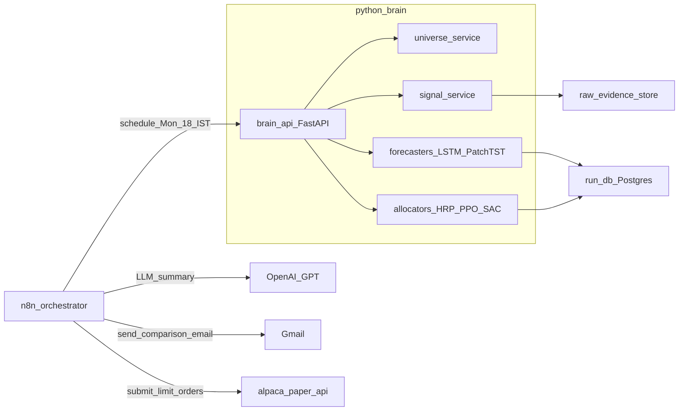
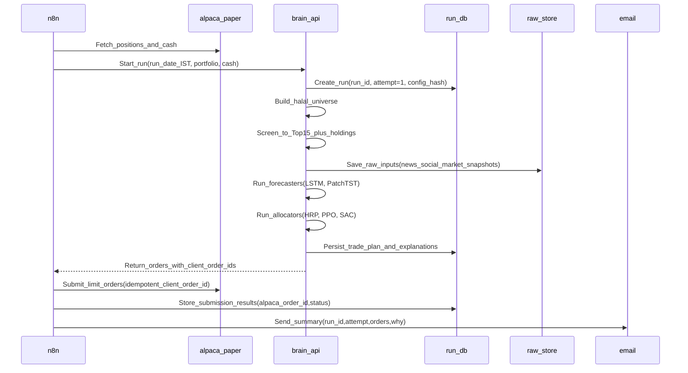
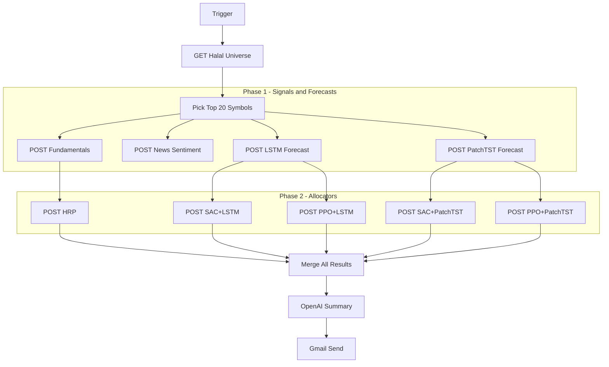
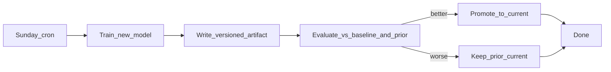

# LearnFinance-2025

A **learning-focused** weekly paper-trading portfolio system for **halal Nasdaq-500 stocks**. The goal is to **compare multiple approaches side-by-side** — not to pick a single "best" method.

## What it does

Every Monday **6:00 PM IST** (pre US open), the system orchestrates:

1. **Universe & Signals**: Fetch halal universe, collect signals (news sentiment, fundamentals)
2. **Price Forecasting**: Run LSTM (price-only) and PatchTST (multi-signal)
3. **Portfolio Allocation**: Run multiple allocators for comparison:
   - **HRP** (Hierarchical Risk Parity) — math baseline
   - **PPO + LSTM** / **PPO + PatchTST** — on-policy RL agents
   - **SAC + LSTM** / **SAC + PatchTST** — off-policy RL agents
4. **LLM Summary**: OpenAI/GPT synthesizes all signals into market insights
5. **Email**: Send comparison tables with all approaches for learning

The email shows **all allocations side-by-side** so you can learn which approach performs best over time.

### What it does NOT do

- It does **not** execute live trades (you can later add that with additional guardrails).
- It is **not** financial advice.

## Architecture



**Architecture overview:**

- **n8n** for scheduling/orchestration and integrations (Alpaca + email + LLM summary)
- A Python "AI brain" for price forecasting, allocation, and signal collection

## Model hierarchy

This repo compares multiple approaches at each stage:

### Price Forecasters (predict weekly returns)

| Model | Input | Status |
|-------|-------|--------|
| LSTM | OHLCV only (pure price) | ✅ Active |
| PatchTST | OHLCV + All signals | ✅ Active |

### Portfolio Allocators (decide weights)

| Model | Input | Status |
|-------|-------|--------|
| HRP | Covariance matrix | ✅ Active |
| PPO + LSTM | State vector + LSTM forecasts | ✅ Active |
| PPO + PatchTST | State vector + PatchTST forecasts | ✅ Active |
| SAC + LSTM | State vector + LSTM forecasts | ✅ Active |
| SAC + PatchTST | State vector + PatchTST forecasts | ✅ Active |

### Signals

| Signal | Status | Endpoint |
|--------|--------|----------|
| News sentiment (FinBERT) | ✅ Active | `/signals/news` |
| News sentiment (historical) | ✅ Active | `/signals/news/historical` |
| Fundamentals (5 ratios) | ✅ Active | `/signals/fundamentals` |
| Fundamentals (historical) | ✅ Active | `/signals/fundamentals/historical` |
| Twitter/Social sentiment | 🔜 To build | — |

### Signal state vector (for RL and PatchTST)

| Feature | Source |
|---------|--------|
| LSTM predicted return | `/inference/lstm` |
| News sentiment score | `/signals/news` |
| Gross margin | `/signals/fundamentals` |
| Operating margin | `/signals/fundamentals` |
| Net margin | `/signals/fundamentals` |
| Current ratio | `/signals/fundamentals` |
| Debt to equity | `/signals/fundamentals` |
| Current portfolio weight | Portfolio state |
| Cash available | Portfolio state |

**Key distinction:**
- **LSTM** = pure price forecaster (OHLCV only, does NOT receive signals)
- **PatchTST** = multi-signal forecaster (receives all signals + OHLCV)
- **PPO/SAC** = RL allocators (receive all signals + forecaster output)

## Prerequisites

- **Docker & Docker Compose** (for n8n and Postgres)
- **Python 3.11+** with `uv` package manager
- A Google account (for Gmail OAuth)
- A Google Cloud project with OAuth credentials (for n8n email integration)

## Quick Start

### 1. Start infrastructure

```bash
docker compose up -d
```

This starts:
- n8n at http://localhost:5678
- Postgres for run tracking

### 2. Start Brain API

```bash
cd brain_api
uv sync --extra dev
uv run uvicorn brain_api.main:app --reload --host 0.0.0.0 --port 8000
```

API available at http://localhost:8000 (docs at `/docs`)

### 3. Configure Gmail in n8n (for email notifications)

1. Go to [Google Cloud Console](https://console.cloud.google.com/)
2. Create a project (or use an existing one)
3. Go to **APIs & Services → OAuth consent screen**
   - Choose **External** (or Internal if using Workspace)
   - Fill in app name, user support email, developer email
   - Add your email as a test user
4. Go to **APIs & Services → Credentials → Create Credentials → OAuth client ID**
   - Application type: **Web application**
   - Name: `n8n Gmail`
   - Authorized redirect URIs: `http://localhost:5678/rest/oauth2-credential/callback`
5. Copy the **Client ID** and **Client Secret**
6. In n8n: **Settings → Credentials → Add Credential → Gmail OAuth2**
   - Fill in Client ID and Client Secret
   - Click **Sign in with Google** and authorize

### 4. Configure Alpaca Paper Trading (for order execution)

The system submits orders to 3 separate Alpaca paper trading accounts:

| Account | Algorithm | Description |
|---------|-----------|-------------|
| PPO_LSTM | PPO + LSTM | On-policy RL with pure price forecasts |
| SAC_PatchTST | SAC + PatchTST | Off-policy RL with multi-signal forecasts |
| HRP | HRP | Risk parity baseline |

**Setup steps:**

1. Create 3 paper trading accounts at [Alpaca](https://alpaca.markets/)
2. For each account, get the API Key and Secret from the dashboard
3. In n8n: **Settings → Credentials → Add Credential → Header Auth**
   - Create 3 credentials named: `Alpaca PPO_LSTM`, `Alpaca SAC_PatchTST`, `Alpaca HRP`
   - For each, add two headers:
     - `APCA-API-KEY-ID`: your API key
     - `APCA-API-SECRET-KEY`: your API secret

**Note:** The other 2 algorithms (PPO+PatchTST, SAC+LSTM) run with mock portfolios for comparison but don't execute real paper trades.

### 5. Test with hello world email

1. In n8n, import `n8n/workflows/hello-world-email.json`
2. Configure Gmail credentials and recipient address
3. Execute workflow

You should receive a "Hello World from LearnFinance-2025" email.

## Weekly workflow setup

Import `n8n/workflows/weekly-lstm-forecast-email.json` and enable the schedule. The cron runs every Monday at 18:00 IST.

### Workflow flow



### 2-Phase execution architecture

The n8n workflow executes in two phases to ensure forecasters complete before RL allocators run:



**Phase 1** runs 4 nodes in parallel: fundamentals, news sentiment, LSTM forecast, PatchTST forecast.

**Phase 2** runs 5 nodes in parallel after Phase 1 completes: SAC+LSTM, SAC+PatchTST, PPO+LSTM, PPO+PatchTST, HRP. The RL allocators use a mock portfolio (cash=10000, no positions) for paper trading simulation.

### Environment variables (optional)

```bash
# n8n configuration
N8N_HOST=localhost
N8N_PORT=5678
N8N_PROTOCOL=http
WEBHOOK_URL=http://localhost:5678/

# Timezone (IST for Monday 6 PM runs)
TZ=Asia/Kolkata
```

## Key design decisions

### Paper auto-submit, live manual

- **Paper orders are auto-submitted** each Monday.
- Live trading is intentionally out of scope until safety, monitoring, and backtesting maturity is higher.

### Run identity & rerun behavior

- **Run date** is the Monday date in IST, e.g. `2025-12-29`.
- **Run ID**: `paper:YYYY-MM-DD` (example: `paper:2025-12-29`).
- **Attempt**: integer starting at `1`.

**Rerun is read-only** if the latest attempt has any order that is not canceled/expired/rejected.

If you manually cancel all active paper orders in Alpaca, the next run can create **attempt=2** and submit new orders.

### Order idempotency (no accidental duplicates)

Every order uses a deterministic `client_order_id`:

- `paper:YYYY-MM-DD:attempt-<N>:<SYMBOL>:<SIDE>`
- Example: `paper:2025-12-29:attempt-1:AAPL:BUY`

On submit:

- If an order with the same `client_order_id` was already submitted, reruns **do not** submit again.
- We also query Alpaca by `client_order_id` as a secondary guardrail.

### Screening stage (runtime control)

We start from all Nasdaq-500 stocks and apply the **halal filter across the full set**. From the resulting halal universe, we only run expensive pipelines for:

- **Always**: your current holdings
- **Plus**: a Top-15 candidate set chosen via cheap deterministic filters + ranking

This keeps the system reliable and cost-bounded.

### Limit orders + fractional sizing

- Default order type: **limit orders**
- Sizing: **fractional shares when supported**
- Limit pricing uses a configurable buffer from last price/quote

### Safety caps (recommended defaults)

Even for paper, enforce hard limits (config):

- Max turnover (% of portfolio value traded)
- Max number of orders
- Max position size (% of portfolio)
- Minimum cash buffer
- Blocklist/allowlist overrides

## Data storage

We store three kinds of data:

- **Run DB (local Postgres via Docker)**:
  - runs (run_id, attempt, timestamps, config_hash, status)
  - universe & screening decisions
  - signals/features (as-of timestamps)
  - trade plan + explanations
  - orders (client_order_id, alpaca_order_id, status)
- **Raw evidence store (filesystem)**:
  - `data/raw/<run_id>/<attempt>/<source>/<symbol>.json`
- **Derived feature snapshots**:
  - `data/features/<run_id>/<attempt>/...`

## API overview

### Inference endpoints

| Endpoint | Purpose |
|----------|---------|
| `POST /inference/lstm` | LSTM price predictions (OHLCV only) |
| `POST /inference/patchtst` | PatchTST price predictions (multi-signal) |
| `POST /inference/ppo_lstm` | PPO allocation using LSTM forecasts |
| `POST /inference/ppo_patchtst` | PPO allocation using PatchTST forecasts |
| `POST /inference/sac_lstm` | SAC allocation using LSTM forecasts |
| `POST /inference/sac_patchtst` | SAC allocation using PatchTST forecasts |
| `POST /allocation/hrp` | HRP risk-parity allocation |

### Order generation endpoints

| Endpoint | Purpose |
|----------|---------|
| `POST /orders/generate` | Convert allocation weights to limit orders |

### Signal endpoints

| Endpoint | Purpose |
|----------|---------|
| `POST /signals/news` | News sentiment (FinBERT, real-time) |
| `POST /signals/news/historical` | News sentiment (historical) |
| `POST /signals/fundamentals` | Financial ratios (5 metrics) |
| `POST /signals/fundamentals/historical` | Historical fundamentals |

### Training endpoints

| Endpoint | Purpose | Trigger |
|----------|---------|---------|
| `POST /train/lstm` | Full LSTM retrain | Monthly (manual) |
| `POST /train/patchtst` | Full PatchTST retrain | Monthly (manual) |
| `POST /train/ppo_lstm/full` | Full PPO+LSTM retrain | Monthly (manual) |
| `POST /train/ppo_lstm/finetune` | PPO+LSTM fine-tune | Weekly (cron) |
| `POST /train/ppo_patchtst/full` | Full PPO+PatchTST retrain | Monthly (manual) |
| `POST /train/ppo_patchtst/finetune` | PPO+PatchTST fine-tune | Weekly (cron) |
| `POST /train/sac_lstm/full` | Full SAC+LSTM retrain | Monthly (manual) |
| `POST /train/sac_lstm/finetune` | SAC+LSTM fine-tune | Weekly (cron) |
| `POST /train/sac_patchtst/full` | Full SAC+PatchTST retrain | Monthly (manual) |
| `POST /train/sac_patchtst/finetune` | SAC+PatchTST fine-tune | Weekly (cron) |

### Other endpoints

| Endpoint | Purpose |
|----------|---------|
| `GET /universe/halal` | Get halal stock universe |
| `POST /etl/news-sentiment` | ETL pipeline for news sentiment |
| `POST /etl/sentiment-gaps` | Gap detection and backfill |
| `POST /experience/store` | Store RL experience |
| `POST /experience/label` | Label experience with rewards |
| `GET /experience/list` | List stored experiences |
| `GET /health`, `/health/live`, `/health/ready` | Health checks |

### Request/response examples

**LSTM inference:**

```json
// POST /inference/lstm
// Request
{ "symbols": ["AAPL", "MSFT"], "as_of_date": "2025-12-29" }

// Response
{
  "predictions": [
    {
      "symbol": "AAPL",
      "predicted_weekly_return_pct": 2.5,
      "direction": "UP",
      "has_enough_history": true
    }
  ],
  "model_version": "v2026-01-09-a4fecab1bdcc",
  "as_of_date": "2025-12-29"
}
```

**PPO+LSTM inference:**

```json
// POST /inference/ppo_lstm
// Request
{ "portfolio": { "positions": [...], "cash": 10000 }, "as_of_date": "2025-12-29" }

// Response
{ "allocation": { "AAPL": 0.15, "MSFT": 0.10, "CASH": 0.05 }, "turnover": 0.12 }
```

## Model lifecycle

Monday inference runs **do not retrain** models. Training happens separately.

### Training schedule

| When | What | Trigger |
|------|------|---------|
| Monthly (Saturday) | Full retrain all models | Manual |
| Weekly (Sunday) | Fine-tune PPO + SAC variants | Cron |
| Monday 6 PM IST | Inference only (all models) | Cron (n8n) |

### Training workflow



### Model artifacts

Models produce **versioned artifact files** stored under `data/models/`:

```
data/models/
├── lstm/
│   ├── v2026-01-09-a4fecab1bdcc/   # versioned artifact (date + config hash)
│   │   ├── weights.pt              # model weights (PyTorch)
│   │   ├── feature_scaler.pkl      # feature scaler/normalizer
│   │   ├── config.json             # hyperparams, feature schema
│   │   └── metadata.json           # training date, data window, metrics
│   ├── snapshot-2025-12-31/        # point-in-time snapshots
│   └── current                     # text file with active version string
└── patchtst/
    └── (same structure)
```

**What's in a model artifact:**

| File | Purpose |
|------|---------|
| `weights.pt` | Trained parameters |
| `feature_scaler.pkl` | Preprocessing transforms fitted on training data |
| `config.json` | Hyperparameters, feature list, model architecture |
| `metadata.json` | Training timestamp, data window, git commit, eval metrics |

### How inference loads models

1. Read `data/models/lstm/current` to get the active version string
2. Load artifacts from `data/models/lstm/<version>/`

This means you can:

- **Roll back** by changing the `current` pointer
- **A/B test** by loading a different version
- **Audit** by inspecting exactly which version was used

### RL experience collection

After each Monday run, store the experience tuple:

- State: features/signals at decision time
- Action: portfolio weights chosen
- Reward: computed later (next-week return minus turnover cost)

Save to: `data/experience/<run_id>.json`

### Fine-tune guardrails

- **Evaluation gate**: new policy must beat prior + a baseline
- **Rollback**: keep last known-good version; promotion is atomic pointer swap
- **Drift detection**: if performance degrades 4 weeks in a row, consider full retrain

## Cloud migration

The API is designed so each endpoint can become a standalone **Google Cloud Function** or be backed by **HuggingFace Hub** for model storage.

### Storage abstraction

```
┌─────────────────────────────────────────────────────────────┐
│  FastAPI endpoint (local)  OR  Cloud Function (later)       │
│  • Validates request                                        │
│  • Calls core function                                      │
│  • Returns JSON response                                    │
└─────────────────────────────────────────────────────────────┘
                              │
                              ▼
┌─────────────────────────────────────────────────────────────┐
│  Core function (pure Python, no framework dependency)       │
│  • lstm_inference(features, model_path) → predictions       │
│  • ppo_inference(state, policy_path) → allocation           │
└─────────────────────────────────────────────────────────────┘
                              │
                              ▼
┌─────────────────────────────────────────────────────────────┐
│  Storage abstraction                                        │
│  • LocalStorage: reads/writes data/models/...               │
│  • HuggingFaceStorage: reads/writes to HuggingFace Hub      │
└─────────────────────────────────────────────────────────────┘
```

### Migration steps

1. Extract endpoint handler → standalone `main.py` with `def handler(request):`
2. Swap `LocalStorage` → `HuggingFaceStorage` via environment variable
3. Deploy: `gcloud functions deploy <name> --runtime python311 --trigger-http`
4. Update n8n to call Cloud Function URL instead of local FastAPI

## Code structure

```
brain_api/
├── routes/
│   ├── inference/
│   │   ├── lstm.py
│   │   ├── patchtst.py
│   │   ├── ppo_lstm.py
│   │   ├── ppo_patchtst.py
│   │   ├── sac_lstm.py
│   │   └── sac_patchtst.py
│   ├── training/
│   │   └── (same pattern)
│   ├── signals/
│   │   └── endpoints.py
│   ├── pipelines/
│   ├── allocation.py
│   ├── experience.py
│   ├── etl.py
│   └── universe.py
├── core/
│   ├── lstm/
│   ├── patchtst/
│   ├── ppo_lstm/
│   ├── ppo_patchtst/
│   ├── sac_lstm/
│   ├── sac_patchtst/
│   ├── hrp.py
│   └── ...
├── storage/
│   ├── base.py              # abstract Storage class
│   ├── local.py             # LocalStorage(base_path="data/")
│   ├── huggingface.py       # HuggingFaceStorage (swap via env var)
│   ├── lstm/
│   ├── patchtst/
│   └── ...
└── ...
```

## Repo docs

- `README.md`: overview + architecture + setup
- `CLAUDE.md`: working agreement for contributors/AI (coding rules, invariants, testing policy)

## License

See `LICENSE`.
