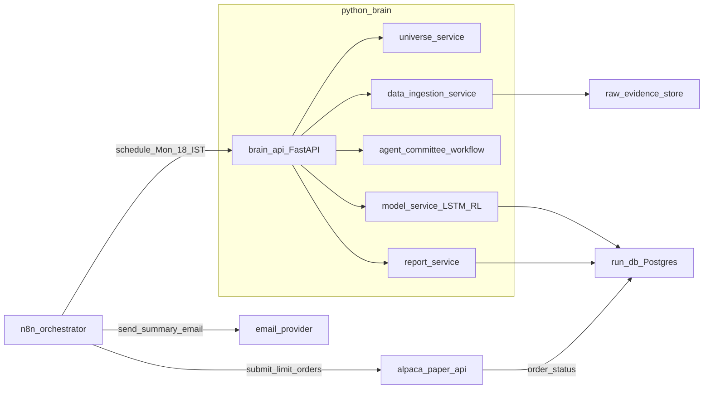

# LearnFinance-2025

Build a weekly, paper-trading portfolio-rebalancing system for **halal Nasdaq-500 stocks** using a hybrid architecture:

- **n8n** for scheduling/orchestration and integrations (Alpaca + email)
- A Python “AI brain” for **multi-agent evidence synthesis**, **LSTM price forecasting**, and **RL portfolio decisions**

This is a learning repo, but the design aims to be **audit-friendly**, **idempotent**, and **safe-by-default**.

## What it does (weekly)

Every Monday **6:00 PM IST** (pre US open), the system:

- Fetches current portfolio + cash from **Alpaca (paper)**
- Builds the **Halal Nasdaq-500 universe**
- Runs a **screening stage** to pick a manageable candidate set (Top-30) while always including current holdings
- Collects signals per ticker (news, social sentiment, global industry/market context)
- Runs a **multi-agent “investment committee”** to synthesize evidence and resolve conflicts
- Uses **LSTM** to predict near-term price movement (with uncertainty/quality signals)
- Uses **RL** to choose the portfolio actions while penalizing unnecessary turnover
- **Auto-submits limit orders to Alpaca paper**
- Emails you: what was submitted + rationale + run identifiers + links/IDs for audit

## What it does NOT do

- It does **not** execute live trades (you can later add that with additional guardrails).
- It is **not** financial advice.

## High-level architecture

## Weekly data flow (Monday run)

## Key design decisions (important)

### Paper auto-submit, live manual

- **Paper orders are auto-submitted** each Monday.
- Live trading is intentionally out of scope until safety, monitoring, and backtesting maturity is higher.

### Run identity (calendar date) + rerun behavior

- **Run date** is the Monday date in IST, e.g. `2025-12-29`.
- **Run ID**: `paper:YYYY-MM-DD` (example: `paper:2025-12-29`).
- **Attempt**: integer starting at `1`.

**Rerun is read-only** if the latest attempt has any order that is not canceled/expired/rejected.

If you manually cancel all active paper orders in Alpaca, the next run can create **attempt=2** and submit new orders.

### Order idempotency (no accidental duplicates)

Every order uses a deterministic `client_order_id`:

- `paper:YYYY-MM-DD:attempt-<N>:<SYMBOL>:<SIDE>`
- Example: `paper:2025-12-29:attempt-1:AAPL:BUY`

On submit:

- If an order with the same `client_order_id` was already submitted, reruns **do not** submit again.
- We also query Alpaca by `client_order_id` as a secondary guardrail.

### Screening stage (runtime control)

We start from all Nasdaq-500 stocks and apply the **halal filter across the full set**. From the resulting halal universe, we only run expensive pipelines (news/social/agents/models) for:

- **Always**: your current holdings
- **Plus**: a Top-30 candidate set chosen via cheap deterministic filters + ranking (liquidity, tradability, volatility/returns, simple momentum proxies, etc.)

This keeps the system reliable and cost-bounded.

### Limit orders + fractional sizing

- Default order type: **limit orders**
- Sizing: **fractional shares when supported**
- Limit pricing uses a configurable buffer from last price/quote:
  - Buy: `price * (1 + buffer)`
  - Sell: `price * (1 - buffer)`

## Data storage strategy (audit + reproducibility)

We store three kinds of data:

- **Run DB (local Postgres via Docker)**:
  - runs (run_id, attempt, timestamps, config_hash, status)
  - universe & screening decisions (why a symbol was included/excluded)
  - signals/features (as-of timestamps)
  - trade plan + explanations
  - orders (client_order_id, alpaca_order_id, status)
- **Raw evidence store (filesystem)**:
  - `data/raw/<run_id>/<attempt>/<source>/<symbol>.json`
  - Inputs used for the run (news results, social samples, market snapshots)
- **Derived feature snapshots**:
  - Stored in DB or as files under `data/features/<run_id>/<attempt>/...`

This makes every run reviewable and debuggable.

## Multi-agent requirement (where it lives)

Multi-agent workflows are used for **evidence synthesis**, not for numeric optimization:

- Agent roles example:
  - `MacroAnalyst`: global market/industry context
  - `NewsAnalyst`: news evidence + impact summary
  - `SocialAnalyst`: sentiment + anomalies
  - `RiskCritic`: challenges contradictions, flags weak evidence
  - `Synthesizer`: produces a structured per-ticker “dossier”

Recommended: use Microsoft’s newer **AutoGen workflow** (successor) inside the Python brain, while keeping **n8n** for orchestration.

## Safety caps (recommended defaults)

Even for paper, enforce hard limits (config):

- Max turnover (% of portfolio value traded)
- Max number of orders
- Max position size (% of portfolio)
- Minimum cash buffer
- Blocklist/allowlist overrides

## Repo docs

- `README.md`: overview + architecture + ops
- `CLAUDE.md`: working agreement for contributors/AI (coding rules, invariants, testing policy)

## License

See `LICENSE`.
