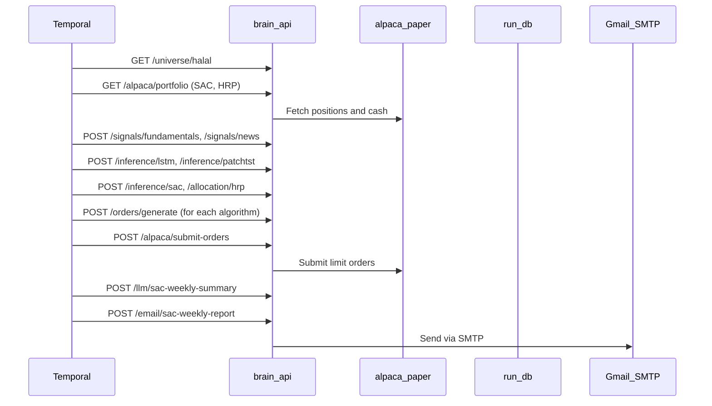
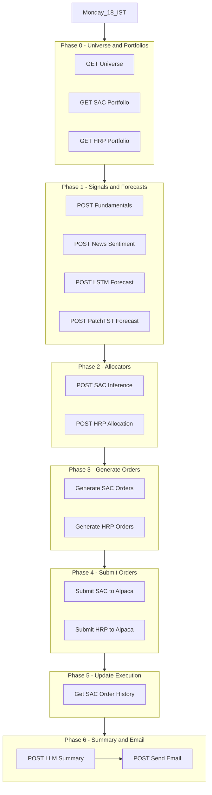
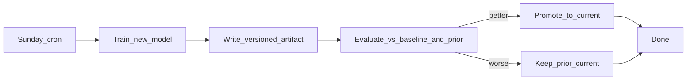

# LearnFinance-2025

A **learning-focused** weekly paper-trading portfolio system for **halal stocks across US and India markets** (US: 5-ETF halal universe; India: Nifty 500 Shariah). The goal is to **compare multiple approaches side-by-side** — not to pick a single "best" method.

## What it does

Each Monday the system runs five independent Temporal workflows that each pick 15 halal stocks and allocate weights using a different strategy. Across all workflows, the brain_api collects the same building blocks (universe scrape, news/fundamentals signals, LSTM + PatchTST price forecasters, HRP/SAC/Alpha-HRP/Double-HRP allocators) and emails a per-strategy report so you can compare outcomes over time.

### What it does NOT do

- It does **not** execute live trades (you can later add that with additional guardrails).
- It is **not** financial advice.

## Architecture

**Components:**

- **Temporal** is the sole orchestrator. Each workflow is registered as its own Temporal schedule (see [temporal/schedules.py](temporal/schedules.py)) and runs independently — there is no fan-out or shared "Monday flow".
- **brain_api** (FastAPI) owns all business logic: universe scraping, signal collection, price forecasting (LSTM + PatchTST, US + India), allocation (HRP, SAC, Alpha-HRP, Double-HRP), Alpaca paper trading, OpenAI/LLM summaries, and Gmail SMTP delivery.
- Storage: local Postgres for run records, local SQLite (`data/allocation/sticky_history.db`, two sibling tables -- `stage1_weight_history` for two-stage HRP strategies on weekly cadence, `screening_history` for single-stage screening strategies on monthly cadence) for sticky-selection history, filesystem for raw evidence + model artifacts.

**Workflows (5 independent schedules):**

| Workflow | Schedule (UTC / IST) | Market | Strategy | Key brain_api endpoints |
|----------|----------------------|--------|----------|-------------------------|
| `us-weekly-allocate` (`USWeeklyAllocationWorkflow`) | Mon 11:00 UTC / 18:00 IST | US | SAC (RL with LSTM + PatchTST forecasts) | `/universe/halal_filtered`, `/alpaca/portfolio`, `/signals/{news,fundamentals}`, `/inference/{lstm,patchtst,sac}`, `/orders/generate`, `/alpaca/submit-orders`, `/llm/sac-weekly-summary`, `/email/sac-weekly-report` |
| `us-double-hrp` (`USDoubleHRPWorkflow`) | Mon 11:30 UTC / 17:00 IST | US | Stage-1 HRP on `halal_new` -> sticky top-15 -> Stage-2 HRP | `/universe/halal_new`, `/allocation/hrp`, `/allocation/sticky-top-n`, `/allocation/record-final-weights`, `/llm/us-double-hrp-summary`, `/email/us-double-hrp-report` |
| `us-alpha-hrp` (`USAlphaHRPWorkflow`) | Mon 12:00 UTC / 17:30 IST | US | PatchTST alpha screen -> rank-band sticky top-15 -> HRP | `/universe/halal_new`, `/inference/patchtst/score-batch`, `/allocation/sticky-top-n`, `/allocation/hrp`, `/llm/us-alpha-hrp-summary`, `/email/us-alpha-hrp-report` |
| `india-weekly-allocate` (`IndiaWeeklyAllocationWorkflow`) | Mon 03:30 UTC / 09:00 IST | India | PatchTST alpha screen -> rank-band sticky top-15 -> HRP (paper-only, no broker) | `/universe/nifty_shariah_500`, `/inference/patchtst/score-batch?market=india`, `/allocation/sticky-top-n`, `/allocation/hrp`, `/llm/india-alpha-hrp-summary`, `/email/india-alpha-hrp-report` |
| `india-double-hrp` (`IndiaDoubleHRPWorkflow`) | Mon 04:00 UTC / 09:30 IST | India | Stage-1 HRP on `nifty_shariah_500` -> sticky top-15 -> Stage-2 HRP | `/universe/nifty_shariah_500`, `/allocation/hrp`, `/allocation/sticky-top-n`, `/allocation/record-final-weights`, `/llm/india-double-hrp-summary`, `/email/india-double-hrp-report` |

Training schedules (US weekly training, India PatchTST weekly training) are defined in `schedules.py` but are intentionally not registered on the default (Raspberry Pi) host — they require a beefier machine.

## Model hierarchy

This repo compares multiple approaches at each stage:

### Price Forecasters (direct 5-day daily returns)

| Model | Input | Output | Status |
|-------|-------|--------|--------|
| LSTM | OHLCV only (pure price) | 5 daily close log returns | ✅ Active |
| PatchTST | OHLCV 5-channel (open, high, low, close, volume) | 5 daily close log returns | ✅ Active |

### Portfolio Allocators (decide weights)

| Model | Input | Status |
|-------|-------|--------|
| HRP | Covariance matrix | ✅ Active |
| ~~PPO~~ | ~~State vector + dual forecasts (LSTM + PatchTST)~~ | Retired |
| SAC | State vector + dual forecasts (LSTM + PatchTST) | ✅ Active |

> **Note:** After 3 months of paper-trading experimentation, HRP and SAC consistently outperformed PPO. PPO has been retired from the codebase.

### Signals

| Signal | Status | Endpoint |
|--------|--------|----------|
| News sentiment (FinBERT) | ✅ Active | `/signals/news` |
| News sentiment (historical) | ✅ Active | `/signals/news/historical` |
| Fundamentals (5 ratios) | ✅ Active | `/signals/fundamentals` |
| Fundamentals (historical) | ✅ Active | `/signals/fundamentals/historical` |
| Twitter/Social sentiment | 🔜 To build | — |

### Signal state vector (for SAC allocator)

**9 features per stock** (x15 stocks selected by `halal_filtered`) = 7 signals + 2 forecasts:

| Feature | Source |
|---------|--------|
| News sentiment score | `/signals/news` (FinBERT) |
| Gross margin | `/signals/fundamentals` |
| Operating margin | `/signals/fundamentals` |
| Net margin | `/signals/fundamentals` |
| Current ratio | `/signals/fundamentals` |
| Debt to equity | `/signals/fundamentals` |
| Fundamental data age | Days since last fundamentals update |
| LSTM predicted return | `/inference/lstm` (re-run on the chosen 15) |
| PatchTST predicted return | `/inference/patchtst` (re-run on the chosen 15) |

Plus portfolio-level features:

| Feature | Source |
|---------|--------|
| Current weight per stock (15) | Portfolio state |
| Current cash weight | Portfolio state (CASH slot in weight vector) |

Total state dimension for 15 stocks: 15 stocks × 9 = 135 stock features + 16 portfolio weights (15 stocks + CASH) = **151** (see [brain_api/brain_api/core/portfolio_rl/state.py](brain_api/brain_api/core/portfolio_rl/state.py)).

**Key distinction:**
- **LSTM** = pure price forecaster (close log returns only, direct 5-day prediction)
- **PatchTST** = OHLCV forecaster (5-channel log returns, direct 5-day prediction)
- **SAC** = RL allocator (receive signals + both LSTM and PatchTST return forecasts)

## Prerequisites

- **Docker & Docker Compose** (for Postgres)
- **Python 3.11+** with `uv` package manager
- **Temporal CLI** (for workflow orchestration)
- Gmail app password (for email notifications)
- Alpaca paper trading accounts (for order execution)

## Quick Start

### 1. Start infrastructure

```bash
docker compose up -d
```

This starts:
- brain-api at http://localhost:8000
- Temporal server at port 7233 (UI at port 8233)
- Temporal worker (polls for workflows)

### 2. Start Brain API

```bash
cd brain_api
cp .env.example .env
# Edit .env with your credentials (see below)
uv sync --extra dev
uv run uvicorn brain_api.main:app --reload --host 0.0.0.0 --port 8000
```

API available at http://localhost:8000 (docs at `/docs`)

### 3. Configure credentials in brain_api/.env

The brain_api handles all external integrations. Configure these environment variables:

**Gmail (for email notifications):**
```bash
GMAIL_USER=your-email@gmail.com
GMAIL_APP_PASSWORD=your-app-password
```

To get a Gmail app password:
1. Go to [Google Account Security](https://myaccount.google.com/security)
2. Enable 2-Step Verification if not already enabled
3. Go to **App passwords** → Generate a new app password for "Mail"
4. Copy the 16-character password (no spaces)

**Alpaca Paper Trading (for order execution):**
```bash
# SAC account
ALPACA_SAC_KEY=your-sac-api-key
ALPACA_SAC_SECRET=your-sac-api-secret

# HRP account
ALPACA_HRP_KEY=your-hrp-api-key
ALPACA_HRP_SECRET=your-hrp-api-secret
```

Create 2 paper trading accounts at [Alpaca](https://alpaca.markets/) and get API keys from each dashboard.

| Account | Algorithm | Description |
|---------|-----------|-------------|
| SAC | SAC | Off-policy RL with dual forecasts (LSTM + PatchTST) |
| HRP | Alpha-HRP | PatchTST alpha screen on `halal_new` -> rank-band sticky top 15 -> HRP (replaces retired naive HRP allocator on the same `hrp` Alpaca account) |

**OpenAI (for LLM summaries):**
```bash
OPENAI_API_KEY=your-openai-api-key
```

### 4. Start Temporal dev server

```bash
devbox run temporal:server
```

### 5. Start Temporal worker

```bash
# In another terminal:
devbox run temporal:worker
```

### 6. Run a workflow manually

```bash
devbox run temporal:run:us-sac-weekly
devbox run temporal:run:india-alpha-hrp
devbox run temporal:run:india-double-hrp
devbox run temporal:run:us-double-hrp
devbox run temporal:run:us-alpha-hrp
```

## Weekly workflow setup

The Temporal workflow runs every Monday at 18:00 IST.

### Register the schedule

```bash
devbox run temporal:schedule
```

### Workflow flow (US SAC weekly workflow)

The diagram below is specific to the `us-weekly-allocate` (SAC) workflow. The other four workflows (US Alpha-HRP, US Double-HRP, India Alpha-HRP, India Double-HRP) follow analogous shapes but hit different brain_api endpoints — see the workflow table above and the workflow source under [temporal/workflows/](temporal/workflows/).


```mermaid
sequenceDiagram
  participant Temporal as Temporal
  participant Brain as brain_api
  participant Alpaca as alpaca_paper
  participant DB as run_db
  participant Email as Gmail_SMTP

  Temporal->>Brain: GET /universe/halal
  Temporal->>Brain: GET /alpaca/portfolio (SAC, HRP)
  Brain->>Alpaca: Fetch positions and cash
  Temporal->>Brain: POST /signals/fundamentals, /signals/news
  Temporal->>Brain: POST /inference/lstm, /inference/patchtst
  Temporal->>Brain: POST /inference/sac, /allocation/hrp
  Temporal->>Brain: POST /orders/generate (for each algorithm)
  Temporal->>Brain: POST /alpaca/submit-orders
  Brain->>Alpaca: Submit limit orders
  Temporal->>Brain: POST /llm/sac-weekly-summary
  Temporal->>Brain: POST /email/sac-weekly-report
  Brain->>Email: Send via SMTP
```

### 7-Phase execution architecture (US SAC weekly workflow)

This 7-phase shape applies to the SAC US workflow only. Alpha-HRP / Double-HRP variants compress these into fewer phases (no SAC inference, no LSTM, sticky selection inserted between Stage 1 and Stage 2). The Temporal workflow executes in 7 phases with parallel tasks where possible:


```mermaid
flowchart TD
    Trigger[Monday_18_IST] --> Phase0

    subgraph Phase0[Phase 0 - Universe and Portfolios]
        GetUniverse[GET Universe]
        GetSAC[GET SAC Portfolio]
        GetHRP[GET HRP Portfolio]
    end

    Phase0 --> Phase1

    subgraph Phase1[Phase 1 - Signals and Forecasts]
        Fundamentals[POST Fundamentals]
        NewsSentiment[POST News Sentiment]
        LSTMForecast[POST LSTM Forecast]
        PatchTSTForecast[POST PatchTST Forecast]
    end

    Phase1 --> Phase2

    subgraph Phase2[Phase 2 - Allocators]
        SAC[POST SAC Inference]
        HRP[POST HRP Allocation]
    end

    Phase2 --> Phase3

    subgraph Phase3[Phase 3 - Generate Orders]
        OrdersSAC[Generate SAC Orders]
        OrdersHRP[Generate HRP Orders]
    end

    Phase3 --> Phase4

    subgraph Phase4[Phase 4 - Submit Orders]
        SubmitSAC[Submit SAC to Alpaca]
        SubmitHRP[Submit HRP to Alpaca]
    end

    Phase4 --> Phase5

    subgraph Phase5[Phase 5 - Update Execution]
        HistorySAC[Get SAC Order History]
    end

    Phase5 --> Phase6

    subgraph Phase6[Phase 6 - Summary and Email]
        Summary[POST LLM Summary]
        Summary --> SendEmail[POST Send Email]
    end
```

**Skip logic:** Algorithms are skipped if they have open orders from a previous run (prevents duplicate submissions).

### Environment variables

```bash
# Brain API URL (for Temporal to call)
BRAIN_API_URL=http://localhost:8000

# Universe overrides (default: halal_filtered)
ETL_UNIVERSE=halal_filtered
FORECASTER_TRAIN_UNIVERSE=halal_filtered
RL_TRAIN_UNIVERSE=halal_filtered
```

## Key design decisions

### Contribution principles (math vs. reuse)

- Math correctness is the highest priority. Never break math to simplify code.
- DRY, DDD, and clean code are also important -- factor out genuinely shared logic.
- When two algorithms have research-driven math differences, keep their math separate even if the surface code looks similar (we previously broke PPO's math by over-sharing with SAC).
- See [AGENTS.md](AGENTS.md#ai-assistant-behavioral-rules) for the full rule.

### Paper auto-submit, live manual

- **Paper orders are auto-submitted** each Monday.
- Live trading is intentionally out of scope until safety, monitoring, and backtesting maturity is higher.

### Run identity & rerun behavior

- **Run date** is the Monday date in IST, e.g. `2025-12-29`.
- **Run ID**: `paper:YYYY-MM-DD` (example: `paper:2025-12-29`).
- **Attempt**: integer starting at `1`.

**Rerun is read-only** if the latest attempt has any order that is not canceled/expired/rejected.

If you manually cancel all active paper orders in Alpaca, the next run can create **attempt=2** and submit new orders.

### Order idempotency (no accidental duplicates)

Every order uses a deterministic `client_order_id`:

- `paper:YYYY-MM-DD:attempt-<N>:<SYMBOL>:<SIDE>`
- Example: `paper:2025-12-29:attempt-1:AAPL:BUY`

On submit:

- If an order with the same `client_order_id` was already submitted, reruns **do not** submit again.
- We also query Alpaca by `client_order_id` as a secondary guardrail.

### Universe types

The system maintains five universe tiers — two base universes (raw scrapes), two PatchTST top-15 universes derived from them, and the original yfinance halal universe kept for backwards compatibility:

| Universe | Size | Pipeline | Purpose |
|----------|------|----------|---------|
| `halal` | ~14 stocks | yfinance top holdings of SPUS, HLAL, SPTE | Original small universe (legacy) |
| `halal_new` | ~400 stocks (varies monthly; e.g. 410 in Mar 2026, 398 in Apr 2026) | Scrape **all** holdings of 5 halal ETFs (SPUS, SPTE, SPWO from sp-funds.com; HLAL, UMMA from Wahed), merge + dedupe, then keep only Alpaca-tradable symbols (and append the 5 ETFs themselves) | US base universe |
| `halal_filtered` | 15 stocks | `halal_new` -> drop symbols with < ~10 years of price history (`compute_min_walkforward_days`, derived from `LSTM_TRAIN_LOOKBACK_YEARS=10`) -> US PatchTST batch inference -> rank-band sticky selection (`K_in=15`, `K_hold=30`, partition `halal_filtered_alpha` in `screening_history`). **Monthly cache cadence**; cold-start (no prior month) is byte-equivalent to the legacy blanket top-15. | Default US universe for training, allocation, and SAC features |
| `nifty_shariah_500` | ~210 stocks | Scrape full Nifty 500 Shariah constituents from NSE India; symbols carry `.NS` suffix end-to-end | India base universe |
| `halal_india` | 15 stocks | `nifty_shariah_500` -> same min-history filter (~10 years) -> India PatchTST batch inference (`PatchTSTIndiaModelStorage`) -> rank-band sticky selection (`K_in=15`, `K_hold=30`, partition `halal_india_filtered_alpha` in `screening_history`). **Monthly cache cadence**; cold-start (no prior month) is byte-equivalent to the legacy blanket top-15. `.NS` suffix preserved end-to-end. | Default India universe |

Notes:

- **No factor scoring is used.** Both `halal_filtered` (US) and `halal_india` (India) are produced by PatchTST predicted weekly return + rank-band sticky selection (after a min-history filter), in distinct partitions (`halal_filtered_alpha` and `halal_india_filtered_alpha`) of the `screening_history` table. There is no momentum/quality/value blend, no ROE/Beta/SMA rule.
- RL/SAC requires exactly 15 stocks, so `halal_filtered` (US) and `halal_india` (India) are the only RL-eligible universes today; `halal` happens to also be ~14 but is legacy-only.
- After top-15 selection, both LSTM and PatchTST run **again** on those 15 symbols to produce SAC's per-stock dual-forecast features.
- Results are cached monthly (one fetch per calendar month) to avoid redundant external API calls. Cache files live under `brain_api/data/cache/universe/<name>_YYYY-MM.json`.

### RL reward design

SAC uses a **blended reward** combining portfolio return with a DifferentialSharpe ratio (Moody & Saffell 2001):

`reward = sharpe_weight * DSR + (1 - sharpe_weight) * return_reward`

Transaction costs are computed in log space. This encourages risk-adjusted returns over raw performance.

### Limit orders + fractional sizing

- Default order type: **limit orders**
- Sizing: **fractional shares when supported**
- Limit pricing uses a configurable buffer from last price/quote

### Safety caps (recommended defaults)

Even for paper, enforce hard limits (config):

- Max turnover (% of portfolio value traded)
- Max number of orders
- Max position size (% of portfolio)
- Minimum cash buffer
- Blocklist/allowlist overrides

## Data storage

We store three kinds of data:

- **Run DB (local Postgres via Docker)**:
  - runs (run_id, attempt, timestamps, config_hash, status)
  - universe & screening decisions
  - signals/features (as-of timestamps)
  - trade plan + explanations
  - orders (client_order_id, alpaca_order_id, status)
- **Raw evidence store (filesystem)**:
  - `data/raw/<run_id>/<attempt>/<source>/<symbol>.json`
- **Derived feature snapshots**:
  - `data/features/<run_id>/<attempt>/...`

## API overview

### Inference endpoints

| Endpoint | Purpose |
|----------|---------|
| `POST /inference/lstm` | LSTM 5-day return predictions (US, pure price OHLCV-close) |
| `POST /inference/patchtst` | PatchTST 5-day return predictions (US, OHLCV 5-channel) |
| `POST /inference/patchtst/india` | PatchTST 5-day return predictions (India, OHLCV 5-channel, `PatchTSTIndiaModelStorage`) |
| `POST /inference/patchtst/score-batch` | Batch PatchTST alpha screen (US or India via `market` param) -> `{symbol -> predicted_weekly_return_pct}` |
| ~~`POST /inference/ppo`~~ | ~~PPO allocation (dual LSTM + PatchTST forecasts)~~ (Retired) |
| `POST /inference/sac` | SAC allocation (dual LSTM + PatchTST forecasts on the chosen 15 stocks) |
| `POST /allocation/hrp` | HRP risk-parity allocation (requires `universe` param) |
| `POST /allocation/sticky-top-n` | Persist Stage 1 weights and select top-N with rank-band sticky retention |
| `POST /allocation/record-final-weights` | Record Stage 2 final weights for the just-completed week |

### Order generation endpoints

| Endpoint | Purpose |
|----------|---------|
| `POST /orders/generate` | Convert allocation weights to limit orders |

### Signal endpoints

| Endpoint | Purpose |
|----------|---------|
| `POST /signals/news` | News sentiment (FinBERT, real-time) |
| `POST /signals/news/historical` | News sentiment (historical) |
| `POST /signals/fundamentals` | Financial ratios (5 metrics) |
| `POST /signals/fundamentals/historical` | Historical fundamentals |

### Training endpoints

| Endpoint | Purpose | Trigger |
|----------|---------|---------|
| `POST /train/lstm` | Full LSTM retrain (US) | Monthly (manual) |
| `POST /train/patchtst` | Full PatchTST retrain (US) | Monthly (manual) |
| `POST /train/patchtst/india` | Full PatchTST retrain (India NiftyShariah500) | Weekly (cron, beefier host only) |
| ~~`POST /train/ppo/full`~~ | ~~Full PPO retrain (dual forecasts)~~ | ~~Monthly (manual)~~ |
| ~~`POST /train/ppo/finetune`~~ | ~~PPO fine-tune on experience buffer~~ | ~~Weekly (cron)~~ |
| `POST /train/sac/full` | Full SAC retrain (dual forecasts) | Monthly (manual) |
| `POST /train/sac/finetune` | SAC fine-tune on experience buffer | Weekly (cron, beefier host only) |

### LLM endpoints

| Endpoint | Purpose |
|----------|---------|
| `POST /llm/sac-weekly-summary` | Generate AI summary of the SAC-only weekly run (US) |
| `POST /llm/us-alpha-hrp-summary` | Generate AI summary of US Alpha-HRP (PatchTST alpha screen + rank-band sticky + HRP) |
| `POST /llm/us-double-hrp-summary` | Generate AI summary of US Double HRP (`halal_new` + sticky selection) |
| `POST /llm/india-alpha-hrp-summary` | Generate AI summary of India Alpha-HRP (PatchTST top-15 alpha screen + HRP) |
| `POST /llm/india-double-hrp-summary` | Generate AI summary of India two-stage HRP allocation |
| `POST /llm/india-training-summary` | Generate AI summary of India PatchTST training results |
| `POST /llm/training-summary` | Generate AI summary of training results (OpenAI/OLLAMA) |

### Email endpoints

| Endpoint | Purpose |
|----------|---------|
| `POST /email/sac-weekly-report` | Send the SAC-only weekly portfolio analysis email via Gmail SMTP (US) |
| `POST /email/us-alpha-hrp-report` | Send US Alpha-HRP report email (alpha screen + sticky + HRP + Alpaca order execution) |
| `POST /email/us-double-hrp-report` | Send US Double HRP report (Stage 1 + Stage 2 + Alpaca order results + sticky stats) |
| `POST /email/india-alpha-hrp-report` | Send India Alpha-HRP report email (paper-only, no broker) via Gmail SMTP |
| `POST /email/india-double-hrp-report` | Send India Double HRP report (Stage 1 + Stage 2 + AI summary) |
| `POST /email/india-training-summary` | Send India training summary email via Gmail SMTP |
| `POST /email/training-summary` | Send US training summary email |

### Alpaca endpoints

| Endpoint | Purpose |
|----------|---------|
| `GET /alpaca/portfolio` | Get account positions, cash, and open orders count |
| `POST /alpaca/submit-orders` | Submit orders to Alpaca paper trading |
| `GET /alpaca/order-history` | Get order execution history |

### Universe endpoints

| Endpoint | Purpose |
|----------|---------|
| `GET /universe/halal` | Legacy halal universe (~14 stocks from yfinance top holdings of SPUS/HLAL/SPTE) |
| `GET /universe/halal_new` | US base universe (~400 stocks; full holdings of 5 halal ETFs filtered to Alpaca-tradable) |
| `GET /universe/halal_filtered` | Top 15 from `halal_new` (~10y min history filter + US PatchTST predicted weekly return + rank-band sticky selection, monthly cache) |
| `GET /universe/nifty_shariah_500` | India base universe (~210 stocks, full Nifty 500 Shariah constituents, `.NS`-suffixed) |
| `GET /universe/halal_india` | Top 15 from `nifty_shariah_500` (~10y min history filter + India PatchTST predicted weekly return + rank-band sticky selection, monthly cache, `.NS`-suffixed) |

### ETL endpoints

| Endpoint | Purpose |
|----------|---------|
| `POST /etl/news-sentiment` | ETL pipeline for news sentiment |
| `GET /etl/news-sentiment/jobs` | List ETL jobs |
| `GET /etl/news-sentiment/{job_id}` | Get ETL job status |
| `POST /etl/sentiment-gaps` | Gap detection and backfill |
| `GET /etl/sentiment-gaps/{job_id}` | Get gap-fill job status |
| `POST /etl/refresh-training-data` | Refresh training data (sentiment gaps + fundamentals) |

### Experience endpoints

| Endpoint | Purpose |
|----------|---------|
| `POST /experience/store` | Store RL experience |
| `POST /experience/update-execution` | Update experience with execution results |
| `POST /experience/label` | Label experience with rewards |
| ~~`POST /experience/label/ppo`~~ | ~~Label PPO experience with rewards~~ |
| `POST /experience/label/sac` | Label SAC experience with rewards |
| `GET /experience/list` | List stored experiences |

### Other endpoints

| Endpoint | Purpose |
|----------|---------|
| `GET /health`, `/health/live`, `/health/ready` | Health checks |

### Request/response examples

**LSTM inference (5-day direct prediction):**

```json
// POST /inference/lstm
// Request
{ "symbols": ["AAPL", "MSFT"], "as_of_date": "2025-12-29" }

// Response
{
  "predictions": [
    {
      "symbol": "AAPL",
      "daily_returns": [0.003, 0.005, -0.001, 0.004, 0.002],
      "direction": "UP",
      "has_enough_history": true,
      "history_days_used": 252,
      "data_end_date": "2025-12-26",
      "target_week_start": "2025-12-29",
      "target_week_end": "2026-01-02"
    }
  ],
  "model_version": "v2026-01-09-a4fecab1bdcc",
  "as_of_date": "2025-12-29",
  "target_week_start": "2025-12-29",
  "target_week_end": "2026-01-02"
}
```

## Model lifecycle

Monday inference runs **do not retrain** models. Training happens separately.

### Training schedule

| When | What | Trigger |
|------|------|---------|
| Monthly (Saturday) | Full retrain all US models (LSTM, PatchTST, SAC) | Manual |
| Weekly (Sunday 11:00 UTC) | Full SAC retrain / fine-tune (US) | Cron (Temporal, beefier host only) |
| Weekly (Sunday 04:30 UTC / 10:00 IST) | Full PatchTST retrain (India NiftyShariah500) | Cron (Temporal, beefier host only) |
| Monday (multiple slots Mon 03:30 - 12:00 UTC) | Inference + allocation across 5 workflows | Cron (Temporal) |

### Training workflow


```mermaid
flowchart LR
  trigger[Sunday_cron] --> train[Train_new_model]
  train --> version[Write_versioned_artifact]
  version --> eval[Evaluate_vs_baseline_and_prior]
  eval -->|better| promote[Promote_to_current]
  eval -->|worse| keep[Keep_prior_current]
  promote --> done[Done]
  keep --> done
```

### Model artifacts

Models produce **versioned artifact files** stored under `data/models/`:

```
data/models/
├── lstm/
│   ├── v2026-01-09-a4fecab1bdcc/   # versioned artifact (date + config hash)
│   │   ├── weights.pt              # model weights (PyTorch)
│   │   ├── feature_scaler.pkl      # feature scaler/normalizer
│   │   ├── config.json             # hyperparams, feature schema
│   │   └── metadata.json           # training date, data window, metrics
│   ├── snapshot-2025-12-31/        # point-in-time snapshots
│   └── current                     # text file with active version string
├── patchtst/                       # US PatchTST artifacts (same structure as lstm/)
└── patchtst_india/                 # India PatchTST artifacts (independent current pointer)
```

`patchtst/` and `patchtst_india/` are independently versioned — promoting a new India PatchTST does not touch the US `current` pointer.

**What's in a model artifact:**

| File | Purpose |
|------|---------|
| `weights.pt` | Trained parameters |
| `feature_scaler.pkl` | Preprocessing transforms fitted on training data |
| `config.json` | Hyperparameters, feature list, model architecture |
| `metadata.json` | Training timestamp, data window, git commit, eval metrics |

### How inference loads models

1. Read `data/models/lstm/current` to get the active version string
2. Load artifacts from `data/models/lstm/<version>/`

This means you can:

- **Roll back** by changing the `current` pointer
- **A/B test** by loading a different version
- **Audit** by inspecting exactly which version was used

### RL experience collection

After each Monday run, store the experience tuple:

- State: features/signals at decision time
- Action: portfolio weights chosen
- Reward: computed later (next-week return minus turnover cost)

Save to: `data/experience/<run_id>.json`

### Fine-tune guardrails

- **Evaluation gate**: new policy must beat prior + a baseline
- **Rollback**: keep last known-good version; promotion is atomic pointer swap
- **Drift detection**: if performance degrades 4 weeks in a row, consider full retrain

## Cloud migration

The API is designed so each endpoint can become a standalone **Google Cloud Function** or be backed by **HuggingFace Hub** for model storage.

### Storage abstraction

```
┌─────────────────────────────────────────────────────────────┐
│  FastAPI endpoint (local)  OR  Cloud Function (later)       │
│  • Validates request                                        │
│  • Calls core function                                      │
│  • Returns JSON response                                    │
└─────────────────────────────────────────────────────────────┘
                              │
                              ▼
┌─────────────────────────────────────────────────────────────┐
│  Core function (pure Python, no framework dependency)       │
│  • lstm_inference(features, model_path) → predictions       │
│  • sac_inference(state, policy_path) → allocation           │
└─────────────────────────────────────────────────────────────┘
                              │
                              ▼
┌─────────────────────────────────────────────────────────────┐
│  Storage abstraction                                        │
│  • LocalStorage: reads/writes data/models/...               │
│  • HuggingFaceStorage: reads/writes to HuggingFace Hub      │
└─────────────────────────────────────────────────────────────┘
```

### Migration steps

1. Extract endpoint handler → standalone `main.py` with `def handler(request):`
2. Swap `LocalStorage` → `HuggingFaceStorage` via environment variable
3. Deploy: `gcloud functions deploy <name> --runtime python311 --trigger-http`
4. Update `BRAIN_API_URL` in Temporal to call Cloud Function URL instead of local FastAPI

## Code structure

```
brain_api/brain_api/
├── main.py
├── routes/
│   ├── inference/            # lstm.py, patchtst.py, sac.py
│   ├── training/             # lstm.py, patchtst.py, sac.py
│   ├── signals/              # endpoints.py
│   ├── email/                # weekly_report.py, training_summary.py
│   ├── llm/                  # weekly_summary.py, training_summary.py
│   ├── pipelines/            # inference.py, training.py
│   ├── allocation.py         # HRP
│   ├── alpaca.py
│   ├── experience.py
│   ├── etl.py
│   ├── orders.py
│   ├── universe.py
│   └── health.py
├── core/
│   ├── lstm/                 # model, dataset, inference, training
│   ├── patchtst/             # dataset, data_loaders, inference, training
│   ├── sac/                  # training, inference
│   ├── portfolio_rl/         # env, rewards, state, constraints, scaler, sac_networks
│   ├── fundamentals/         # fetcher, parser, storage, loader
│   ├── news_sentiment/       # processor, fetcher, aggregation, persistence
│   ├── hrp.py
│   ├── orders.py
│   ├── alpaca_client.py
│   ├── config.py
│   └── ...
├── storage/
│   ├── base.py               # abstract Storage class
│   ├── local.py              # LocalStorage
│   ├── huggingface.py        # HuggingFaceStorage (swap via env var)
│   ├── lstm/                 # local.py, huggingface.py
│   ├── patchtst/
│   ├── sac/
│   ├── datasets/
│   └── forecaster_snapshots/
├── universe/                  # halal.py, halal_new.py, halal_filtered.py, nifty_shariah_500.py, halal_india.py, scrapers/ (incl. nse.py)
├── etl/                       # pipeline.py, gap_detection.py, gap_fill.py, dataset.py
└── templates/                 # Jinja2 templates for LLM prompts and emails
```

## Repo docs

- `README.md`: overview + architecture + setup
- `AGENTS.md`: working agreement for contributors/AI (coding rules, invariants, testing policy)

## License

See `LICENSE`.
