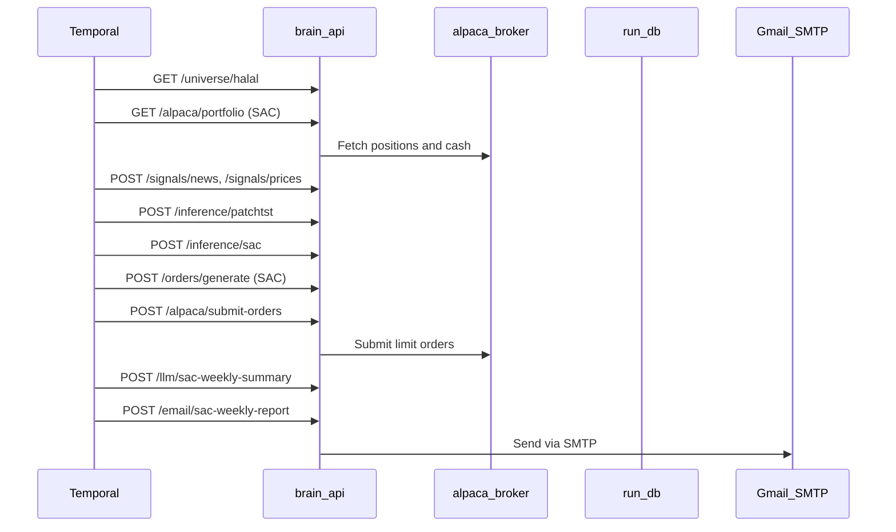
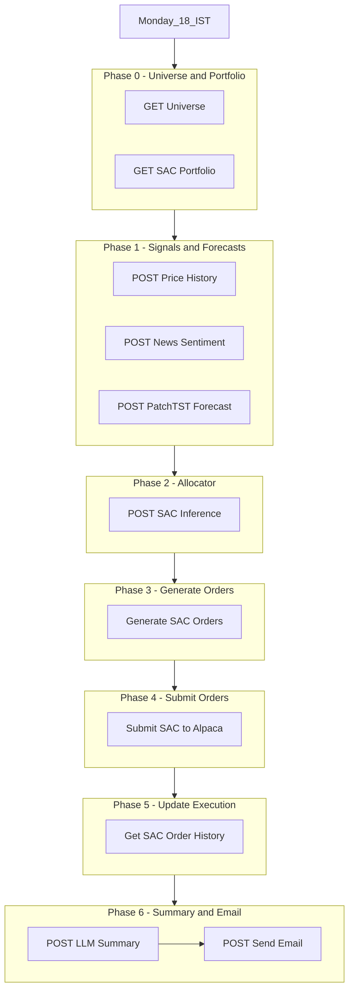
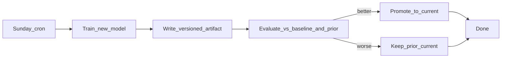

# LearnFinance-2025

A **learning-focused** weekly portfolio system (paper by default, per-account live opt-in) for **halal stocks across US and India markets** (US: 5-ETF halal universe; India: Nifty 500 Shariah). The goal is to **compare multiple approaches side-by-side** — not to pick a single "best" method.

## What it does

Each Monday the system runs independent Temporal workflows that allocate halal portfolios using different strategies. Across the workflows, brain_api owns universe scraping, news and momentum signals, LSTM + PatchTST price forecasters, HRP/SAC/Alpha-HRP/Double-HRP allocators, and per-strategy reports.

### What it does NOT do

- It defaults to paper trading. Per-account live execution is opt-in via env (`ALPACA_{ACCOUNT}_URL` + live keys); safety caps for live are still pending — treat live as a manual smoke test today, not a scheduled production run.
- It is **not** financial advice.

## Architecture

**Components:**

- **Temporal** is the sole orchestrator. Each workflow is registered as its own Temporal schedule (see [temporal/schedules.py](temporal/schedules.py)) and runs independently — there is no fan-out or shared "Monday flow".
- **brain_api** (FastAPI) owns all business logic: universe scraping, signal collection, price forecasting (LSTM + PatchTST, US + India), allocation (HRP, SAC, Alpha-HRP, Double-HRP), Alpaca trading (paper by default, live opt-in), OpenAI/LLM summaries, and Gmail SMTP delivery.
- Storage: local Postgres for run records, local SQLite (`data/allocation/sticky_history.db`, two sibling tables -- `stage1_weight_history` for two-stage HRP strategies on weekly cadence, `screening_history` for single-stage screening strategies on monthly cadence) for sticky-selection history, filesystem for raw evidence + model artifacts.

**Workflows (5 independent schedules):**

| Workflow | Schedule (UTC / IST) | Market | Strategy | Key brain_api endpoints |
|----------|----------------------|--------|----------|-------------------------|
| `us-weekly-allocate` (`USWeeklyAllocationWorkflow`) | Mon 11:00 UTC / 18:00 IST | US | SAC (news + momentum + PatchTST) | `/universe/halal_filtered`, `/alpaca/portfolio`, `/signals/{news,prices}`, `/inference/{patchtst,sac}`, `/orders/generate`, `/alpaca/submit-orders`, `/llm/sac-weekly-summary`, `/email/sac-weekly-report` |
| `us-double-hrp` (`USDoubleHRPWorkflow`) | Mon 11:30 UTC / 17:00 IST | US | Stage-1 HRP on `halal_new` -> sticky top-15 -> Stage-2 HRP | `/universe/halal_new`, `/allocation/hrp`, `/allocation/sticky-top-n`, `/allocation/record-final-weights`, `/llm/us-double-hrp-summary`, `/email/us-double-hrp-report` |
| `us-alpha-hrp` (`USAlphaHRPWorkflow`) | Mon 12:00 UTC / 17:30 IST | US | PatchTST alpha screen -> rank-band sticky top-15 -> HRP | `/universe/halal_new`, `/inference/patchtst/score-batch`, `/allocation/sticky-top-n`, `/allocation/hrp`, `/llm/us-alpha-hrp-summary`, `/email/us-alpha-hrp-report` |
| `india-weekly-allocate` (`IndiaWeeklyAllocationWorkflow`) | Mon 03:30 UTC / 09:00 IST | India | PatchTST alpha screen -> rank-band sticky top-15 -> HRP (paper-only, no broker) | `/universe/nifty_shariah_500`, `/inference/patchtst/score-batch?market=india`, `/allocation/sticky-top-n`, `/allocation/hrp`, `/llm/india-alpha-hrp-summary`, `/email/india-alpha-hrp-report` |
| `india-double-hrp` (`IndiaDoubleHRPWorkflow`) | Mon 04:00 UTC / 09:30 IST | India | Stage-1 HRP on `nifty_shariah_500` -> sticky top-15 -> Stage-2 HRP | `/universe/nifty_shariah_500`, `/allocation/hrp`, `/allocation/sticky-top-n`, `/allocation/record-final-weights`, `/llm/india-double-hrp-summary`, `/email/india-double-hrp-report` |

Training schedules (US Forecasters training Saturday 11:00 UTC, US SAC training Sunday 14:00 UTC — kept 12+ hours apart so the host never has to run two trainers concurrently — and India PatchTST weekly training Sunday 04:30 UTC) are defined in `schedules.py` but are intentionally not registered on the default (Raspberry Pi) host — they require a beefier machine.

## Model hierarchy

This repo compares multiple approaches at each stage:

### Price Forecasters (direct 5-day daily returns)

| Model | Input | Output | Status |
|-------|-------|--------|--------|
| LSTM | OHLCV only (pure price) | 5 daily close log returns | ✅ Active |
| PatchTST | OHLCV 5-channel (open, high, low, close, volume) | 5 daily close log returns | ✅ Active |

### Portfolio Allocators (decide weights)

| Model | Input | Status |
|-------|-------|--------|
| HRP | Covariance matrix | ✅ Active |
| ~~PPO~~ | ~~Legacy state vector~~ | Retired |
| SAC v3 | 30-slot masked token state + PatchTST/HMM features | ✅ Active |

> **Note:** After 3 months of paper-trading experimentation, HRP and SAC consistently outperformed PPO. PPO has been retired from the codebase.

### Signals

| Signal | Status | Endpoint |
|--------|--------|----------|
| News sentiment (FinBERT) | ✅ Active | `/signals/news` |
| News sentiment (historical) | ✅ Active | `/signals/news/historical` |
| Price momentum (1w, 4w, 12-1) | ✅ Active | `/signals/prices` |
| Twitter/Social sentiment | 🔜 To build | — |

### SAC v3 token state

The fixed 245-value carrier contains `asset_features[30,7]`, five globals,
and an auxiliary `asset_mask[30]`; the action is always 30 stock slots plus
CASH. Valid assets use exact cross-sectional ranks:

| Feature | Source |
|---------|--------|
| PatchTST weekly return | `/inference/patchtst` |
| Momentum 1w / 4w / 12-1 | adjusted closes from `/signals/prices` |
| News sentiment | `/signals/news` (FinBERT) |
| Realized volatility 20d | adjusted closes from `/signals/prices` |
| Current weight | portfolio state (unscaled) |

Globals are raw PatchTST median/fraction-positive, causal three-state HMM
calm/stress probabilities from SPY/VIX, and cash weight. Pads are excluded from
attention, actions, entropy, critics, rewards, and costs. Production requires
at least 10 eligible assets. There are no SAC feature flags or legacy artifact
fallbacks.

**Key distinction:**
- **LSTM** = pure price forecaster (close log returns only, direct 5-day prediction)
- **PatchTST** = OHLCV forecaster (5-channel log returns, direct 5-day prediction)
- **SAC** = RL allocator (receives five news/momentum signals + PatchTST return forecast)

## Prerequisites

- **Docker & Docker Compose** (for Postgres)
- **Python 3.11+** with `uv` package manager
- **Temporal CLI** (for workflow orchestration)
- Gmail app password (for email notifications)
- Alpaca trading accounts (paper required; live optional per account)

## Quick Start

### 1. Start infrastructure

```bash
docker compose up -d
```

This starts:
- brain-api at http://localhost:8000
- Temporal server at port 7233 (UI at port 8233)
- Temporal worker (polls for workflows)

**Raspberry Pi production stack only:** brain-api persists `data/` on the host so rebuilds do not wipe experience, HRP sticky history, IBKR order dedup, or audit snapshots. One-time on the Pi:

```bash
mkdir -p ~/learnfinance/brain-data && chmod 777 ~/learnfinance/brain-data
```

In `brain_api/.env` on the Pi, set `STORAGE_BACKEND=hf_first` and configure `HF_TOKEN` plus the per-bucket model repos (see `brain_api/.env.example`). Training on the Mac pushes artifacts to Hugging Face; the Pi pulls them on demand—**you do not need to rebuild the image to ship new model versions**, only for code changes. Override the mount path with `BRAIN_DATA_DIR` if your Pi user's home directory differs.

### 2. Start Brain API

```bash
cd brain_api
cp .env.example .env
# Edit .env with your credentials (see below)
uv sync --extra dev
uv run uvicorn brain_api.main:app --reload --host 0.0.0.0 --port 8000
```

API available at http://localhost:8000 (docs at `/docs`)

### 3. Configure credentials in brain_api/.env

The brain_api handles all external integrations. Configure these environment variables:

**Gmail (for email notifications):**
```bash
GMAIL_USER=your-email@gmail.com
GMAIL_APP_PASSWORD=your-app-password
```

To get a Gmail app password:
1. Go to [Google Account Security](https://myaccount.google.com/security)
2. Enable 2-Step Verification if not already enabled
3. Go to **App passwords** → Generate a new app password for "Mail"
4. Copy the 16-character password (no spaces)

**Alpaca trading (for order execution; paper by default):**
```bash
# SAC account
ALPACA_SAC_KEY=your-sac-api-key
ALPACA_SAC_SECRET=your-sac-api-secret

# HRP account
ALPACA_HRP_KEY=your-hrp-api-key
ALPACA_HRP_SECRET=your-hrp-api-secret
```

Create 2 paper trading accounts at [Alpaca](https://alpaca.markets/) and get API keys from each dashboard. To flip an account to live later, also set `ALPACA_{ACCOUNT}_URL=https://api.alpaca.markets` and use that account's live key/secret.

| Account | Algorithm | Description |
|---------|-----------|-------------|
| SAC | SAC | Off-policy RL with PatchTST forecast features |
| HRP | Alpha-HRP | PatchTST alpha screen on `halal_new` -> rank-band sticky top 15 -> HRP (replaces retired naive HRP allocator on the same `hrp` Alpaca account) |

**OpenAI (for LLM summaries):**
```bash
OPENAI_API_KEY=your-openai-api-key
```

### 4. Start Temporal dev server

```bash
devbox run temporal:server
```

### 5. Start Temporal worker

Workers are split by role into two task queues: `learnfinance-inference` (weekly allocation / HRP workflows) and `learnfinance-training` (monthly training workflows). On a single-host dev setup you start whichever you need in a separate terminal:

```bash
# Allocation / HRP workflows -- default concurrency (10).
devbox run temporal:worker:inference

# Monthly training workflows -- concurrency capped to 1 so heavy
# trainings are serialized. Only needed when you want training slots
# to actually execute.
devbox run temporal:worker:training
```

You can run both at the same time (in two terminals) if you want the same laptop to handle both roles.

On a split Pi + Mac deployment (Pi runs the Temporal server + inference worker via `docker compose`; Mac runs training), set `TEMPORAL_ADDRESS=<pi-host>:7233` on the Mac before starting the training worker so it connects to the Pi's server. LAN or Tailscale is fine; the Temporal dev server has no auth, so do not expose `7233` publicly.

### 6. Run a workflow manually

Each manual script targets the task queue its workflow is registered on. You need the matching worker running (inference or training) before the workflow will execute.

```bash
# Allocation workflows -- require temporal:worker:inference up.
devbox run temporal:run:us-sac-weekly
devbox run temporal:run:india-alpha-hrp
devbox run temporal:run:india-double-hrp
devbox run temporal:run:us-double-hrp
devbox run temporal:run:us-alpha-hrp

# Training workflows -- require temporal:worker:training up.
devbox run temporal:run:us-forecasters-training
devbox run temporal:run:us-sac-training
devbox run temporal:run:india-training
```

## Weekly workflow setup

The Temporal workflow runs every Monday at 18:00 IST.

### Register the schedule

```bash
devbox run temporal:schedule
```

### Workflow flow (US SAC weekly workflow)

The diagram below is specific to the `us-weekly-allocate` (SAC) workflow. The other four workflows (US Alpha-HRP, US Double-HRP, India Alpha-HRP, India Double-HRP) follow analogous shapes but hit different brain_api endpoints — see the workflow table above and the workflow source under [temporal/workflows/](temporal/workflows/).


```mermaid
sequenceDiagram
  participant Temporal as Temporal
  participant Brain as brain_api
  participant Alpaca as alpaca_broker
  participant DB as run_db
  participant Email as Gmail_SMTP

  Temporal->>Brain: GET /universe/halal
  Temporal->>Brain: GET /alpaca/portfolio (SAC)
  Brain->>Alpaca: Fetch positions and cash
  Temporal->>Brain: POST /signals/news, /signals/prices
  Temporal->>Brain: POST /inference/patchtst
  Temporal->>Brain: POST /inference/sac
  Temporal->>Brain: POST /orders/generate (SAC)
  Temporal->>Brain: POST /alpaca/submit-orders
  Brain->>Alpaca: Submit limit orders
  Temporal->>Brain: POST /llm/sac-weekly-summary
  Temporal->>Brain: POST /email/sac-weekly-report
  Brain->>Email: Send via SMTP
```

### 7-Phase execution architecture (US SAC weekly workflow)

This 7-phase shape applies to the SAC US workflow only. LSTM training/inference and all HRP strategies run in separate workflows. The Temporal workflow executes in 7 phases with parallel tasks where possible:


```mermaid
flowchart TD
    Trigger[Monday_18_IST] --> Phase0

    subgraph Phase0[Phase 0 - Universe and Portfolio]
        GetUniverse[GET Universe]
        GetSAC[GET SAC Portfolio]
    end

    Phase0 --> Phase1

    subgraph Phase1[Phase 1 - Signals and Forecasts]
        Prices[POST Price History]
        NewsSentiment[POST News Sentiment]
        PatchTSTForecast[POST PatchTST Forecast]
    end

    Phase1 --> Phase2

    subgraph Phase2[Phase 2 - Allocator]
        SAC[POST SAC Inference]
    end

    Phase2 --> Phase3

    subgraph Phase3[Phase 3 - Generate Orders]
        OrdersSAC[Generate SAC Orders]
    end

    Phase3 --> Phase4

    subgraph Phase4[Phase 4 - Submit Orders]
        SubmitSAC[Submit SAC to Alpaca]
    end

    Phase4 --> Phase5

    subgraph Phase5[Phase 5 - Update Execution]
        HistorySAC[Get SAC Order History]
    end

    Phase5 --> Phase6

    subgraph Phase6[Phase 6 - Summary and Email]
        Summary[POST LLM Summary]
        Summary --> SendEmail[POST Send Email]
    end
```

**Skip logic:** Algorithms are skipped if they have open orders from a previous run (prevents duplicate submissions).

### Environment variables

```bash
# Brain API URL (for Temporal to call)
BRAIN_API_URL=http://localhost:8000

# Universe selection for ETL is now per-request (no env var). Each
# call to /etl/* takes a {"universe": "..."} body validated against the
# in-process registry in brain_api/etl/universe_registry.py.

# Per-bucket HuggingFace repos. Each (model, universe) bucket has its
# own repo so two parallel A/B workflows can promote independently.
HF_LSTM_HALAL_NEW_MODEL_REPO=hajirazin/learnfinance-models-lstm
HF_PATCHTST_HALAL_NEW_MODEL_REPO=hajirazin/learnfinance-models-patchtst
HF_PATCHTST_NIFTY_SHARIAH_500_MODEL_REPO=hajirazin/learnfinance-models-patchtst-india
HF_SAC_HALAL_FILTERED_MODEL_REPO=hajirazin/learnfinance-models-sac-halal-filtered
HF_SAC_HALAL_MODEL_REPO=hajirazin/learnfinance-models-sac-halal
```

Forecaster / SAC universe selection is no longer env-driven. Training
endpoints take `{"universe": "<name>"}` in the request body and resolve
symbols + storage via the per-bucket registry in
[brain_api/brain_api/core/model_buckets.py](brain_api/brain_api/core/model_buckets.py).
This is what lets two Temporal workflows hit `/train/sac/full` with
different universes in parallel without colliding.

### Parallel SAC A/B (sac_halal_filtered vs sac_halal)

Two SAC training workflows run on a Sunday cron, on different universes,
to compare which slate produces a better allocator:

- `USSACTrainingWorkflow` (Sunday 02:00 UTC) trains SAC on
  `halal_filtered` (sticky top-15 from PatchTST scores; `n_stocks=15`
  fixed by the bucket validator). Bucket: `sac_halal_filtered`, HF repo
  `HF_SAC_HALAL_FILTERED_MODEL_REPO`.
- `USSACHalalTrainingWorkflow` (Sunday 13:00 UTC, 11 hours later so the
  two trainers never overlap on the single-host laptop) trains SAC on
  the legacy yfinance `halal` universe (ETF top-holdings of SPUS / HLAL
  / SPTE; variable size, typical 12-15 names). Bucket: `sac_halal`, HF
  repo `HF_SAC_HALAL_MODEL_REPO`. SAC's `n_stocks` and `target_entropy`
  are resized at training time from the resolved slate via
  `make_sac_config_for_n_stocks`.

Each bucket has an independent `current` pointer; promoting one MUST
NOT touch the other. `/inference/sac` requires an explicit `universe`
query param (`halal_filtered` or `halal`) so the two A/B paths cannot
share state.

## Key design decisions

### Contribution principles (math vs. reuse)

- Math correctness is the highest priority. Never break math to simplify code.
- DRY, DDD, and clean code are also important -- factor out genuinely shared logic.
- When two algorithms have research-driven math differences, keep their math separate even if the surface code looks similar (we previously broke PPO's math by over-sharing with SAC).
- See [AGENTS.md](AGENTS.md#ai-assistant-behavioral-rules) for the full rule.

### Paper by default, per-account live opt-in

- **Paper is the default.** All Alpaca accounts hit `paper-api.alpaca.markets` unless explicitly overridden.
- **Live opt-in is per account, env-driven.** Set 3 env vars on the brain_api process to flip a single account live:

  ```bash
  ALPACA_SAC_URL=https://api.alpaca.markets
  ALPACA_SAC_KEY=<live key>
  ALPACA_SAC_SECRET=<live secret>
  ```

  Restart brain_api. Revert by clearing the URL (or pointing it back at the paper host) and restoring paper key/secret. HRP and DHRP stay on paper unless their own URL+keys are also flipped.
- **Audit prefix is cosmetic.** `run_id` and `client_order_id` always start with `paper:` — this is a static audit-string label and does not reflect the actual Alpaca host. Use the Alpaca dashboard or env inspection to confirm which broker a run actually hit.
- **Live still has open safety gaps:** market orders (not limit), no max turnover/order cap in `/orders/generate`, no DB pre-submit dedup in `/alpaca/submit-orders`, 48h sells-stuck auto-buy fallback in the sell-wait-buy loop. Treat live as a manual smoke test only; do not register live schedules in production until these are closed.

### Run identity & rerun behavior

- **Run date** is the Monday date in IST, e.g. `2025-12-29`.
- **Run ID**: `paper:YYYY-MM-DD` (example: `paper:2025-12-29`).
- **Attempt**: integer starting at `1`.

**Rerun is read-only** if the latest attempt has any order that is not canceled/expired/rejected.

If you manually cancel all active orders in Alpaca, the next run can create **attempt=2** and submit new orders.

### Order idempotency (no accidental duplicates)

Every order uses a deterministic `client_order_id`:

- `paper:YYYY-MM-DD:attempt-<N>:<SYMBOL>:<SIDE>`
- Example: `paper:2025-12-29:attempt-1:AAPL:BUY`

The `paper:` literal is a static audit-string prefix; it does NOT reflect the actual Alpaca host being used. To check whether a run hit live, inspect `ALPACA_{ACCOUNT}_URL` env at run time or the Alpaca dashboard.

On submit:

- If an order with the same `client_order_id` was already submitted, reruns **do not** submit again.
- We also query Alpaca by `client_order_id` as a secondary guardrail.

### Broker and Currency Mappings

The system orchestrates trading across multiple markets and brokers. Each broker has a defined base currency:

- **Alpaca**: US market only. Base currency is **USD**.
- **IBKR**: Multi-currency account, primarily used for the US market in this system. Base currency is **USD**. (The system dynamically detects cash balances via account tags and asks IBKR for Forex conversion rates if needed).
- **AngelOne** (Upcoming): Indian market. Base currency will be **INR**.

### Universe types

The system maintains five universe tiers — two base universes (raw scrapes), two PatchTST top-15 universes derived from them, and the original yfinance halal universe kept for backwards compatibility:

| Universe | Size | Pipeline | Purpose |
|----------|------|----------|---------|
| `halal` | ~14 stocks | yfinance top holdings of SPUS, HLAL, SPTE | Original small universe (legacy) |
| `halal_new` | ~400 stocks (varies monthly; e.g. 410 in Mar 2026, 398 in Apr 2026) | Scrape **all** holdings of 5 halal ETFs (SPUS, SPTE, SPWO from sp-funds.com; HLAL, UMMA from Wahed), merge + dedupe, then keep only Alpaca-tradable symbols (and append the 5 ETFs themselves) | US base universe |
| `halal_filtered` | 15 stocks | `halal_new` -> drop symbols with < ~10 years of price history (`compute_min_walkforward_days`, derived from `LSTM_TRAIN_LOOKBACK_YEARS=10`) -> US PatchTST batch inference -> rank-band sticky selection (`K_in=15`, `K_hold=30`, partition `halal_filtered_alpha` in `screening_history`). **Monthly cache cadence**; cold-start (no prior month) is byte-equivalent to the legacy blanket top-15. | Default US universe for training, allocation, and SAC features |
| `nifty_shariah_500` | ~210 stocks | Scrape full Nifty 500 Shariah constituents from NSE India; symbols carry `.NS` suffix end-to-end | India base universe |
| `halal_india` | 15 stocks | `nifty_shariah_500` -> same min-history filter (~10 years) -> India PatchTST batch inference (`PatchTSTIndiaModelStorage`) -> rank-band sticky selection (`K_in=15`, `K_hold=30`, partition `halal_india_filtered_alpha` in `screening_history`). **Monthly cache cadence**; cold-start (no prior month) is byte-equivalent to the legacy blanket top-15. `.NS` suffix preserved end-to-end. | Default India universe |

Notes:

- **No factor scoring is used.** Both `halal_filtered` (US) and `halal_india` (India) are produced by PatchTST predicted weekly return + rank-band sticky selection (after a min-history filter), in distinct partitions (`halal_filtered_alpha` and `halal_india_filtered_alpha`) of the `screening_history` table. There is no momentum/quality/value blend, no ROE/Beta/SMA rule.
- SAC resizes `n_stocks` from its universe at training time. The `halal_filtered` bucket is fixed at 15 stocks, while the parallel `halal` bucket uses its variable legacy slate (typically 12-15 stocks).
- After top-15 selection, PatchTST runs **again** on those 15 symbols to produce SAC's per-stock forecast feature. LSTM remains a standalone forecaster and is not an SAC input.
- Results are cached monthly (one fetch per calendar month) to avoid redundant external API calls. Cache files live under `brain_api/data/cache/universe/<name>_YYYY-MM.json`.

### RL reward design

SAC uses a **blended reward** combining portfolio return with a DifferentialSharpe ratio (Moody & Saffell 2001):

`reward = sharpe_weight * DSR + (1 - sharpe_weight) * return_reward`

The return component is `log(1 + r) - log(1 + tc)` (log-space, so subtracting cost is unit-consistent with log return).

Transaction cost `tc` is the per-symbol per-leg **IBKR Singapore Tiered** schedule (see [brain_api/brain_api/core/portfolio_rl/broker_costs.py](brain_api/brain_api/core/portfolio_rl/broker_costs.py)):

- **Commission**: USD 0.0035 / share, min USD 0.35 / order, max 1% of trade value
- **Sell-side regulatory**: SEC 0.0000206 × sale notional + FINRA TAF 0.000195 × shares (capped at USD 9.27)
- **Both sides**: NSCC/DTC clearing 0.00020 × shares + FINRA CAT 0.000033 × shares
- **Pass-through**: NYSE + FINRA fees on commission

Calibration anchor: USD 10,000 NAV (the cost is sized against this assumed portfolio value to make the per-order minimum bite realistically). At that scale a 30%-turnover rebalance comes out around **1.5-3 bps round-trip** -- the per-order minimum binds because typical legs are only a few shares of a $200 stock. Deliberately out of scope: FX (SGD↔USD), US dividend WHT, IBKR account fees.

### Limit orders + fractional sizing

- Default order type: **limit orders**
- Sizing: **fractional shares when supported**
- Limit pricing uses a configurable buffer from last price/quote

### Safety caps (recommended defaults)

Enforce hard limits regardless of paper or live (config):

- Max turnover (% of portfolio value traded)
- Max number of orders
- Max position size (% of portfolio)
- Minimum cash buffer
- Blocklist/allowlist overrides

## Data storage

We store three kinds of data:

- **Run DB (local Postgres via Docker)**:
  - runs (run_id, attempt, timestamps, config_hash, status)
  - universe & screening decisions
  - signals/features (as-of timestamps)
  - trade plan + explanations
  - orders (client_order_id, alpaca_order_id, status)
- **Raw evidence store (filesystem)**:
  - `data/raw/<run_id>/<attempt>/<source>/<symbol>.json`
- **Derived feature snapshots**:
  - `data/features/<run_id>/<attempt>/...`

## API overview

### Inference endpoints

| Endpoint | Purpose |
|----------|---------|
| `POST /inference/lstm` | LSTM 5-day return predictions (US, pure price OHLCV-close) |
| `POST /inference/patchtst` | PatchTST 5-day return predictions (US, OHLCV 5-channel) |
| `POST /inference/patchtst/india` | PatchTST 5-day return predictions (India, OHLCV 5-channel, `PatchTSTIndiaModelStorage`) |
| `POST /inference/patchtst/score-batch` | Batch PatchTST alpha screen (US or India via `market` param) -> `{symbol -> predicted_weekly_return_pct}` |
| ~~`POST /inference/ppo`~~ | ~~PPO allocation (dual LSTM + PatchTST forecasts)~~ (Retired) |
| `POST /inference/sac` | SAC allocation (PatchTST forecasts on the chosen stock slate) |
| `POST /allocation/hrp` | HRP risk-parity allocation (requires `universe` param) |
| `POST /allocation/sticky-top-n` | Persist Stage 1 weights and select top-N with rank-band sticky retention |
| `POST /allocation/record-final-weights` | Record Stage 2 final weights for the just-completed week |

### Order generation endpoints

| Endpoint | Purpose |
|----------|---------|
| `POST /orders/generate` | Convert allocation weights to limit orders |

### Signal endpoints

| Endpoint | Purpose |
|----------|---------|
| `POST /signals/news` | News sentiment (FinBERT, real-time) |
| `POST /signals/news/historical` | News sentiment (historical) |
| `POST /signals/prices` | Adjusted closes and execution prices for SAC v3 |
| `POST /signals/market-history` | Post-cutoff SPY/VIX rows for the causal HMM |

### Training endpoints

| Endpoint | Purpose | Trigger |
|----------|---------|---------|
| `POST /train/lstm` | Full LSTM retrain (US) | Monthly (manual) |
| `POST /train/patchtst` | Full PatchTST retrain (US) | Monthly (manual) |
| `POST /train/patchtst/india` | Full PatchTST retrain (India NiftyShariah500) | Weekly (cron, beefier host only) |
| ~~`POST /train/ppo/full`~~ | ~~Full PPO retrain~~ | ~~Monthly (manual)~~ |
| ~~`POST /train/ppo/finetune`~~ | ~~PPO fine-tune on experience buffer~~ | ~~Weekly (cron)~~ |
| `POST /train/sac/full` | Full SAC retrain (PatchTST-only forecasts) | Monthly (manual) |

### LLM endpoints

| Endpoint | Purpose |
|----------|---------|
| `POST /llm/sac-weekly-summary` | Generate AI summary of the SAC-only weekly run (US) |
| `POST /llm/us-alpha-hrp-summary` | Generate AI summary of US Alpha-HRP (PatchTST alpha screen + rank-band sticky + HRP) |
| `POST /llm/us-double-hrp-summary` | Generate AI summary of US Double HRP (`halal_new` + sticky selection) |
| `POST /llm/india-alpha-hrp-summary` | Generate AI summary of India Alpha-HRP (PatchTST top-15 alpha screen + HRP) |
| `POST /llm/india-double-hrp-summary` | Generate AI summary of India two-stage HRP allocation |
| `POST /llm/india-training-summary` | Generate AI summary of India PatchTST training results |
| `POST /llm/forecasters-training-summary` | Generate AI summary of US LSTM + PatchTST training (called by `USForecastersTrainingWorkflow`) |
| `POST /llm/sac-training-summary` | Generate AI summary of US SAC training (called by `USSACTrainingWorkflow`) |

### Email endpoints

| Endpoint | Purpose |
|----------|---------|
| `POST /email/sac-weekly-report` | Send the SAC-only weekly portfolio analysis email via Gmail SMTP (US) |
| `POST /email/us-alpha-hrp-report` | Send US Alpha-HRP report email (alpha screen + sticky + HRP + Alpaca order execution) |
| `POST /email/us-double-hrp-report` | Send US Double HRP report (Stage 1 + Stage 2 + Alpaca order results + sticky stats) |
| `POST /email/india-alpha-hrp-report` | Send India Alpha-HRP report email (paper-only, no broker) via Gmail SMTP |
| `POST /email/india-double-hrp-report` | Send India Double HRP report (Stage 1 + Stage 2 + AI summary) |
| `POST /email/india-training-summary` | Send India training summary email via Gmail SMTP |
| `POST /email/forecasters-training-summary` | Send US Forecasters (LSTM + PatchTST) training summary email via Gmail SMTP |
| `POST /email/sac-training-summary` | Send US SAC training summary email via Gmail SMTP |

### Alpaca endpoints

| Endpoint | Purpose |
|----------|---------|
| `GET /alpaca/portfolio` | Get account positions, cash, and open orders count |
| `POST /alpaca/submit-orders` | Submit orders to Alpaca (paper by default; live when `ALPACA_{ACCOUNT}_URL` is set) |
| `GET /alpaca/order-history` | Get order execution history |

### Universe endpoints

| Endpoint | Purpose |
|----------|---------|
| `GET /universe/halal` | Legacy halal universe (~14 stocks from yfinance top holdings of SPUS/HLAL/SPTE) |
| `GET /universe/halal_new` | US base universe (~400 stocks; full holdings of 5 halal ETFs filtered to Alpaca-tradable) |
| `GET /universe/halal_filtered` | Top 15 from `halal_new` (~10y min history filter + US PatchTST predicted weekly return + rank-band sticky selection, monthly cache) |
| `GET /universe/nifty_shariah_500` | India base universe (~210 stocks, full Nifty 500 Shariah constituents, `.NS`-suffixed) |
| `GET /universe/halal_india` | Top 15 from `nifty_shariah_500` (~10y min history filter + India PatchTST predicted weekly return + rank-band sticky selection, monthly cache, `.NS`-suffixed) |

### ETL endpoints

| Endpoint | Purpose |
|----------|---------|
| `POST /etl/news-sentiment` | ETL pipeline for news sentiment |
| `GET /etl/news-sentiment/jobs` | List ETL jobs |
| `GET /etl/news-sentiment/{job_id}` | Get ETL job status |
| `POST /etl/sentiment-gaps` | Gap detection and backfill |
| `GET /etl/sentiment-gaps/{job_id}` | Get gap-fill job status |

### Experience endpoints

| Endpoint | Purpose |
|----------|---------|
| `POST /experience/store` | Store RL experience |
| `POST /experience/update-execution` | Update experience with execution results |
| `POST /experience/label` | Label experience with rewards |
| ~~`POST /experience/label/ppo`~~ | ~~Label PPO experience with rewards~~ |
| `POST /experience/label/sac` | Label SAC experience with rewards (routes per-record by `universe`: `halal_filtered` -> `sac` account, `halal` -> `sac_halal` account) |
| `GET /experience/list` | List stored experiences |

### Other endpoints

| Endpoint | Purpose |
|----------|---------|
| `GET /health`, `/health/live`, `/health/ready` | Health checks |

### Request/response examples

**LSTM inference (5-day direct prediction):**

```json
// POST /inference/lstm
// Request
{ "symbols": ["AAPL", "MSFT"], "as_of_date": "2025-12-29" }

// Response
{
  "predictions": [
    {
      "symbol": "AAPL",
      "daily_returns": [0.003, 0.005, -0.001, 0.004, 0.002],
      "direction": "UP",
      "has_enough_history": true,
      "history_days_used": 252,
      "data_end_date": "2025-12-26",
      "target_week_start": "2025-12-29",
      "target_week_end": "2026-01-02"
    }
  ],
  "model_version": "v2026-01-09-a4fecab1bdcc",
  "as_of_date": "2025-12-29",
  "target_week_start": "2025-12-29",
  "target_week_end": "2026-01-02"
}
```

## Model lifecycle

Monday inference runs **do not retrain** models. Training happens separately.

### Training schedule

| When | What | Trigger |
|------|------|---------|
| Monthly (Saturday) | Full retrain all US models (LSTM, PatchTST, SAC) | Manual |
| Monthly (first Sunday) | Full SAC retrain (US; `halal_filtered` then `halal`) | Cron (Temporal, training queue) |
| Weekly (Sunday 04:30 UTC / 10:00 IST) | Full PatchTST retrain (India NiftyShariah500) | Cron (Temporal, beefier host only) |
| Monday (multiple slots Mon 03:30 - 12:00 UTC) | Inference + allocation across 5 workflows | Cron (Temporal) |

### Training workflow


```mermaid
flowchart LR
  trigger[Sunday_cron] --> train[Train_new_model]
  train --> version[Write_versioned_artifact]
  version --> eval[Evaluate_vs_baseline_and_prior]
  eval -->|better| promote[Promote_to_current]
  eval -->|worse| keep[Keep_prior_current]
  promote --> done[Done]
  keep --> done
```

### Model artifacts

Models produce **versioned artifact files** stored under `data/models/`:

```
data/models/
├── lstm/
│   ├── v2026-01-09-a4fecab1bdcc/   # versioned artifact (date + config hash)
│   │   ├── weights.pt              # model weights (PyTorch)
│   │   ├── feature_scaler.pkl      # feature scaler/normalizer
│   │   ├── config.json             # hyperparams, feature schema
│   │   └── metadata.json           # training date, data window, metrics
│   ├── snapshot-2025-12-31/        # point-in-time snapshots
│   └── current                     # text file with active version string
├── patchtst/                       # US PatchTST artifacts (same structure as lstm/)
└── patchtst_india/                 # India PatchTST artifacts (independent current pointer)
```

`patchtst/` and `patchtst_india/` are independently versioned — promoting a new India PatchTST does not touch the US `current` pointer.

**What's in a model artifact:**

| File | Purpose |
|------|---------|
| `weights.pt` | Trained parameters |
| `feature_scaler.pkl` | Preprocessing transforms fitted on training data |
| `config.json` | Hyperparameters, feature list, model architecture |
| `metadata.json` | Training timestamp, data window, git commit, eval metrics |

### How inference loads models

1. Read `data/models/lstm/current` to get the active version string
2. Load artifacts from `data/models/lstm/<version>/`

This means you can:

- **Roll back** by changing the `current` pointer
- **A/B test** by loading a different version
- **Audit** by inspecting exactly which version was used

### RL experience collection

After each Monday run, store the experience tuple:

- State: features/signals at decision time
- Action: portfolio weights chosen
- Reward: computed later (next-week return minus turnover cost)

Save to: `data/experience/<run_id>.json`

### Promotion guardrails

- **Evaluation gate**: new artifact must pass model-specific health checks (finite metrics, artifact integrity; SAC also requires eval CAGR above floor and symbol-count match)
- **Rollback**: keep last known-good version; promotion is atomic pointer swap
- **No HF cold-start fallback**: HuggingFace `make_current` follows `promoted` only

## Cloud migration

The API is designed so each endpoint can become a standalone **Google Cloud Function** or be backed by **HuggingFace Hub** for model storage.

### Storage abstraction

```
┌─────────────────────────────────────────────────────────────┐
│  FastAPI endpoint (local)  OR  Cloud Function (later)       │
│  • Validates request                                        │
│  • Calls core function                                      │
│  • Returns JSON response                                    │
└─────────────────────────────────────────────────────────────┘
                              │
                              ▼
┌─────────────────────────────────────────────────────────────┐
│  Core function (pure Python, no framework dependency)       │
│  • lstm_inference(features, model_path) → predictions       │
│  • sac_inference(state, policy_path) → allocation           │
└─────────────────────────────────────────────────────────────┘
                              │
                              ▼
┌─────────────────────────────────────────────────────────────┐
│  Storage abstraction                                        │
│  • LocalStorage: reads/writes data/models/...               │
│  • HuggingFaceStorage: reads/writes to HuggingFace Hub      │
└─────────────────────────────────────────────────────────────┘
```

### Migration steps

1. Extract endpoint handler → standalone `main.py` with `def handler(request):`
2. Swap `LocalStorage` → `HuggingFaceStorage` via environment variable
3. Deploy: `gcloud functions deploy <name> --runtime python311 --trigger-http`
4. Update `BRAIN_API_URL` in Temporal to call Cloud Function URL instead of local FastAPI

## Code structure

```
brain_api/brain_api/
├── main.py
├── routes/
│   ├── inference/            # lstm.py, patchtst.py, sac.py
│   ├── training/             # lstm.py, patchtst.py, sac.py
│   ├── signals/              # endpoints.py
│   ├── email/                # weekly_report.py, training_summary.py
│   ├── llm/                  # weekly_summary.py, training_summary.py
│   ├── pipelines/            # inference.py, training.py
│   ├── allocation.py         # HRP
│   ├── alpaca.py
│   ├── experience.py
│   ├── etl.py
│   ├── orders.py
│   ├── universe.py
│   └── health.py
├── core/
│   ├── lstm/                 # model, dataset, inference, training
│   ├── patchtst/             # dataset, data_loaders, inference, training
│   ├── sac/                  # training, inference
│   ├── portfolio_rl/         # env, rewards, state, constraints, scaler, sac_networks
│   ├── news_sentiment/       # processor, fetcher, aggregation, persistence
│   ├── hrp.py
│   ├── orders.py
│   ├── alpaca_client.py
│   ├── config.py
│   └── ...
├── storage/
│   ├── base.py               # abstract Storage class
│   ├── local.py              # LocalStorage
│   ├── huggingface.py        # HuggingFaceStorage (swap via env var)
│   ├── lstm/                 # local.py, huggingface.py
│   ├── patchtst/
│   ├── sac/
│   ├── datasets/
│   └── forecaster_snapshots/
├── universe/                  # halal.py, halal_new.py, halal_filtered.py, nifty_shariah_500.py, halal_india.py, scrapers/ (incl. nse.py)
├── etl/                       # pipeline.py, gap_detection.py, gap_fill.py, dataset.py
└── templates/                 # Jinja2 templates for LLM prompts and emails
```

## Repo docs

- `README.md`: overview + architecture + setup
- `AGENTS.md`: working agreement for contributors/AI (coding rules, invariants, testing policy)

## License

See `LICENSE`.
