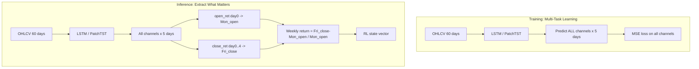

# 5-Day Direct Multi-Channel Forecast + RL Bug Fixes

> **Status:** LSTM phase implemented (close-only). PatchTST phase implemented (5-channel OHLCV multi-task). RL phases still planned.
>
> **Scope:** Change LSTM and PatchTST from 1-day autoregressive prediction to direct 5-day
> prediction. Fix pre-existing bugs across forecasters,
> SAC actor, RL reward, gamma, and experience storage. Drop volatility from the RL state vector.
>
> **LSTM implementation notes (deviations from original plan):**
> - LSTM uses **close-only** targets (5 values), NOT multi-channel OHLCV (25 values). Research shows close-only is more proven; multi-channel risks negative transfer.
> - Holiday handling: **no calendar logic**. Targets are always the next 5 rows in `features_df` (trading days by definition). No zero-padding, no position mapping.
> - 3 additional bugs fixed: inverse-transform (Bug #1), off-by-one alignment (Bug #2), no gradient clipping (Bug #3).
> - Early stopping added to training loop.
> - `predicted_volatility` kept (for RL interface compat), computed as `std(5 daily predictions)`.
> - `daily_returns` field added to inference response (5 close log returns per symbol).

---

## Table of Contents

1. [Why This Change is Validated](#1-why-this-change-is-validated)
2. [Architecture Overview](#2-architecture-overview)
3. [Training Target Construction](#3-training-target-construction)
4. [Inference: Weekly Return from Predicted Channels](#4-inference-weekly-return-from-predicted-channels)
5. [Drop Volatility from RL State](#5-drop-volatility-from-rl-state)
6. [Bugs Fixed by This Plan](#6-bugs-fixed-by-this-plan)
7. [Detailed File-by-File Changes](#7-detailed-file-by-file-changes)
   - [7.1 LSTM Changes](#71-lstm-changes)
   - [7.2 PatchTST Changes](#72-patchtst-changes)
   - [7.3 RL State and Environment Changes](#73-rl-state-and-environment-changes)
   - [7.4 Walkforward Changes](#74-walkforward-changes)
   - [7.5 Forecasters](#75-forecasters)
   - [7.6 SAC Algorithm Fixes](#76-sac-algorithm-fixes)
   - [7.7 Reward Function Fix](#77-reward-function-fix)
   - [7.8 Experience Storage Fix](#78-experience-storage-fix)
8. [Test Changes](#8-test-changes)
   - [8.1 Existing Tests to Update](#81-existing-tests-to-update)
   - [8.2 New Tests to Add](#82-new-tests-to-add)
9. [Endpoint Impact Summary](#9-endpoint-impact-summary)
10. [Risks and Notes](#10-risks-and-notes)
11. [Implementation TODOs](#11-implementation-todos)
12. [Future Improvements](#12-future-improvements)

---

## 1. Why This Change is Validated

**Current approach is flawed.** Both LSTM and PatchTST are trained on 1-day returns but run a 5-step autoregressive loop at inference. Three problems:

- **Error compounding**: Each day's prediction uses the previous prediction as synthetic input. All OHLCV channels are set to the same `close_ret` value (`lstm/inference.py:233-236`). The model was never trained on its own outputs.
- **PatchTST misuse**: PatchTST was designed for multi-horizon forecasting (`prediction_length=N`). Using `prediction_length=1` with autoregression defeats its design.
- **Meaningless volatility**: `std` of 5 serially-correlated autoregressive predictions is not a real volatility signal.

Direct 5-day multi-channel prediction eliminates all three issues and adds multi-task learning as a bonus.

---

## 2. Architecture Overview



**Key data science decisions:**

1. **Multi-task learning during training**: Predicting all OHLCV channels forces richer internal representations. The model learns intraday dynamics (open/close spread), range (high/low), and activity (volume). This is a proven regularizer that improves the primary prediction quality (Caruana 1997, Ruder 2017).
2. **Conservative RL input**: Only pass the weekly return to RL (1 feature per forecaster). Predicted signals are inherently noisier than real signals (news, fundamentals). Adding more derived predicted features (vol, intraday vol, volume trend) risks RL overfitting to forecaster noise.
3. **Mon open to Fri close via predicted channels**: Both models predict standard day-over-day returns for each channel. At inference, reconstruct Mon_open from `open_ret[day0]` and Fri_close from compounded `close_ret[day0..4]`. No special target engineering needed.

---

## 3. Training Target Construction

### LSTM (IMPLEMENTED -- close-only)

**Targets are close-to-close log returns only.** For the 5 next trading days after a week-end anchor:

- `y[i] = log(close[t+i+1] / close[t+i])` for i = 0..4

y shape: `(n_samples, 5)`. Uses `compute_ohlcv_log_returns()` to extract `close_ret` column.

**Samples anchored at last trading day of each week** (detected by gap >= 2 calendar days in the trading date index). Input includes the anchor day's return (Bug #2 fix).

**Holiday handling: none needed.** Targets are always the next 5 rows in `features_df`, which are trading days by definition. Holidays don't appear in the data. The model predicts "next 5 trading day returns" regardless of which calendar days they are. No calendar awareness, no zero-padding, no position mapping. Research consensus (pandas_market_calendars docs, DataCamp LSTM guides, interrupted time series literature) confirms: filter to trading days, skip non-trading days entirely.

### PatchTST (PLANNED -- multi-channel, still per original plan)

**All targets are standard same-series day-over-day returns.** For the 5 next trading days after a Friday anchor:

- `open_ret[i] = (open[day_i] - open[day_{i-1}]) / open[day_{i-1}]`
- `high_ret[i] = (high[day_i] - high[day_{i-1}]) / high[day_{i-1}]`
- `low_ret[i] = (low[day_i] - low[day_{i-1}]) / low[day_{i-1}]`
- `close_ret[i] = (close[day_i] - close[day_{i-1}]) / close[day_{i-1}]`
- `volume_ret[i] = (volume[day_i] - volume[day_{i-1}]) / volume[day_{i-1}]`

(For log returns, use `log(price_t / price_{t-1})` per current `use_returns=True` config.)

---

## 4. Inference: Weekly Return from Predicted Channels

At inference, the model outputs all channels for 5 days. To compute the Mon open to Fri close weekly return:

1. **Reconstruct Mon_open**: `Mon_open = last_known_Fri_open * (1 + predicted_open_ret[first_trading_pos])`
   - `last_known_Fri_open` comes from `InferenceFeatures.starting_open_price` (extracted from raw OHLCV data before cutoff)
   - `first_trading_pos` = 0 for normal weeks, 1 if Monday is a holiday
2. **Reconstruct Fri_close**: `Fri_close = last_known_Fri_close * product(1 + predicted_close_ret[i] for i in 0..last_trading_pos)`
   - Compound close-to-close returns from the last known Friday close
   - `last_trading_pos` = 4 for normal weeks, 3 if Friday is a holiday
3. **Weekly return**: `(Fri_close - Mon_open) / Mon_open`
4. **daily_returns**: The 5 `close_ret` values (uncompounded) included in `SymbolPrediction` response

---

## 5. Drop Volatility from RL State

**Decision: Drop to 1 per forecaster (just weekly return).** Rationale:

- The "volatility" (`std` of 5 predicted returns) measures model prediction spread, not real market volatility
- It was broken at inference anyway (always zeros -- train/inference mismatch bug in `ppo.py` and `sac.py` which never pass volatility params)
- Risk info is already captured by real signals (current_ratio, debt_to_equity, news_sentiment)
- Predicted features are noisy; overfitting RL on noisy predicted signals hurts more than the information helps

**State vector layout change:**

Before (181 dims for 15 stocks):

| Range | Content |
|---|---|
| [0..104] | 15 stocks x 7 signals |
| [105..119] | LSTM return (15) |
| [120..134] | LSTM volatility (15) |
| [135..149] | PatchTST return (15) |
| [150..164] | PatchTST volatility (15) |
| [165..180] | portfolio weights (16) |

After (151 dims for 15 stocks):

| Range | Content |
|---|---|
| [0..104] | 15 stocks x 7 signals (unchanged) |
| [105..119] | LSTM return (15) |
| [120..134] | PatchTST return (15) |
| [135..150] | portfolio weights (16) |

---

## 6. Bugs Fixed by This Plan

This plan fixes **10 pre-existing bugs**, ordered by severity:

| # | Severity | Bug | File(s) | Fix | Status |
|---|---|---|---|---|---|
| 1 | CRITICAL | LSTM inverse-transform applied to already-unscaled model output, compressing predictions ~20x | `lstm/inference.py:210-215`, `walkforward.py:523-527` | Remove inverse-transform for LSTM inference. Model outputs raw log returns (targets never scaled). | **FIXED** |
| 2 | CRITICAL | PatchTST training loss compares scaled model output against unscaled targets | `patchtst/training.py:199`, `patchtst/dataset.py:166-171` | Scale PatchTST targets during dataset construction; keep inverse-transform at inference | Planned |
| 3 | MAJOR | Autoregressive error accumulation -- 5-day loop feeds synthetic features back as input | `lstm/inference.py:195-245`, `patchtst/inference.py:303-374` | Direct 5-day prediction (single forward pass) | **FIXED** (LSTM) |
| 4 | MAJOR | Volatility train/inference mismatch -- ppo/sac inference never pass volatility params, causing zeros | `ppo/inference.py`, `sac/inference.py` | Drop volatility entirely from RL state | Planned |
| 5 | SIGNIFICANT | Off-by-one in dataset alignment. Input ends at position t-1, target starts at t+1. Model trained as 2-step forecaster instead of 1-step. | `lstm/dataset.py:69-74` | Include anchor day's return in input: `features_df.iloc[t-seq_len+1 : t+1]` | **FIXED** |
| 6 | SIGNIFICANT | SAC `* 10.0` scaling makes softmax extremely peaked, fighting entropy maximization | `sac_networks.py:119,127` | Remove `* 10.0`, fix Jacobian correction | Planned |
| 7 | SIGNIFICANT | `gamma=0.99` gives ~1+ year effective horizon for weekly steps (too long) | `config.py:23`, `sac_config.py:24` | `gamma=0.97` (~6-month effective horizon) | Planned |
| 8 | MINOR | No gradient clipping. LSTMs with seq_len=60 are susceptible to exploding gradients. | `lstm/training.py` (missing) | Add `torch.nn.utils.clip_grad_norm_()` before `optimizer.step()` | **FIXED** |
| 9 | MINOR | Reward function subtracts linear transaction cost from log return (different units) | `rewards.py:117` | Use `log(1 + tc)` instead of raw `tc` | Planned |
| 10 | MINOR | Experience storage stores percentage returns instead of documented decimal | `execution.py:186-189` | Divide by 100 | Planned |

---

## 7. Detailed File-by-File Changes

### 7.1 LSTM Changes -- **IMPLEMENTED (close-only)**

> **Deviation from original plan:** LSTM uses close-only targets (5 outputs), NOT multi-channel OHLCV (25 outputs). Research shows close-only is more proven for stock forecasting; multi-channel risks negative transfer without complex loss balancing. `predicted_volatility` kept for RL interface compat.

#### 7.1.1 Config (`brain_api/core/lstm/config.py`) -- DONE

- `forecast_horizon`: 1 -> 5 (direct 5-day prediction)
- `hidden_size`: 64 -> 128 (more capacity for 5-step prediction)
- NO `output_channels` (close-only means `forecast_horizon` alone is sufficient)
- Add `gradient_clip_norm: float = 1.0` (Bug #8 fix)
- Add `early_stopping_patience: int = 10`
- Update `to_dict()` to serialize new fields
- Update docstring

#### 7.1.2 Model (`brain_api/core/lstm/model.py`) -- DONE (no code changes)

- `nn.Linear(config.hidden_size, config.forecast_horizon)` already outputs `forecast_horizon` values
- `forecast_horizon=5` -> `nn.Linear(128, 5)` -> output `(batch, 5)`. No reshape needed.
- Only docstrings updated

#### 7.1.3 Dataset (`brain_api/core/lstm/dataset.py`) -- DONE

- **Week-aligned sampling**: anchors at last trading day of each week (gap >= 2 calendar days)
- **Input**: `features_df.iloc[t-seq_len+1 : t+1]` -- includes anchor day's return (Bug #5 fix)
- **Target**: `features_df["close_ret"].iloc[t+1 : t+6]` -- next 5 close log returns. Shape `(5,)` per sample, `(n, 5)` total.
- **No holiday logic**: targets are always next 5 rows in features_df = next 5 trading days
- Removed `df_aligned`, manual `next_day_return` logic
- Empty dataset shapes: `(0, seq_len, 5)` and `(0, 5)`

#### 7.1.4 Training (`brain_api/core/lstm/training.py`) -- DONE

- **Gradient clipping** (Bug #8 fix): `torch.nn.utils.clip_grad_norm_(model.parameters(), config.gradient_clip_norm)` between `loss.backward()` and `optimizer.step()`
- **Early stopping**: `epochs_without_improvement` counter, break if >= `config.early_stopping_patience`
- MSELoss on `(batch, 5)` vs `(batch, 5)` works as-is. No flattening needed.
- Docstrings updated for y shape `(n_samples, 5)`

#### 7.1.5 Inference (`brain_api/core/lstm/inference.py`) -- DONE

- `SymbolPrediction`: Added `daily_returns: list[float] | None = None`. Kept `predicted_volatility`.
- `InferenceFeatures` and `build_inference_features()`: No changes needed.
- `run_inference()`: Deleted autoregressive loop. Single forward pass -> `(batch, 5)`.
  - **NO inverse transform** (Bug #1 fix). Model outputs raw log returns.
  - `weekly_return = exp(sum(5 log returns)) - 1`
  - `volatility = std(5 daily predictions)`
  - `daily_returns = [round(float(r), 6) for r in symbol_daily]`

---

### 7.2 PatchTST Changes

> **DEVIATION FROM ORIGINAL PLAN (implemented):**
> PatchTST converted to **5-channel OHLCV multi-task** prediction instead of 12-channel.
> See detailed plan: `patchtst_ohlcv_multi-task_34d759d3.plan.md`
>
> Key changes from original plan:
> - **5 channels** (OHLCV only), not 12. News/fundamentals dropped from model input due to negative transfer risk with shared weights.
> - **RevIN enabled** (default `scaling="std"`) for per-channel per-sample normalization. NO external StandardScaler applied to X or y.
> - **HuggingFace built-in loss** with `future_values=batch_y`. Equal-weight MSE on all 5 channels in RevIN-normalized space.
> - **NO inverse-transform at inference**. `prediction_outputs` are already denormalized by RevIN.
> - **Bug #E fixed**: Removed `.permute(0,2,1)` in walkforward that crashed PatchTST. PatchTST walk-forward predictions had NEVER worked.
> - **Bug #F fixed**: Changed `prod(1 + log_ret)` to `exp(sum(log_ret))` for correct log-return compounding.
> - **All old snapshots deleted** (incompatible architecture).

#### 7.2.1 Config (`brain_api/core/patchtst/config.py`)

- `num_input_channels`: 12 -> 5 (OHLCV only)
- `prediction_length`: 1 -> 5 (direct 5-day)
- `feature_names`: 12 names -> 5 OHLCV names
- `sample_stride` field removed (week-aligned sampling)
- RevIN kept enabled (default `scaling="std"`)

#### 7.2.2 Dataset (`brain_api/core/patchtst/dataset.py`)

**Major rewrite.** Week-aligned sampling (identical to LSTM). 5-channel OHLCV only:

- **Input**: Extract 5 OHLCV columns from `aligned_features`. Shape: `(context_length, 5)`.
- **Targets**: ALL 5 OHLCV channels for next 5 trading days. Shape: `(5, 5)`.
- **`DatasetResult.y`**: Shape `(n_samples, 5, 5)` -- UNSCALED raw log returns.
- **X and y are UNSCALED** -- RevIN handles normalization internally.
- **StandardScaler** fitted for diagnostics only (data drift), NOT applied to X or y.
- Remove `_compute_weekly_return()` helper.

#### 7.2.3 Training (`brain_api/core/patchtst/training.py`)

- **HuggingFace built-in loss**: `outputs = model(past_values=batch_X, future_values=batch_y); loss = outputs.loss`. Equal-weight MSE on all 5 channels in RevIN-normalized space.
- Remove `close_ret_idx`, manual `nn.MSELoss()`, per-channel extraction.
- Update baseline_loss for y shape `(n, 5, 5)`.

#### 7.2.4 Inference (`brain_api/core/patchtst/inference.py`)

**`SymbolPrediction` dataclass:**

- Add `daily_returns: list[float] | None` (5 daily close_ret log returns)

**`build_inference_features()`:**

- Still loads news/fundamentals for response flags.
- Returns only 5 OHLCV columns as model features (UNSCALED).

**`run_inference()` -- DELETE autoregressive loop. Replace with:**

1. Single forward pass: `outputs = model(past_values=X_tensor).prediction_outputs` -> `(batch, 5, 5)` already in original scale.
2. Extract `close_ret` channel (index 3). NO inverse-transform needed (RevIN denormalizes).
3. `weekly_return = exp(sum(5 daily log returns)) - 1`
4. `daily_returns = close_ret_preds.tolist()`

---

### 7.3 RL State and Environment Changes

#### 7.3.1 State (`brain_api/core/portfolio_rl/state.py`)

- `n_forecasts_per_stock`: 4 -> 2
- `n_forecast_features` property: now `n_stocks * 2` (was `n_stocks * 4`)
- Remove `get_lstm_volatility_indices()` method
- Remove `get_patchtst_volatility_indices()` method
- Update `get_patchtst_forecast_indices()`: start offset from `n_stocks * n_signals_per_stock + 1 * n_stocks` (was `+ 2 * n_stocks`)
- Update `get_portfolio_indices()`: automatically correct via `n_forecast_features` property
- Update `build_state_vector()`: Remove `lstm_volatilities` and `patchtst_volatilities` params. Remove sections 3 and 5 (volatility fill). Renumber remaining sections.
- Update `state_to_dict()`: Remove volatility extraction sections. Remove "lstm_volatilities" and "patchtst_volatilities" keys from result dict.
- Update class docstring with new state dim formula: `15*7 + 15*2 + 16 = 151`

#### 7.3.2 Environment (`brain_api/core/portfolio_rl/env.py`)

- `PortfolioEnv.__init__()`: Remove `lstm_volatilities` and `patchtst_volatilities` params. Remove `self.lstm_volatilities` and `self.patchtst_volatilities` arrays.
- `_build_state()` (around line 162): Remove `week_lstm_vol`, `lstm_vol_dict`, `week_patchtst_vol`, `patchtst_vol_dict` construction. Remove `lstm_volatilities` and `patchtst_volatilities` from `build_state_vector()` call.
- `create_env_from_data()`: Remove `lstm_volatilities` and `patchtst_volatilities` params. Remove `lstm_vol_array` and `patchtst_vol_array` construction (lines 402-417). Remove from `PortfolioEnv()` constructor call.

#### 7.3.3 PPO Inference (`brain_api/core/ppo/inference.py`)

- `run_ppo_inference()`: Remove `lstm_volatilities` and `patchtst_volatilities` params (lines 71-72). Remove from `build_state_vector()` call (lines 109-110).

#### 7.3.4 SAC Inference (`brain_api/core/sac/inference.py`)

- Same changes as PPO inference: remove volatility params from `run_sac_inference()` and `build_state_vector()` call.

#### 7.3.5 SAC Training (`brain_api/core/sac/training.py`)

- Remove any `lstm_volatilities` / `patchtst_volatilities` references (grep confirmed hits in this file).

---

### 7.4 Walkforward Changes

#### 7.4.1 Walkforward - LSTM (`brain_api/core/portfolio_rl/walkforward.py`)

**`_run_lstm_snapshot_inference()` (lines 329-427):**

- Change return type from `tuple[list[float], list[float]]` (predictions, volatilities) to `list[float]` (predictions only)
- Remove volatilities list construction

**`_predict_single_week_lstm()` (lines 430-575):**

- DELETE the 5-day autoregressive loop (lines 507-569). Replace with:
  1. Single forward pass: model outputs `(1, 5, 5)` if multi-channel LSTM, or `(1, 5)` if legacy
  2. Do NOT apply inverse-transform (LSTM targets unscaled)
  3. Extract open_ret[0] and close_ret[0..4]
  4. Reconstruct Mon_open and Fri_close from known prices
  5. Return `weekly_return` only (not `(weekly_return, volatility)` tuple)

#### 7.4.2 Walkforward - PatchTST (`brain_api/core/portfolio_rl/walkforward.py`)

**`_run_patchtst_snapshot_inference()` (lines 577-674):**

- Same return type change as LSTM

**`_predict_single_week_patchtst()` (lines 677-959):**

- DELETE autoregressive loop (lines 822-884). Replace with single forward pass.
- Apply inverse-transform per channel (PatchTST targets are scaled)
- DELETE fallback single-channel autoregressive loop (lines 916-958). Replace with momentum fallback.
- Return `weekly_return` only

#### 7.4.3 Walkforward - Build Features (`brain_api/core/portfolio_rl/walkforward.py`)

**`build_dual_forecast_features()` (lines ~798+):**

- Change return types throughout the call chain: functions that returned `(predictions, volatilities)` now return just `predictions`
- Remove all volatility tracking dicts/arrays
- Update callers in `build_dual_forecast_features` to not destructure tuples

---

### 7.5 Forecasters

**`forecasters.py` (`brain_api/core/realtime_signals/forecasters.py`):**

- `LSTMForecaster.build_forecasts()`: No interface change. Internally calls `run_inference()` which now returns updated `SymbolPrediction` (with `daily_returns`, without `predicted_volatility`). Still extracts `predicted_weekly_return_pct / 100.0`.
- `PatchTSTForecaster.build_forecasts()`: Same -- no interface change.

---

### 7.6 SAC Algorithm Fixes

#### 7.6.1 Remove * 10.0 Scaling (`brain_api/core/portfolio_rl/sac_networks.py`)

The SAC actor applies `torch.tanh(raw_action) * 10.0` (lines 119, 127), scaling actions to `[-10, 10]` before softmax. This is harmful:

- **Kills exploration**: `softmax([1, 2, 3])` produces gentle weights, but `softmax([10, 20, 30])` produces near-one-hot allocations. The `* 10.0` makes the portfolio extremely concentrated, directly fighting SAC's entropy-maximizing objective.
- **PPO doesn't do this**: PPO (`ppo/model.py`) outputs raw mean/log_std and applies softmax directly on tanh outputs. SAC should be consistent.
- **Jacobian correction is affected**: Line 133 uses `action / 10.0` to undo the scaling for the correction. Removing `* 10.0` simplifies this to just `action`.

**Changes:**

- Line 119: `torch.tanh(mean) * 10.0` -> `torch.tanh(mean)`
- Line 127: `torch.tanh(raw_action) * 10.0` -> `torch.tanh(raw_action)`
- Line 133: `(action / 10.0).pow(2)` -> `action.pow(2)`
- Update comments

#### 7.6.2 Target Entropy Comment (`brain_api/core/portfolio_rl/sac_config.py`)

After removing `* 10.0`, the action space is `[-1, 1]` (standard tanh). The `target_entropy = -16.0` (which is `-dim(action)`) is now the correct standard formula. Only the comment at lines 27-29 needs updating to remove the stale reference to `[-10, 10]`.

#### 7.6.3 Gamma: 0.99 -> 0.97 (`brain_api/core/portfolio_rl/config.py`, `sac_config.py`)

Both PPO (`config.py:23`) and SAC (`sac_config.py:24`) use `gamma = 0.99`. With weekly rebalancing:

- `gamma = 0.99`: `0.99^52 = 0.59` -- agent effectively looks ~1+ year ahead. Too long-horizon for a weekly portfolio allocator; distant rewards dominate and the agent may learn volatile strategies chasing long-term gains.
- `gamma = 0.97`: `0.97^52 = 0.22` -- ~6-month effective horizon. More appropriate for weekly portfolio decisions where the relevant future is medium-term.

**Changes:**

- `config.py` line 23: `gamma: float = 0.99` -> `gamma: float = 0.97`
- `sac_config.py` line 24: `gamma: float = 0.99` -> `gamma: float = 0.97`
- Update comments

---

### 7.7 Reward Function Fix

**`rewards.py` (`brain_api/core/portfolio_rl/rewards.py`):**

`compute_reward_from_log_return()` (line 117) subtracts a linear transaction cost from a log return:

```python
net_return = portfolio_log_return - transaction_cost
# portfolio_log_return = log(1 + r)  <-- log space
# transaction_cost = turnover * cost_rate  <-- linear space
```

These are in different units. For consistency in log space, the correct formula is:

```python
net_return = portfolio_log_return - np.log(1 + transaction_cost)
```

At typical magnitudes (returns ~0.01, costs ~0.001), the numerical difference is small but the mathematical consistency matters for the RL agent's gradient signal. `log(1 + 0.001) = 0.0009995` vs `0.001` -- about 0.05% relative difference per step, which compounds over training.

---

### 7.8 Experience Storage Fix

**`execution.py` (`prefect/flows/tasks/execution.py`):**

`_build_state_dict()` (lines 186-189) stores raw `predicted_weekly_return_pct` (percentage, e.g. 2.5 for +2.5%) into `ExperienceState.lstm_forecasts` and `patchtst_forecasts`. But the `ExperienceState` schema (line 42-43) documents these as "predicted weekly returns" (decimal, e.g. 0.025). This is a bug:

- `forecasters.py` correctly divides by 100 before passing to RL
- But the experience storage skips this conversion
- If experience data is ever consumed by RL fine-tuning (which the `/experience/list` endpoint is designed for), the forecast inputs would be 100x too large

**Fix:** Lines 186-189:

```python
lstm_forecasts = {p.symbol: p.predicted_weekly_return_pct / 100.0 for p in lstm.predictions}
patchtst_forecasts = {p.symbol: p.predicted_weekly_return_pct / 100.0 for p in patchtst.predictions}
```

---

## 8. Test Changes

### 8.1 Existing Tests to Update

**`test_inference_lstm.py`:**

- `test_inference_lstm_returns_required_fields` (line 179): Change `assert "predicted_volatility" in pred` to `assert "daily_returns" in pred`
- `test_inference_lstm_returns_volatility_field` (line 206): DELETE entirely
- `test_inference_lstm_volatility_is_non_negative` (line 224): DELETE entirely
- Mock setup: Update any mock that returns `SymbolPrediction` to include `daily_returns` and omit `predicted_volatility`

**`test_inference_patchtst.py`:**

- Same pattern: replace volatility assertions with daily_returns assertions
- `test_inference_patchtst_returns_volatility_field`: DELETE
- `test_inference_patchtst_volatility_is_non_negative`: DELETE

**`test_ppo.py`:**

- `trained_model` fixture (line 79-84): Change `state_dim = n_stocks * 7 + n_stocks * 4 + (n_stocks + 1)` to `state_dim = n_stocks * 7 + n_stocks * 2 + (n_stocks + 1)`
- Update comment from "dual forecasts with vol" to "dual forecasts"

**`test_sac.py`:**

- Same state_dim change in fixture (line 55-60)
- Same comment update

**`test_forecaster_snapshots.py`:**

- Update tests that destructure `(predictions, volatilities)` tuples to expect just `predictions`
- `test_generate_simple_forecasts`: Update expected return type
- `test_build_forecast_features_simple`: Update expected structure

**`test_experience.py`:**

- Verify no volatility references in `ExperienceState` assertions (should be clean)

**`test_llm.py` and `test_email.py`:**

- Update mock `SymbolPrediction` objects if they include `predicted_volatility` -- replace with `daily_returns`

### 8.2 New Tests to Add

**`test_lstm_dataset.py` (new file):**

- `test_build_dataset_returns_correct_shapes`: y shape is `(n, 5, 5)`, X shape is `(n, seq_len, 5)`
- `test_build_dataset_week_aligned_sampling`: Anchor dates are Fridays (or last day before weekends)
- `test_build_dataset_targets_are_valid_returns`: No NaN/Inf, values in reasonable range (-0.2 to 0.2)
- `test_build_dataset_targets_match_ohlcv_channels`: Channel 0=open, 1=high, 2=low, 3=close, 4=volume
- `test_build_dataset_empty_prices_returns_empty`
- `test_build_dataset_insufficient_data_skips_symbol`

**`test_patchtst_dataset.py` (new file):**

- Same tests as LSTM but with 12 channels: y shape `(n, 5, 12)`
- `test_build_dataset_targets_include_all_12_channels`
- `test_build_dataset_news_and_fundamentals_channels_present`

**`test_state_vector.py` (new file):**

- `test_state_schema_dimensions`: `state_dim == 151` for 15 stocks
- `test_state_schema_n_forecasts_per_stock_is_2`
- `test_build_state_vector_shape`: Returns array of length 151
- `test_build_state_vector_forecast_indices`: LSTM forecasts at [105..119], PatchTST at [120..134]
- `test_build_state_vector_no_volatility_params`: Function signature has no volatility args
- `test_state_to_dict_roundtrip`: build -> to_dict -> verify all fields present, no volatility keys

**`test_weekly_return.py` (new file):**

- `test_weekly_return_from_predicted_returns`: Given known open_ret[0] and close_ret[0..4], verify `(Fri_close - Mon_open) / Mon_open`
- `test_weekly_return_monday_holiday`: Use position 1 for open instead of 0
- `test_weekly_return_friday_holiday`: Use position 3 for close instead of 4
- `test_weekly_return_midweek_holiday`: Formula unchanged (still positions 0 and 4)
- `test_weekly_return_zero_returns_gives_zero`

**`test_sac_actor.py` (new tests):**

- Test SAC actor output is in [-1,1] range (tanh without scaling)
- Test that softmax of actor output produces valid portfolio weights
- Test that Jacobian correction uses action directly (not action/10)

**`test_reward.py` (new tests):**

- Test `compute_reward_from_log_return`: verify both terms are in log space
- Test that `log(1+r) - log(1+tc)` equals `log((1+r)/(1+tc))`
- Test with known values

---

## 9. Endpoint Impact Summary

| Endpoint | Change |
|---|---|
| POST /train/lstm | Dataset + model arch + multi-task loss |
| POST /train/patchtst | Dataset + standard all-channel loss |
| POST /inference/lstm | Response: add daily_returns, remove volatility. Logic: single forward pass. |
| POST /inference/patchtst | Same as LSTM inference |
| POST /train/ppo/full | Walkforward + state vector changes |
| POST /train/sac/full | Walkforward + state vector changes |
| POST /train/ppo/finetune | Walkforward + state vector changes |
| POST /train/sac/finetune | Walkforward + state vector changes |
| POST /inference/ppo | Remove unused volatility params internally |
| POST /inference/sac | Remove unused volatility params internally |
| POST /experience/store | Fix pct-to-decimal bug in _build_state_dict |
| POST /llm/* | No change |
| POST /email/* | No change |

**Total: 5 endpoints with direct changes, 6 with indirect/minimal changes, 0 breaking API contract changes.**

---

## 10. Risks and Notes

- **Dataset size reduction**: Week-aligned sampling = ~5x fewer samples. For 15 years x 20+ symbols, still thousands of samples. No weeks are skipped (holiday weeks included).
- **LSTM hidden capacity**: 25 outputs from hidden_size=64 is tight. Increasing to hidden_size=128.
- **Price reconstruction at inference**: Need `starting_open_price` and `starting_close_price` (last Fri open/close) in `InferenceFeatures`. PatchTST already has `starting_price` (close); both need `starting_open_price` added.
- **All models must be retrained**: Old snapshots incompatible. Delete and retrain.
- **State dim change (181->151)**: All PPO/SAC models must be retrained.
- **Feature scaler: LSTM vs PatchTST differ**: LSTM targets are unscaled (model output = raw returns, NO inverse transform at inference). PatchTST targets are scaled (model output = scaled space, inverse transform at inference IS correct). This asymmetry exists because PatchTST's architecture reconstructs input channels (scaled space), while LSTM's linear layer maps hidden state directly to any target space. The current codebase has a bug where BOTH models apply inverse-transform, which is wrong for LSTM. This plan fixes that.

---

## 11. Implementation TODOs

Ordered by dependency (implement top-to-bottom):

### Phase 1: LSTM Forecaster

| # | ID | Task |
|---|---|---|
| 1 | `lstm-config` | **DONE.** `config.py`: forecast_horizon=5, hidden_size=128. Added gradient_clip_norm=1.0, early_stopping_patience=10. No output_channels (close-only). |
| 2 | `lstm-model` | **DONE.** `model.py`: No code changes. fc layer already uses config.forecast_horizon. Docstrings updated. |
| 3 | `lstm-dataset` | **DONE.** `dataset.py`: Week-aligned sampling, close-only targets, y shape (n, 5). Bug #5 fix (off-by-one). No holiday logic. |
| 4 | `lstm-training` | **DONE.** `training.py`: Gradient clipping (Bug #8). Early stopping (patience=10). Docstrings for y=(n,5). |
| 5 | `lstm-inference` | **DONE.** `inference.py`: Added daily_returns to SymbolPrediction. Kept predicted_volatility. Deleted autoregressive loop. Single forward pass. NO inverse-transform (Bug #1). weekly_return = exp(sum(log_rets)) - 1. |
| 6 | `lstm-walkforward` | **DONE.** `walkforward.py`: Rewrote _predict_single_week_lstm. Single forward pass. NO inverse-transform. Bug #1 + #5 fixed. |
| 7 | `prefect-model` | **DONE.** `forecast_email.py`: Added daily_returns to LSTMPrediction for email/LLM flow-through. |
| 8 | `lstm-tests` | **DONE.** Updated test_inference_lstm.py (daily_returns), test_training_lstm.py (y shape), test_forecaster_snapshots.py. |

### Phase 2: PatchTST Forecaster

| # | ID | Task |
|---|---|---|
| 9 | `patchtst-config` | `config.py`: prediction_length 1 -> 5. |
| 10 | `patchtst-dataset` | `dataset.py`: Rewrite build_dataset(). All 12 channels x 5 days. CRITICAL: Scale y targets using feature_scaler. Remove _compute_weekly_return(). |
| 11 | `patchtst-training` | `training.py`: All-channel MSE loss on (batch, 5, 12). Both output and target in scaled space. Remove close_ret-specific logic. |
| 12 | `patchtst-inference-prediction` | `inference.py`: Add daily_returns, remove predicted_volatility. |
| 13 | `patchtst-inference-run` | `inference.py`: Delete autoregressive loop. Single forward pass. Inverse-transform per channel (correct for PatchTST). Extract open_ret + close_ret. |
| 14 | `patchtst-inference-build-features` | `inference.py`: Add starting_open_price to InferenceFeatures. |

### Phase 3: RL State and Environment

| # | ID | Task |
|---|---|---|
| 15 | `state-drop-vol` | `state.py`: n_forecasts_per_stock 4->2. Remove volatility index methods. Update build_state_vector() and state_to_dict(). New state_dim=151. |
| 16 | `env-drop-vol` | `env.py`: Remove volatility from PortfolioEnv.__init__(), _build_state(), create_env_from_data(). |
| 17 | `ppo-inference-drop-vol` | `ppo/inference.py`: Remove volatility params from run_ppo_inference(). |
| 18 | `sac-inference-drop-vol` | `sac/inference.py`: Remove volatility params from run_sac_inference(). |
| 19 | `sac-training-drop-vol` | `sac/training.py`: Remove volatility references. |

### Phase 4: Walkforward

| # | ID | Task |
|---|---|---|
| 20 | `walkforward-lstm` | `walkforward.py`: Replace LSTM autoregressive loop with single forward pass. No inverse-transform. Return prediction only. |
| 21 | `walkforward-patchtst` | `walkforward.py`: Replace PatchTST autoregressive loop with single forward pass. Inverse-transform per channel. Return prediction only. |
| 22 | `walkforward-build-features` | `walkforward.py`: Change return types from (predictions, volatilities) to predictions only. Remove all volatility tracking. |

### Phase 5: Forecasters and SAC Fixes

| # | ID | Task |
|---|---|---|
| 23 | `forecasters-update` | `forecasters.py`: Update for new SymbolPrediction (no volatility). Interface unchanged. |
| 24 | `sac-remove-10x-scaling` | `sac_networks.py`: Remove * 10.0 from lines 119, 127. Fix Jacobian at line 133. Update comments. |
| 25 | `sac-target-entropy-fix` | `sac_config.py`: Update comment at lines 27-29 to reflect [-1, 1] range. |
| 26 | `gamma-reduce-weekly` | `config.py` + `sac_config.py`: gamma 0.99 -> 0.97. Update comments. |
| 27 | `reward-fix-log-linear-mismatch` | `rewards.py`: Change line 117 to use np.log(1 + transaction_cost). |
| 28 | `experience-pct-to-decimal-fix` | `execution.py`: Divide by 100 in _build_state_dict() lines 186-189. |

### Phase 6: Test Updates

| # | ID | Task |
|---|---|---|
| 29 | `test-lstm-inference-update` | Update test_inference_lstm.py: daily_returns instead of predicted_volatility. Add new assertions. |
| 30 | `test-patchtst-inference-update` | Update test_inference_patchtst.py: same as LSTM test changes. |
| 31 | `test-ppo-state-dim` | Update test_ppo.py: state_dim formula and comments. |
| 32 | `test-sac-state-dim` | Update test_sac.py: same state_dim change. |
| 33 | `test-experience-update` | Verify test_experience.py passes. Update volatility references if any. |
| 34 | `test-forecaster-snapshots-update` | Update test_forecaster_snapshots.py: predictions only (no volatilities tuple). |

### Phase 7: New Tests

| # | ID | Task |
|---|---|---|
| 35 | `test-new-lstm-dataset` | New test_lstm_dataset.py: shapes, week-aligned sampling, OHLCV channels, holidays. |
| 36 | `test-new-patchtst-dataset` | New test_patchtst_dataset.py: shapes, 12 channels, holidays. |
| 37 | `test-new-state-vector` | New test_state_vector.py: state_dim=151, indices, no volatility, round-trip. |
| 38 | `test-new-weekly-return` | New test_weekly_return.py: formula, holiday adjustments, edge cases. |
| 39 | `test-sac-no-10x-scaling` | Test SAC actor output in [-1,1], softmax produces valid weights, Jacobian uses action directly. |
| 40 | `test-reward-log-consistency` | Test log-space reward consistency with known values. |

### Phase 8: Verification

| # | ID | Task |
|---|---|---|
| 41 | `run-all-tests` | Run full test suite (pytest brain_api/tests/ and pytest prefect/tests/). Fix ALL failures. |
| 42 | `run-linter` | Run linter/type checks (ruff, mypy). Fix all new lint errors. |

---

## 12. Future Improvements

- Consider Sharpe-based or risk-adjusted reward for RL training (differential Sharpe ratio)
- Add secondary loss `alpha * MSE(daily) + beta * MSE(weekly_compound)` to optimize directly for weekly accuracy
