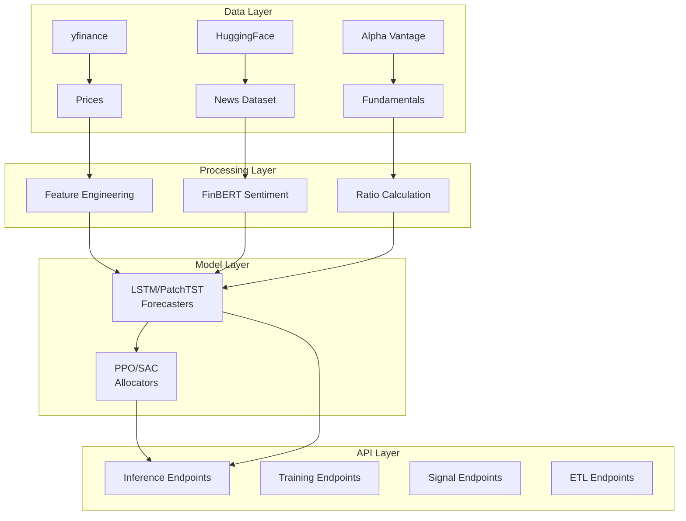
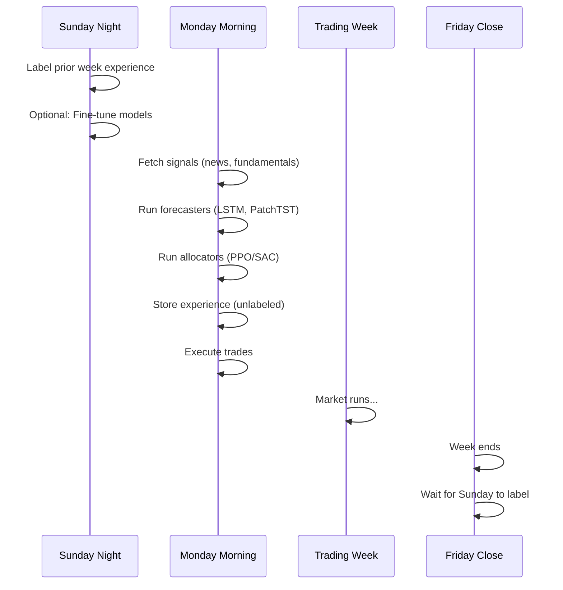
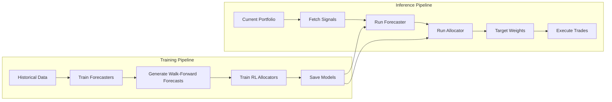

# Brain API Flow Diagrams

This directory contains documentation and flow diagrams for all Brain API endpoints.

## Overview

The Brain API is a machine learning-powered portfolio management system for halal-compliant stock trading. It provides:

- **Forecasting**: LSTM and PatchTST models predict weekly stock returns
- **Allocation**: PPO and SAC reinforcement learning models determine portfolio weights
- **Signals**: News sentiment and fundamental data for model inputs
- **ETL**: Batch pipelines for data processing

## Architecture

## Endpoint Documentation

| Documentation | Description |
|--------------|-------------|
| [health.md](./health.md) | Health check endpoints for monitoring |
| [root.md](./root.md) | Root endpoint (API info) |
| [universe.md](./universe.md) | Stock universe (halal symbols) |
| [allocation.md](./allocation.md) | HRP portfolio allocation |
| [etl.md](./etl.md) | ETL pipeline endpoints |
| [experience.md](./experience.md) | RL experience buffer |
| [signals.md](./signals.md) | News sentiment & fundamentals |
| [inference.md](./inference.md) | Model inference endpoints |
| [training.md](./training.md) | Model training endpoints |

## Quick Reference

### All Endpoints

| Category | Method | Path | Description |
|----------|--------|------|-------------|
| Health | GET | `/health` | Generic health check |
| Health | GET | `/health/live` | Liveness probe |
| Health | GET | `/health/ready` | Readiness probe |
| Root | GET | `/` | API information |
| Universe | GET | `/universe/halal` | Halal stock universe |
| Allocation | POST | `/allocation/hrp` | HRP allocation |
| ETL | POST | `/etl/news-sentiment` | Start sentiment ETL |
| ETL | GET | `/etl/news-sentiment/jobs` | List ETL jobs |
| ETL | GET | `/etl/news-sentiment/{job_id}` | Get job status |
| ETL | POST | `/etl/sentiment-gaps` | Fill sentiment gaps |
| ETL | GET | `/etl/sentiment-gaps/{job_id}` | Get gap fill status |
| Experience | POST | `/experience/store` | Store experience |
| Experience | POST | `/experience/label` | Label with rewards |
| Experience | GET | `/experience/list` | List experiences |
| Signals | POST | `/signals/news` | Current news sentiment |
| Signals | POST | `/signals/news/historical` | Historical sentiment |
| Signals | POST | `/signals/fundamentals` | Current fundamentals |
| Signals | POST | `/signals/fundamentals/historical` | Historical fundamentals |
| Inference | POST | `/infer/lstm` | LSTM prediction |
| Inference | POST | `/infer/patchtst` | PatchTST prediction |
| Inference | POST | `/infer/ppo_lstm` | PPO+LSTM allocation |
| Inference | POST | `/infer/ppo_patchtst` | PPO+PatchTST allocation |
| Inference | POST | `/infer/sac_lstm` | SAC+LSTM allocation |
| Inference | POST | `/infer/sac_patchtst` | SAC+PatchTST allocation |
| Training | POST | `/train/lstm` | Train LSTM |
| Training | POST | `/train/patchtst` | Train PatchTST |
| Training | POST | `/train/ppo_lstm/full` | Full PPO+LSTM training |
| Training | POST | `/train/ppo_lstm/finetune` | Fine-tune PPO+LSTM |
| Training | POST | `/train/ppo_patchtst/full` | Full PPO+PatchTST training |
| Training | POST | `/train/ppo_patchtst/finetune` | Fine-tune PPO+PatchTST |
| Training | POST | `/train/sac_lstm/full` | Full SAC+LSTM training |
| Training | POST | `/train/sac_lstm/finetune` | Fine-tune SAC+LSTM |
| Training | POST | `/train/sac_patchtst/full` | Full SAC+PatchTST training |
| Training | POST | `/train/sac_patchtst/finetune` | Fine-tune SAC+PatchTST |

## Weekly Workflow

## Data Flow

## Model Architecture Summary

| Model | Type | Input | Output | Use Case |
|-------|------|-------|--------|----------|
| LSTM | Forecaster | 60-day OHLCV | Weekly return % | Simple baseline |
| PatchTST | Forecaster | 60-day 5-channel OHLCV | Weekly return % | OHLCV |
| PPO | Allocator | Signals + Forecasts + Weights | Target weights | On-policy RL |
| SAC | Allocator | Signals + Forecasts + Weights | Target weights | Off-policy RL |

## Viewing Mermaid Diagrams

The flow diagrams in these documents use [Mermaid](https://mermaid.js.org/) syntax. To view them:

1. **GitHub**: GitHub renders Mermaid diagrams automatically in markdown
2. **VS Code**: Install the "Markdown Preview Mermaid Support" extension
3. **Cursor**: Mermaid diagrams render in the markdown preview
4. **Online**: Use [mermaid.live](https://mermaid.live/) to paste and view diagrams
