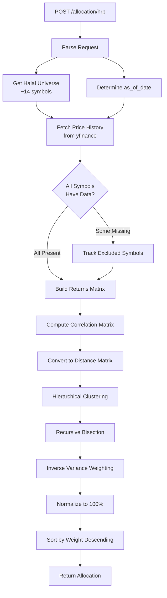
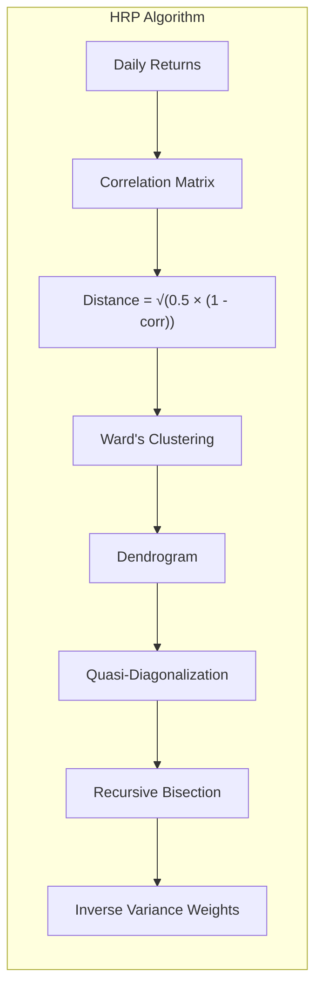
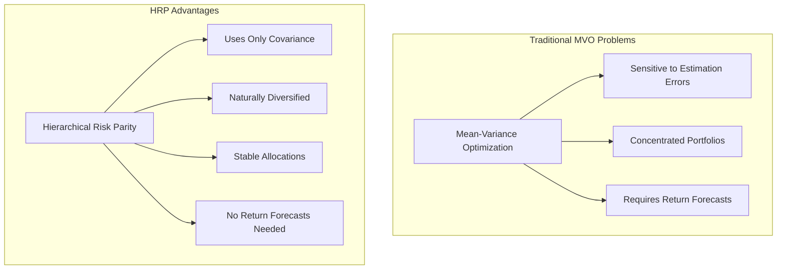

# Allocation Endpoints

## Overview

The allocation endpoints compute portfolio weights using optimization algorithms. Currently supports Hierarchical Risk Parity (HRP) allocation.

## Endpoints

| Method | Path | Description |
|--------|------|-------------|
| POST | `/allocation/hrp` | Compute HRP portfolio allocation |

---

## POST /allocation/hrp

**Compute HRP Portfolio Allocation**

Computes portfolio weights using Hierarchical Risk Parity (López de Prado, 2016). HRP uses hierarchical clustering to group similar assets and recursive bisection to allocate weights by inverse variance.

### Flow Diagram



### Algorithm Details



### Request Schema

```json
{
  "lookback_days": 252,
  "as_of_date": "2026-01-10"
}
```

| Parameter | Type | Default | Range | Description |
|-----------|------|---------|-------|-------------|
| `lookback_days` | int | 252 | 60-504 | Trading days for return calculation |
| `as_of_date` | string | today | - | Reference date (YYYY-MM-DD) |

### Response Schema

```json
{
  "percentage_weights": {
    "AAPL": 8.23,
    "MSFT": 7.15,
    "GOOGL": 6.42,
    "...": "..."
  },
  "symbols_used": 42,
  "symbols_excluded": ["XYZ", "ABC"],
  "lookback_days": 252,
  "as_of_date": "2026-01-10"
}
```

| Field | Type | Description |
|-------|------|-------------|
| `percentage_weights` | dict | Symbol → weight (%) sorted descending |
| `symbols_used` | int | Number of symbols in allocation |
| `symbols_excluded` | array | Symbols with insufficient data |
| `lookback_days` | int | Trading days used |
| `as_of_date` | string | Reference date used |

### Error Responses

| Status | Condition |
|--------|-----------|
| 400 | No symbols have sufficient data |

---

## Why HRP?



---

## Usage Example

```python
import httpx

response = httpx.post(
    "http://localhost:8000/allocation/hrp",
    json={
        "lookback_days": 252,
        "as_of_date": "2026-01-10"
    }
)

allocation = response.json()
print(f"Top holdings: {list(allocation['percentage_weights'].items())[:5]}")
```
