# Brain API - Complete System Diagram

```mermaid
graph TD
    %% ============================================
    %% STYLING
    %% ============================================
    classDef endpoint fill:#a8e6cf,stroke:#2d6a4f,stroke-width:2px,color:black;
    classDef storage fill:#ffd6a5,stroke:#d4ac0d,stroke-width:2px,color:black;
    classDef external fill:#bde0fe,stroke:#1d3557,stroke-width:1px,color:black;
    classDef logic fill:#e1e1e1,stroke:#333,stroke-width:1px,stroke-dasharray: 5 5,color:black;
    classDef output fill:#c9f0ff,stroke:#0077b6,stroke-width:2px,color:black;

    %% ============================================
    %% EXTERNAL SERVICES
    %% ============================================
    subgraph External_Services [External APIs & Libraries]
        YF(yfinance)
        ALP(Alpaca API)
        AV(Alpha Vantage)
        FB(FinBERT)
        HF_Hub(HuggingFace Hub)
    end
    class YF,ALP,AV,FB,HF_Hub external;

    %% ============================================
    %% HEALTH & ROOT
    %% ============================================
    subgraph Domain_Health [Health & Discovery]
        EP_Root(GET /)
        EP_Health(GET /health)
        EP_Live(GET /health/live)
        EP_Ready(GET /health/ready)
    end
    class EP_Root,EP_Health,EP_Live,EP_Ready endpoint;

    %% ============================================
    %% UNIVERSE
    %% ============================================
    subgraph Domain_Universe [Universe Selection]
        EP_Uni(GET /universe/halal)
        Logic_Uni[Merge SPUS/HLAL/SPTE\nDedup → Top 15 by Weight]
        
        EP_Uni -->|Fetch ETF Holdings| YF
        YF --> Logic_Uni
        Logic_Uni -->|Returns List| SYMB(~45 Halal Symbols\nTop 15 for RL)
    end
    class EP_Uni endpoint;

    %% ============================================
    %% DATA ETL & SERVING
    %% ============================================
    subgraph Domain_Data [Data ETL & Serving]
        
        %% News Pipeline
        subgraph News_Pipe [News Sentiment Pipeline]
            EP_News_ETL(POST /etl/news-sentiment)
            EP_News_Gap(POST /etl/sentiment-gaps)
            EP_News_Jobs(GET /etl/news-sentiment/jobs)
            DS_News[(daily_sentiment.parquet\n+ Sentiment Cache)]
            
            EP_News_ETL -->|1. Download HF Dataset| HF_Hub
            EP_News_ETL -->|2. Score with| FB
            EP_News_ETL -->|3. Upsert Idempotent| DS_News
            
            EP_News_Gap -->|1. Find Missing Dates| DS_News
            EP_News_Gap -->|2. Fetch 2015+ News| ALP
            ALP --> FB
            FB -->|Score or 0.0| EP_News_Gap
            EP_News_Gap -->|3. Append to Parquet| DS_News
            
            EP_News_Jobs -->|Poll Status| EP_News_ETL

            EP_News_Live(POST /signals/news)
            EP_News_Hist(POST /signals/news/historical)

            EP_News_Live -->|Fetch Recent Articles| YF
            YF -->|Score with FinBERT| FB
            FB --> EP_News_Live
            EP_News_Hist -->|Read Parquet| DS_News
        end

        %% Fundamentals Pipeline
        subgraph Fund_Pipe [Fundamentals Pipeline]
            DS_Fund[(Fundamentals Cache\nSQLite + JSONs)]
            
            EP_Fund_Live(POST /signals/fundamentals)
            EP_Fund_Hist(POST /signals/fundamentals/historical)

            EP_Fund_Live -->|Fetch ticker.info| YF
            EP_Fund_Hist -->|Fetch Quarterly| AV
            AV -->|Cache Response| DS_Fund
            DS_Fund --> EP_Fund_Hist
        end
    end
    class EP_News_ETL,EP_News_Gap,EP_News_Jobs,EP_News_Live,EP_News_Hist,EP_Fund_Live,EP_Fund_Hist endpoint;
    class DS_News,DS_Fund storage;

    %% ============================================
    %% FORECASTER MODELS
    %% ============================================
    subgraph Domain_Forecaster [Forecasting Models]
        
        %% Model Storage
        Model_LSTM_Main[(LSTM Main Branch)]
        Model_LSTM_Snap[(LSTM Snapshots\n2015..2025)]
        Model_PT_Main[(PatchTST Main Branch)]
        Model_PT_Snap[(PatchTST Snapshots\n2015..2025)]

        %% LSTM
        EP_Train_LSTM(POST /train/lstm)
        EP_Inf_LSTM(POST /infer/lstm)

        EP_Train_LSTM -->|1. Train on 15yr OHLCV| YF
        EP_Train_LSTM -->|2. Evaluate & Promote| Model_LSTM_Main
        EP_Train_LSTM -->|3. Loop Years\nTrain & Save Snapshots| Model_LSTM_Snap
        
        EP_Inf_LSTM -->|Load Current| Model_LSTM_Main
        EP_Inf_LSTM -->|Output| Out_LSTM[Weekly Return %\nper Symbol]

        %% PatchTST
        EP_Train_PT(POST /train/patchtst)
        EP_Inf_PT(POST /infer/patchtst)

        EP_Train_PT -->|1. Train 11 Channels| YF
        EP_Train_PT -.->|+ News Sentiment| EP_News_Hist
        EP_Train_PT -.->|+ Fundamentals| EP_Fund_Hist
        EP_Train_PT -->|2. Evaluate & Promote| Model_PT_Main
        EP_Train_PT -->|3. Loop Years\nTrain & Save Snapshots| Model_PT_Snap

        EP_Inf_PT -->|Load Current| Model_PT_Main
        EP_Inf_PT -.->|+ Live News| EP_News_Live
        EP_Inf_PT -.->|+ Live Fundamentals| EP_Fund_Live
        EP_Inf_PT -->|Output| Out_PT[Weekly Return %\nper Symbol]
    end
    class EP_Train_LSTM,EP_Inf_LSTM,EP_Train_PT,EP_Inf_PT endpoint;
    class Model_LSTM_Main,Model_LSTM_Snap,Model_PT_Main,Model_PT_Snap storage;
    class Out_LSTM,Out_PT output;

    %% ============================================
    %% ALLOCATION & RL
    %% ============================================
    subgraph Domain_Allocation [Allocation & RL]
        
        %% HRP (non-ML baseline)
        EP_HRP(POST /allocation/hrp)
        EP_HRP -->|Fetch 1yr Prices| YF
        EP_HRP -->|Hierarchical Clustering\nInverse Variance| Out_HRP[HRP Weights %]

        %% RL Training
        subgraph RL_Training [RL Model Training]
            EP_RL_Train(POST /train/ppo_lstm\nPOST /train/ppo_patchtst\nPOST /train/sac_lstm\nPOST /train/sac_patchtst)
            EP_RL_Fine(POST /train/*/finetune)
            Repo_RL[(RL Models\nPPO & SAC Variants)]

            EP_RL_Train -.->|Walk-Forward Forecasts| Model_LSTM_Snap
            EP_RL_Train -.->|Walk-Forward Forecasts| Model_PT_Snap
            EP_RL_Train -.->|Historical Signals| EP_News_Hist
            EP_RL_Train -.->|Historical Signals| EP_Fund_Hist
            EP_RL_Train -->|Train & Save| Repo_RL
            
            EP_RL_Fine -->|Load Current Model| Repo_RL
            EP_RL_Fine -->|Train on Last 26 Weeks| Repo_RL
        end

        %% RL Inference
        subgraph RL_Inference [RL Portfolio Inference]
            EP_RL_Inf(POST /infer/ppo_lstm\nPOST /infer/ppo_patchtst\nPOST /infer/sac_lstm\nPOST /infer/sac_patchtst)
            
            EP_RL_Inf -->|Load Model| Repo_RL
            EP_RL_Inf -.->|Live Forecast| EP_Inf_LSTM
            EP_RL_Inf -.->|Live Forecast| EP_Inf_PT
            EP_RL_Inf -.->|Live News| EP_News_Live
            EP_RL_Inf -.->|Live Fundamentals| EP_Fund_Live
            EP_RL_Inf -->|Output| Out_RL[Target Weights %\n+ Turnover]
        end
    end
    class EP_HRP,EP_RL_Train,EP_RL_Fine,EP_RL_Inf endpoint;
    class Repo_RL storage;
    class Out_HRP,Out_RL output;

    %% ============================================
    %% EXPERIENCE BUFFER
    %% ============================================
    subgraph Domain_Experience [Experience Buffer for Online Learning]
        EP_Exp_Store(POST /experience/store)
        EP_Exp_Label(POST /experience/label)
        EP_Exp_List(GET /experience/list)
        DS_Exp[(Experience JSONs\nstate, action, reward)]

        EP_RL_Inf -->|After Inference| EP_Exp_Store
        EP_Exp_Store -->|Save Decision\nNo Reward Yet| DS_Exp
        
        EP_Exp_Label -->|After Week Ends\nFetch Returns| YF
        EP_Exp_Label -->|Compute Reward\nUpdate Record| DS_Exp
        
        EP_Exp_List -->|Read Labeled Data| DS_Exp
        DS_Exp -.->|Labeled Experience| EP_RL_Fine
    end
    class EP_Exp_Store,EP_Exp_Label,EP_Exp_List endpoint;
    class DS_Exp storage;

    %% ============================================
    %% CROSS-DOMAIN DEPENDENCIES
    %% ============================================
    SYMB -->|Symbols| EP_News_ETL
    SYMB -->|Symbols| EP_HRP
    SYMB -->|Symbols| EP_Train_LSTM
    SYMB -->|Symbols| EP_Train_PT
    SYMB -->|Top 15| EP_RL_Train

    %% HuggingFace Hub Connections
    Model_LSTM_Main -.->|Sync| HF_Hub
    Model_PT_Main -.->|Sync| HF_Hub
    Repo_RL -.->|Sync| HF_Hub
```

---

## Weekly Workflow

---

## Model Architecture

---

## Endpoint Quick Reference

| Category | Method | Path | Purpose |
|----------|--------|------|---------|
| Health | GET | `/health`, `/health/live`, `/health/ready` | Service status |
| Root | GET | `/` | API info |
| Universe | GET | `/universe/halal` | Get ~45 halal symbols |
| ETL | POST | `/etl/news-sentiment` | Batch news processing |
| ETL | POST | `/etl/sentiment-gaps` | Fill missing data |
| Signals | POST | `/signals/news` | Live news sentiment |
| Signals | POST | `/signals/news/historical` | Training data |
| Signals | POST | `/signals/fundamentals` | Live ratios |
| Signals | POST | `/signals/fundamentals/historical` | Training data |
| Training | POST | `/train/lstm`, `/train/patchtst` | Train forecasters |
| Training | POST | `/train/ppo_lstm`, `/train/sac_lstm`, etc. | Train RL models |
| Training | POST | `/train/*/finetune` | Weekly fine-tuning |
| Inference | POST | `/infer/lstm`, `/infer/patchtst` | Predict returns |
| Inference | POST | `/infer/ppo_lstm`, `/infer/sac_lstm`, etc. | Get target weights |
| Experience | POST | `/experience/store` | Save decisions |
| Experience | POST | `/experience/label` | Add rewards |
| Experience | GET | `/experience/list` | Read for training |
| Allocation | POST | `/allocation/hrp` | HRP baseline weights |
