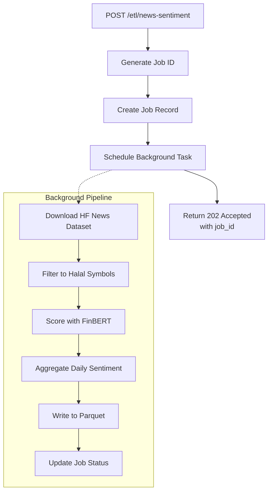
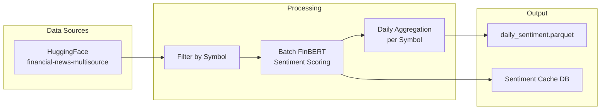
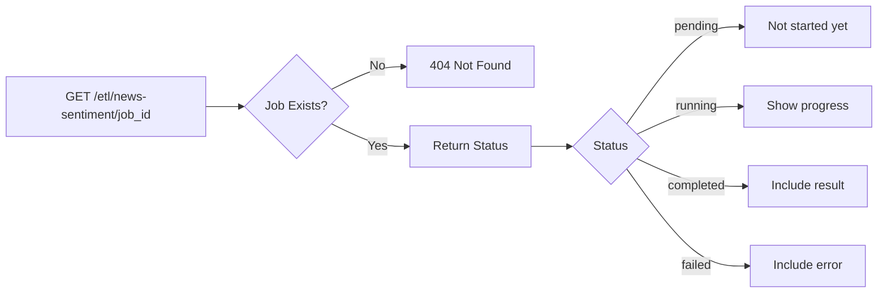
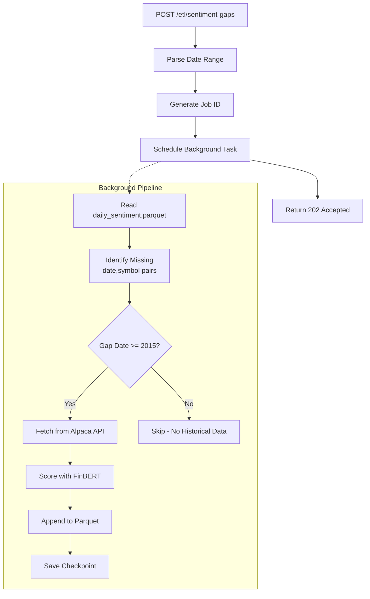
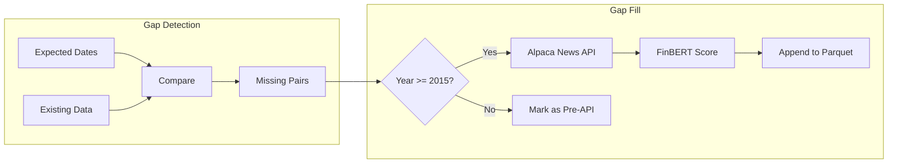
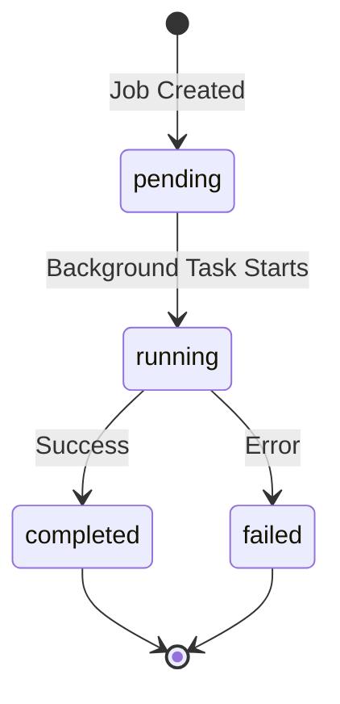

# ETL Endpoints

## Overview

The ETL endpoints trigger batch data pipelines for processing news sentiment data. Jobs run asynchronously with progress tracking.

## Endpoints

| Method | Path | Description |
|--------|------|-------------|
| POST | `/etl/news-sentiment` | Start news sentiment ETL job |
| GET | `/etl/news-sentiment/jobs` | List all ETL jobs |
| GET | `/etl/news-sentiment/{job_id}` | Get job status |
| POST | `/etl/sentiment-gaps` | Start sentiment gap fill job |
| GET | `/etl/sentiment-gaps/{job_id}` | Get gap fill job status |

---

## POST /etl/news-sentiment

**Start News Sentiment ETL Pipeline**

Initiates an asynchronous ETL job that processes financial news articles and generates daily sentiment scores.

### Flow Diagram



### Pipeline Details



### Request Schema

```json
{
  "batch_size": 256,
  "max_articles": null,
  "sentiment_threshold": 0.1,
  "filter_to_halal": true,
  "local_only": true,
  "output_dir": "data/output",
  "cache_dir": "data/cache"
}
```

| Parameter | Type | Default | Description |
|-----------|------|---------|-------------|
| `batch_size` | int | 256 | FinBERT batch size (1-1024) |
| `max_articles` | int | null | Max NEW articles to score (null = all) |
| `sentiment_threshold` | float | 0.1 | Min \|p_pos - p_neg\| to include |
| `filter_to_halal` | bool | true | Filter to halal universe only |
| `local_only` | bool | true | Skip HuggingFace upload |
| `output_dir` | string | data/output | Output directory for parquet |
| `cache_dir` | string | data/cache | Cache directory for sentiment DB |

### Response Schema (202 Accepted)

```json
{
  "job_id": "a1b2c3d4",
  "status": "pending",
  "message": "ETL job a1b2c3d4 started. Poll GET /etl/news-sentiment/a1b2c3d4 for status."
}
```

---

## GET /etl/news-sentiment/{job_id}

**Get ETL Job Status**

Poll this endpoint to track job progress and get results.

### Flow Diagram



### Response Schema

```json
{
  "job_id": "a1b2c3d4",
  "status": "completed",
  "started_at": "2026-01-11T10:00:00Z",
  "completed_at": "2026-01-11T10:15:00Z",
  "progress": {
    "articles_processed": 50000,
    "articles_scored": 48500,
    "symbols_processed": 45
  },
  "error": null,
  "result": {
    "output_path": "data/output/daily_sentiment.parquet",
    "total_rows": 125000
  },
  "config": {
    "batch_size": 256,
    "filter_to_halal": true
  }
}
```

---

## POST /etl/sentiment-gaps

**Fill Sentiment Data Gaps**

Identifies missing sentiment data and fills gaps by fetching news from Alpaca API.

### Flow Diagram



### Request Schema

```json
{
  "start_date": "2011-01-01",
  "end_date": "2026-01-10"
}
```

| Parameter | Type | Required | Description |
|-----------|------|----------|-------------|
| `start_date` | string | Yes | Earliest date to check (YYYY-MM-DD) |
| `end_date` | string | No | Latest date (defaults to today) |

### Gap Fill Process



---

## GET /etl/news-sentiment/jobs

**List All ETL Jobs**

Returns all jobs sorted by start time (most recent first). Limited to 100 jobs in memory.

### Response Schema

```json
{
  "jobs": [
    {
      "job_id": "a1b2c3d4",
      "status": "completed",
      "started_at": "2026-01-11T10:00:00Z",
      "completed_at": "2026-01-11T10:15:00Z",
      "progress": {},
      "error": null,
      "result": {},
      "config": {}
    }
  ],
  "total": 5
}
```

---

## Job State Machine



---

## Usage Example

```python
import httpx
import time

# Start job
response = httpx.post(
    "http://localhost:8000/etl/news-sentiment",
    json={"batch_size": 256, "max_articles": 10000}
)
job_id = response.json()["job_id"]

# Poll for completion
while True:
    status = httpx.get(f"http://localhost:8000/etl/news-sentiment/{job_id}").json()
    if status["status"] in ["completed", "failed"]:
        break
    print(f"Progress: {status['progress']}")
    time.sleep(30)

print(f"Final status: {status['status']}")
```
