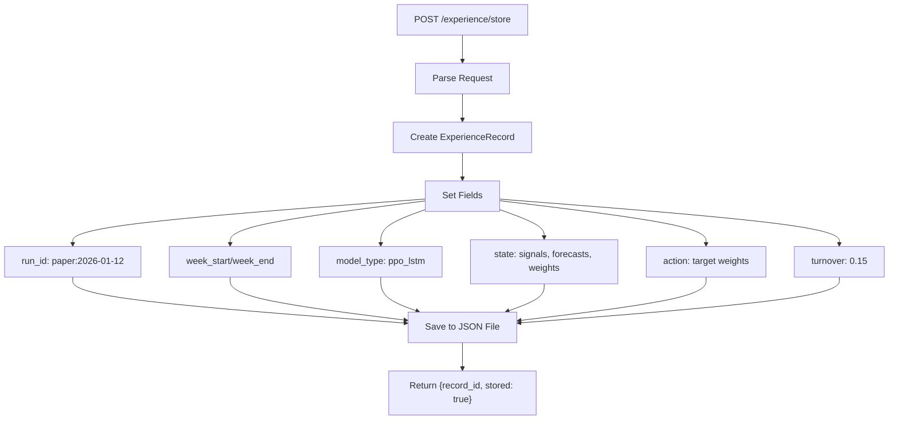
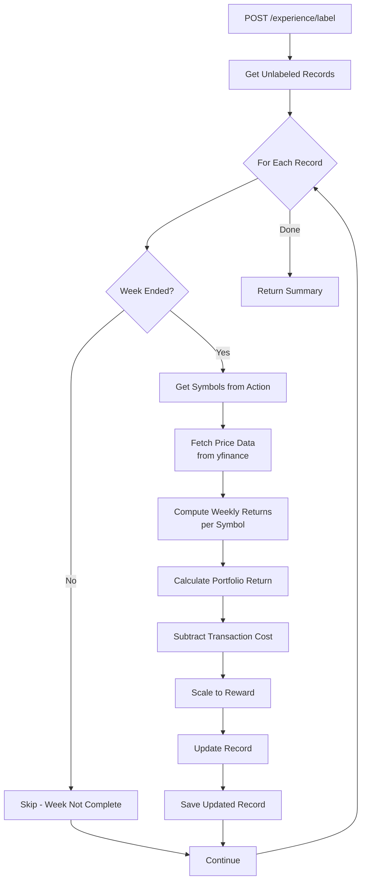
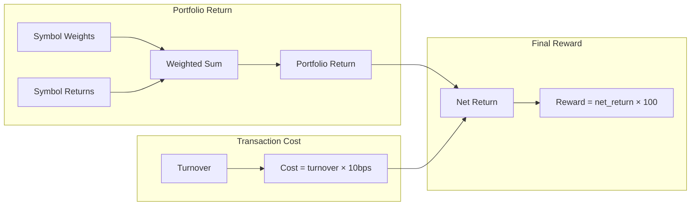
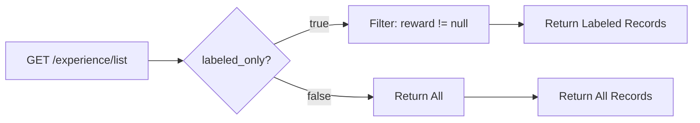
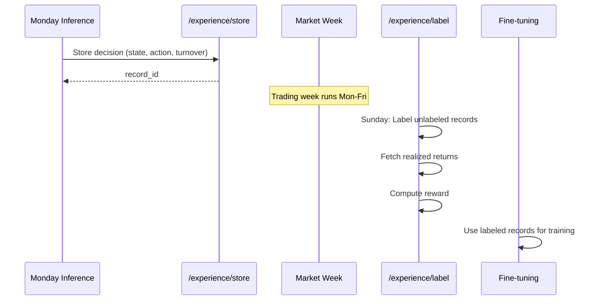

# Experience Endpoints

## Overview

The experience endpoints manage PPO/SAC experience tuples for reinforcement learning. They store decisions made during inference and label them with realized rewards for fine-tuning.

## Endpoints

| Method | Path | Description |
|--------|------|-------------|
| POST | `/experience/store` | Store an experience record |
| POST | `/experience/label` | Label records with realized rewards |
| GET | `/experience/list` | List experience records |

---

## POST /experience/store

**Store Experience Record**

Called after each RL inference to record the decision for later reward labeling and fine-tuning.

### Flow Diagram



### Request Schema

```json
{
  "run_id": "paper:2026-01-12",
  "week_start": "2026-01-13",
  "week_end": "2026-01-17",
  "model_type": "ppo_lstm",
  "model_version": "v1.2.3",
  "state": {
    "signals": {"AAPL": {"news_sentiment": 0.2}},
    "forecasts": {"AAPL": 1.5},
    "current_weights": {"AAPL": 0.1, "CASH": 0.9}
  },
  "action": {
    "AAPL": 0.15,
    "MSFT": 0.12,
    "CASH": 0.73
  },
  "turnover": 0.15
}
```

| Field | Type | Description |
|-------|------|-------------|
| `run_id` | string | Unique identifier (e.g., "paper:2026-01-12") |
| `week_start` | string | ISO date of week start |
| `week_end` | string | ISO date of week end |
| `model_type` | string | "ppo_lstm" or "ppo_patchtst" |
| `model_version` | string | Model version used |
| `state` | dict | State at decision time |
| `action` | dict | Target weights (symbol → weight) |
| `turnover` | float | Portfolio turnover |

### Response Schema

```json
{
  "record_id": "paper:2026-01-12",
  "stored": true
}
```

---

## POST /experience/label

**Label Experience with Realized Rewards**

Computes realized rewards from actual market returns. Should be called weekly (e.g., Sunday) after the trading week ends.

### Flow Diagram



### Reward Calculation



### Request Schema

```json
{
  "run_id": null
}
```

| Field | Type | Description |
|-------|------|-------------|
| `run_id` | string \| null | Specific run to label, or null for all unlabeled |

### Response Schema

```json
{
  "records_labeled": 3,
  "records_skipped": 1,
  "errors": []
}
```

---

## GET /experience/list

**List Experience Records**

Returns all stored experience records, optionally filtered to labeled-only for fine-tuning.

### Flow Diagram



### Query Parameters

| Parameter | Type | Default | Description |
|-----------|------|---------|-------------|
| `labeled_only` | bool | false | Only return labeled records |

### Response Schema

```json
[
  {
    "run_id": "paper:2026-01-05",
    "week_start": "2026-01-06",
    "week_end": "2026-01-10",
    "model_type": "ppo_lstm",
    "model_version": "v1.2.3",
    "state": {},
    "action": {"AAPL": 0.15, "CASH": 0.85},
    "turnover": 0.15,
    "reward": 2.34,
    "realized_return": 0.0245,
    "next_state": null,
    "labeled_at": "2026-01-12T10:00:00Z"
  }
]
```

---

## Experience Lifecycle



---

## Storage Structure

```
data/experience/
├── paper_2026-01-05.json
├── paper_2026-01-12.json
└── paper_2026-01-19.json
```

Each JSON file contains:
```json
{
  "run_id": "paper:2026-01-05",
  "week_start": "2026-01-06",
  "week_end": "2026-01-10",
  "model_type": "ppo_lstm",
  "model_version": "v1.2.3",
  "state": {},
  "action": {},
  "turnover": 0.15,
  "reward": 2.34,
  "realized_return": 0.0245,
  "labeled_at": "2026-01-12T10:00:00Z"
}
```

---

## Usage

The experience buffer enables online learning:

1. **Weekly Inference**: PPO model makes allocation decision
2. **Store Experience**: Record decision without reward
3. **Week Passes**: Market realizes returns
4. **Label Experience**: Compute actual reward from returns
5. **Fine-tune**: Use labeled data to improve model
