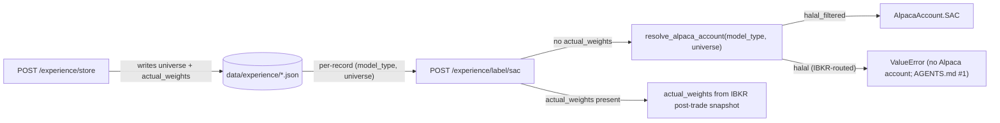
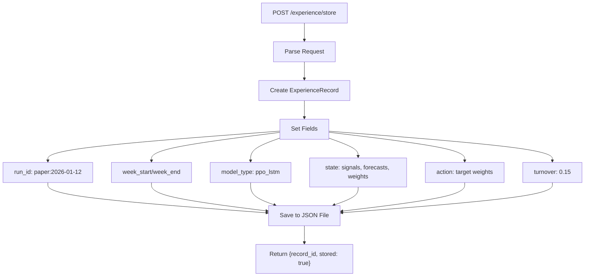
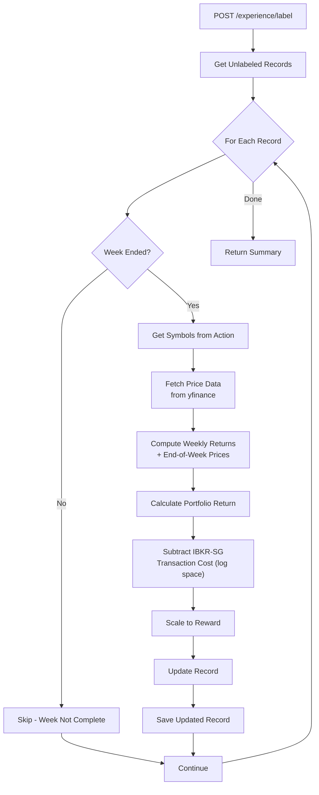
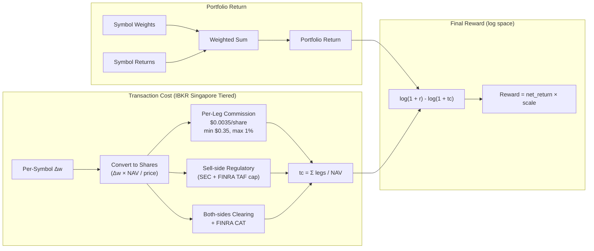
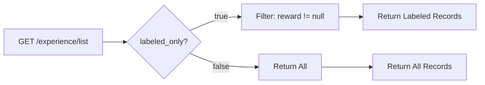
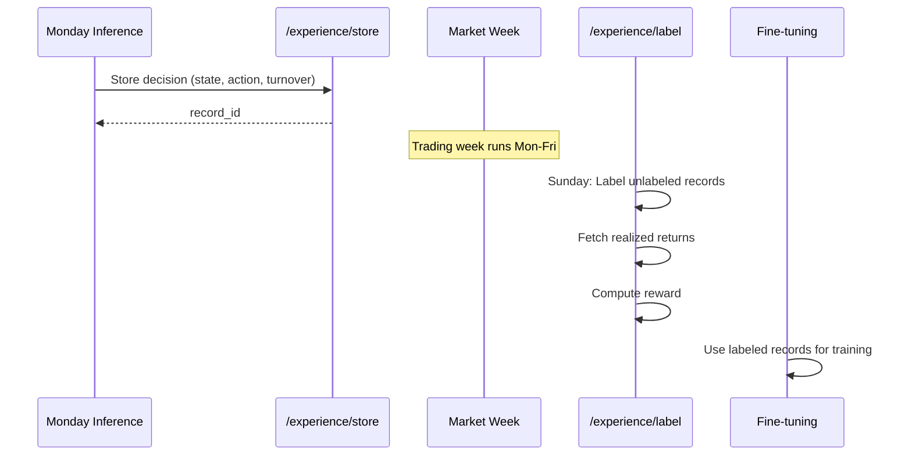

# Experience Endpoints

## Overview

The experience endpoints manage PPO/SAC experience tuples for reinforcement learning. They store decisions made during inference and label them with realized rewards for fine-tuning.

## Endpoints

| Method | Path | Description |
|--------|------|-------------|
| POST | `/experience/store` | Store an experience record (SAC writes set `universe`) |
| POST | `/experience/update-execution` | Attach execution report (and optional `actual_weights`) |
| POST | `/experience/label` | Label records with realized rewards (legacy generic path) |
| POST | `/experience/label/sac` | Label SAC records using actual weights; routes per-record by `universe` |
| GET | `/experience/list` | List experience records |

### `/experience/label/sac` per-record account routing

Two parallel SAC A/B Temporal workflows (`USWeeklyAllocationWorkflow`
on `halal_filtered`, `USSACHalalAllocationWorkflow` on `halal`) share
`model_type='sac'` but trade on disjoint Alpaca accounts. The labeller
reads `universe` off each record and routes via
`brain_api.core.alpaca_client.resolve_alpaca_account` so a mixed batch
labels each record against the correct Alpaca portfolio:


```mermaid
flowchart LR
    StoreEP["POST /experience/store"]
    Disk[("data/experience/*.json")]
    LabelEP["POST /experience/label/sac"]
    AccountMap["resolve_alpaca_account(model_type, universe)"]
    AlpacaSAC["AlpacaAccount.SAC"]
    IBKRSnapshot["actual_weights from IBKR post-trade snapshot"]
    Raise["ValueError (no Alpaca account; AGENTS.md #1)"]

    StoreEP -->|"writes universe + actual_weights"| Disk
    Disk -->|"per-record (model_type, universe)"| LabelEP
    LabelEP -->|"actual_weights present"| IBKRSnapshot
    LabelEP -->|"no actual_weights"| AccountMap
    AccountMap -->|"halal_filtered"| AlpacaSAC
    AccountMap -->|"halal (IBKR-routed)"| Raise
```

The `halal` SAC variant trades through IBKR rather than Alpaca, so
`resolve_alpaca_account('sac', 'halal')` is intentionally undefined --
the IBKR-routed workflow plumbs `actual_weights` onto every halal
record from the post-trade IBKR snapshot, so the labeller never falls
through to the Alpaca lookup. A halal record reaching the labeller
without `actual_weights` surfaces as a routing error (AGENTS.md
rule #1) rather than silently labelling against the wrong portfolio.

Legacy records that pre-date the `universe` field fall back to
inferring the universe from the run_id prefix (`paper:halal:...` ->
`halal`, else `halal_filtered`). Halal legacy records will fail-loud
the same way -- there are none in production at the IBKR cutover.

---

## POST /experience/store

**Store Experience Record**

Called after each RL inference to record the decision for later reward labeling and fine-tuning.

### Flow Diagram


```mermaid
flowchart TD
    A[POST /experience/store] --> B[Parse Request]
    B --> C[Create ExperienceRecord]
    
    C --> D[Set Fields]
    D --> E[run_id: paper:2026-01-12]
    D --> F[week_start/week_end]
    D --> G[model_type: ppo_lstm]
    D --> H[state: signals, forecasts, weights]
    D --> I[action: target weights]
    D --> J[turnover: 0.15]
    
    E & F & G & H & I & J --> K[Save to JSON File]
    K --> L["Return {record_id, stored: true}"]
```

### Request Schema

```json
{
  "run_id": "paper:2026-01-12",
  "week_start": "2026-01-13",
  "week_end": "2026-01-17",
  "model_type": "ppo_lstm",
  "model_version": "v1.2.3",
  "state": {
    "signals": {"AAPL": {"news_sentiment": 0.2}},
    "forecasts": {"AAPL": 1.5},
    "current_weights": {"AAPL": 0.1, "CASH": 0.9}
  },
  "action": {
    "AAPL": 0.15,
    "MSFT": 0.12,
    "CASH": 0.73
  },
  "turnover": 0.15
}
```

| Field | Type | Description |
|-------|------|-------------|
| `run_id` | string | Unique identifier (e.g., "paper:2026-01-12") |
| `week_start` | string | ISO date of week start |
| `week_end` | string | ISO date of week end |
| `model_type` | string | "ppo_lstm" or "ppo_patchtst" |
| `model_version` | string | Model version used |
| `state` | dict | State at decision time |
| `action` | dict | Target weights (symbol → weight) |
| `turnover` | float | Portfolio turnover |

### Response Schema

```json
{
  "record_id": "paper:2026-01-12",
  "stored": true
}
```

---

## POST /experience/label

**Label Experience with Realized Rewards**

Computes realized rewards from actual market returns. Should be called weekly (e.g., Sunday) after the trading week ends.

### Flow Diagram


```mermaid
flowchart TD
    A[POST /experience/label] --> B[Get Unlabeled Records]
    B --> C{For Each Record}
    
    C --> D{Week Ended?}
    D -->|No| E[Skip - Week Not Complete]
    D -->|Yes| F[Get Symbols from Action]
    
    F --> G[Fetch Price Data<br/>from yfinance]
    G --> H[Compute Weekly Returns<br/>+ End-of-Week Prices]
    H --> I[Calculate Portfolio Return]
    I --> J["Subtract IBKR-SG<br/>Transaction Cost (log space)"]
    J --> K[Scale to Reward]
    K --> L[Update Record]
    
    L --> M[Save Updated Record]
    E --> N[Continue]
    M --> N
    N --> C
    
    C -->|Done| O[Return Summary]
```

### Reward Calculation


```mermaid
flowchart LR
    subgraph "Portfolio Return"
        A[Symbol Weights] --> C[Weighted Sum]
        B[Symbol Returns] --> C
        C --> D[Portfolio Return]
    end
    
    subgraph "Transaction Cost (IBKR Singapore Tiered)"
        E1[Per-Symbol Δw] --> E2["Convert to Shares<br/>(Δw × NAV / price)"]
        E2 --> E3["Per-Leg Commission<br/>$0.0035/share<br/>min $0.35, max 1%"]
        E2 --> E4["Sell-side Regulatory<br/>(SEC + FINRA TAF cap)"]
        E2 --> E5["Both-sides Clearing<br/>+ FINRA CAT"]
        E3 --> F["tc = Σ legs / NAV"]
        E4 --> F
        E5 --> F
    end
    
    subgraph "Final Reward (log space)"
        D --> G["log(1 + r) - log(1 + tc)"]
        F --> G
        G --> H["Reward = net_return × scale"]
    end
```

### Request Schema

```json
{
  "run_id": null
}
```

| Field | Type | Description |
|-------|------|-------------|
| `run_id` | string \| null | Specific run to label, or null for all unlabeled |

### Response Schema

```json
{
  "records_labeled": 3,
  "records_skipped": 1,
  "errors": []
}
```

---

## GET /experience/list

**List Experience Records**

Returns all stored experience records, optionally filtered to labeled-only for fine-tuning.

### Flow Diagram


```mermaid
flowchart LR
    A[GET /experience/list] --> B{labeled_only?}
    B -->|true| C[Filter: reward != null]
    B -->|false| D[Return All]
    C --> E[Return Labeled Records]
    D --> F[Return All Records]
```

### Query Parameters

| Parameter | Type | Default | Description |
|-----------|------|---------|-------------|
| `labeled_only` | bool | false | Only return labeled records |

### Response Schema

```json
[
  {
    "run_id": "paper:2026-01-05",
    "week_start": "2026-01-06",
    "week_end": "2026-01-10",
    "model_type": "ppo_lstm",
    "model_version": "v1.2.3",
    "state": {},
    "action": {"AAPL": 0.15, "CASH": 0.85},
    "turnover": 0.15,
    "reward": 2.34,
    "realized_return": 0.0245,
    "next_state": null,
    "labeled_at": "2026-01-12T10:00:00Z"
  }
]
```

---

## Experience Lifecycle


```mermaid
sequenceDiagram
    participant Monday as Monday Inference
    participant Store as /experience/store
    participant Market as Market Week
    participant Label as /experience/label
    participant Finetune as Fine-tuning
    
    Monday->>Store: Store decision (state, action, turnover)
    Store-->>Monday: record_id
    
    Note over Market: Trading week runs Mon-Fri
    
    Label->>Label: Sunday: Label unlabeled records
    Label->>Label: Fetch realized returns
    Label->>Label: Compute reward
    
    Finetune->>Finetune: Use labeled records for training
```

---

## Storage Structure

```
data/experience/
├── paper_2026-01-05.json
├── paper_2026-01-12.json
└── paper_2026-01-19.json
```

Each JSON file contains:
```json
{
  "run_id": "paper:2026-01-05",
  "week_start": "2026-01-06",
  "week_end": "2026-01-10",
  "model_type": "ppo_lstm",
  "model_version": "v1.2.3",
  "state": {},
  "action": {},
  "turnover": 0.15,
  "reward": 2.34,
  "realized_return": 0.0245,
  "labeled_at": "2026-01-12T10:00:00Z"
}
```

---

## Usage

The experience buffer enables online learning:

1. **Weekly Inference**: PPO model makes allocation decision
2. **Store Experience**: Record decision without reward
3. **Week Passes**: Market realizes returns
4. **Label Experience**: Compute actual reward from returns
5. **Fine-tune**: Use labeled data to improve model
