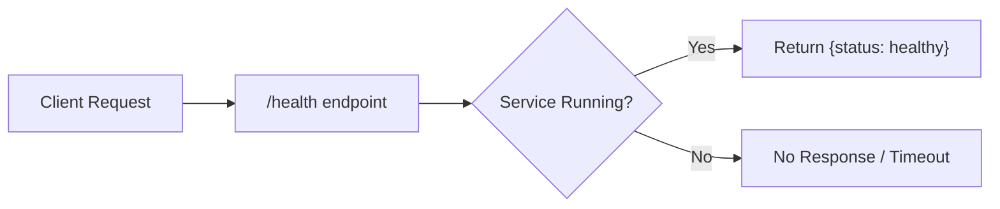
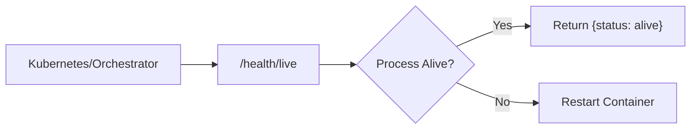
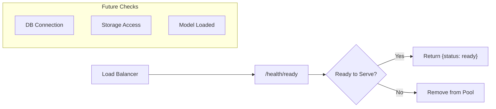

# Health Endpoints

## Overview

The health endpoints provide service status information for monitoring and orchestration tools like Kubernetes or load balancers.

## Endpoints

| Method | Path | Description |
|--------|------|-------------|
| GET | `/health` | Generic health check |
| GET | `/health/live` | Liveness probe |
| GET | `/health/ready` | Readiness probe |

---

## GET /health

**Generic Health Check**

Returns the overall health status of the API service.

### Flow Diagram



### Response

```json
{
  "status": "healthy"
}
```

---

## GET /health/live

**Liveness Probe**

Indicates whether the service process is running. Used by orchestrators to determine if the container needs to be restarted.

### Flow Diagram



### Response

```json
{
  "status": "alive"
}
```

---

## GET /health/ready

**Readiness Probe**

Indicates whether the service is ready to accept traffic. Can be extended to check database/storage connectivity.

### Flow Diagram



### Response

```json
{
  "status": "ready"
}
```

---

## Usage

These endpoints are typically used in:
- **Kubernetes**: `livenessProbe` and `readinessProbe` configuration
- **Docker Compose**: `healthcheck` configuration
- **Load Balancers**: Backend health monitoring
- **Monitoring Systems**: Uptime tracking
