# Inference Endpoints

## Overview

The inference endpoints run trained models to generate predictions. There are two categories:
- **Forecasters**: LSTM and PatchTST predict weekly stock returns
- **Allocators**: PPO and SAC determine portfolio weights

## Endpoints

| Method | Path | Description |
|--------|------|-------------|
| POST | `/infer/lstm` | LSTM weekly return prediction |
| POST | `/infer/patchtst` | PatchTST weekly return prediction |
| POST | `/infer/ppo_lstm` | PPO+LSTM portfolio allocation |
| POST | `/infer/ppo_patchtst` | PPO+PatchTST portfolio allocation |
| POST | `/infer/sac_lstm` | SAC+LSTM portfolio allocation |
| POST | `/infer/sac_patchtst` | SAC+PatchTST portfolio allocation |

---

## Forecaster Endpoints

### POST /infer/lstm

**LSTM Weekly Return Prediction**

Predicts weekly returns using a pure-price LSTM model trained on OHLCV data.

### Flow Diagram


### LSTM Architecture


### Request Schema

```json
{
  "symbols": ["AAPL", "MSFT", "GOOGL"],
  "as_of_date": "2026-01-11"
}
```

### Response Schema

```json
{
  "predictions": [
    {
      "symbol": "AAPL",
      "predicted_weekly_return_pct": 2.34,
      "has_enough_history": true,
      "history_days_used": 60,
      "data_end_date": "2026-01-10"
    }
  ],
  "model_version": "v2026.01.05-abc123",
  "as_of_date": "2026-01-11",
  "target_week_start": "2026-01-13",
  "target_week_end": "2026-01-17"
}
```

---

### POST /infer/patchtst

**PatchTST OHLCV Prediction**

Predicts weekly returns using 5-channel OHLCV log returns (open, high, low, close, volume).

### Flow Diagram


### PatchTST Input Channels


### Response Schema

```json
{
  "predictions": [...],
  "model_version": "v2026.01.05-def456",
  "as_of_date": "2026-01-11",
  "target_week_start": "2026-01-13",
  "target_week_end": "2026-01-17",
  "signals_used": ["ohlcv", "news_sentiment", "fundamentals"]
}
```

---

## Allocator Endpoints

### POST /infer/ppo_lstm

**PPO + LSTM Portfolio Allocation**

Uses PPO policy with LSTM forecasts to determine portfolio weights.

### Flow Diagram


### State Vector Composition


### Request Schema

```json
{
  "portfolio": {
    "cash": 50000.00,
    "positions": [
      {"symbol": "AAPL", "shares": 100, "market_value": 15000.00},
      {"symbol": "MSFT", "shares": 50, "market_value": 20000.00}
    ]
  },
  "as_of_date": "2026-01-11"
}
```

### Response Schema

```json
{
  "target_weights": {
    "AAPL": 0.12,
    "MSFT": 0.15,
    "GOOGL": 0.10,
    "CASH": 0.63
  },
  "turnover": 0.18,
  "target_week_start": "2026-01-13",
  "target_week_end": "2026-01-17",
  "model_version": "v2026.01.05-ppo123",
  "weight_changes": [
    {"symbol": "AAPL", "current_weight": 0.18, "target_weight": 0.12, "change": -0.06},
    {"symbol": "MSFT", "current_weight": 0.24, "target_weight": 0.15, "change": -0.09}
  ]
}
```

---

### POST /infer/ppo_patchtst

**PPO + PatchTST Portfolio Allocation**

Same as PPO+LSTM but uses PatchTST forecasts instead.


---

### POST /infer/sac_lstm

**SAC + LSTM Portfolio Allocation**

Uses Soft Actor-Critic policy with LSTM forecasts.

### Flow Diagram



```mermaid
flowchart TD
    A[POST /infer/sac_lstm] --> B[Parse Portfolio]
    B --> C[Compute Current Weights Vector]
    C --> D[Load SAC Actor Model]
    
    D --> E[Build Signals]
    E --> F[Generate LSTM Forecasts]
    F --> G[Build State]
    
    G --> H[SAC Actor Network]
    H --> I[Sample Action<br/>or Mean Action]
    I --> J[Softmax → Weights]
    J --> K[Compute Turnover]
    K --> L[Return Allocation]
```

### SAC vs PPO


---

### POST /infer/sac_patchtst

**SAC + PatchTST Portfolio Allocation**

Same as SAC+LSTM but uses PatchTST forecasts.

---

## Model Comparison

| Endpoint | Forecaster | Allocator | Input Channels |
|----------|------------|-----------|----------------|
| `/infer/lstm` | LSTM | - | 5 (OHLCV) |
| `/infer/patchtst` | PatchTST | - | 11 (OHLCV + Sentiment + Fundamentals) |
| `/infer/ppo_lstm` | LSTM | PPO | 9 per stock |
| `/infer/ppo_patchtst` | PatchTST | PPO | 9 per stock |
| `/infer/sac_lstm` | LSTM | SAC | 9 per stock |
| `/infer/sac_patchtst` | PatchTST | SAC | 9 per stock |

---

## Week Boundary Computation

All inference endpoints use holiday-aware week boundary computation:


---

## Error Responses

| Status | Condition |
|--------|-----------|
| 503 | No trained model available |
| 400 | Invalid request parameters |
