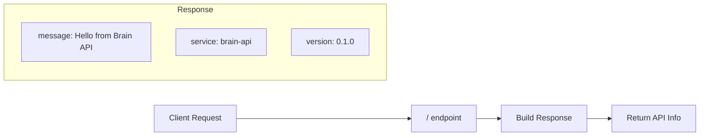

# Root Endpoint

## Overview

The root endpoint provides basic API information and acts as a simple hello world / discovery endpoint.

## Endpoints

| Method | Path | Description |
|--------|------|-------------|
| GET | `/` | API information |

---

## GET /

**Hello World Endpoint**

Returns basic information about the Brain API service.

### Flow Diagram



### Response

```json
{
  "message": "Hello from Brain API",
  "service": "brain-api",
  "version": "0.1.0"
}
```

---

## Usage

This endpoint is useful for:
- **Service Discovery**: Verifying the API is reachable
- **Version Checking**: Confirming which API version is deployed
- **Quick Testing**: Simple endpoint to test connectivity
