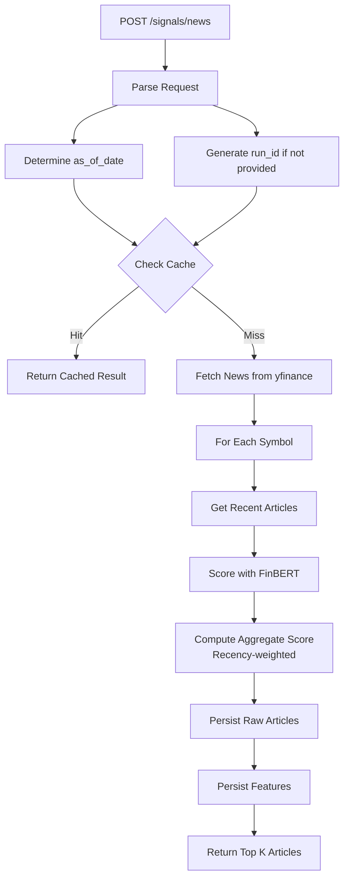
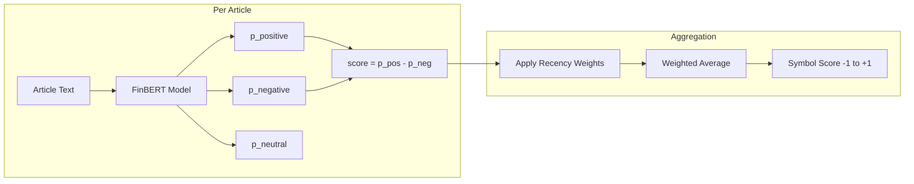
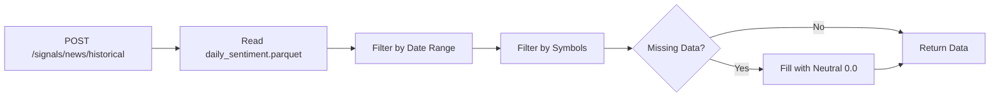
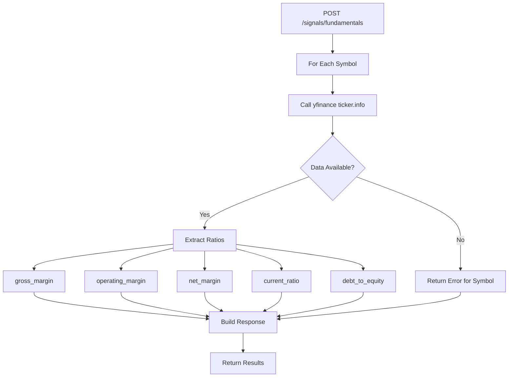
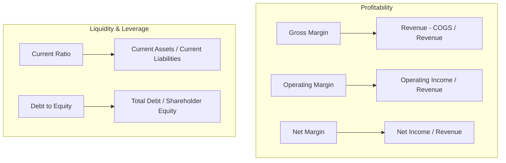
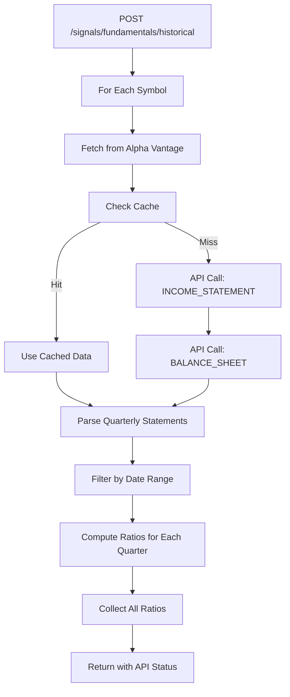
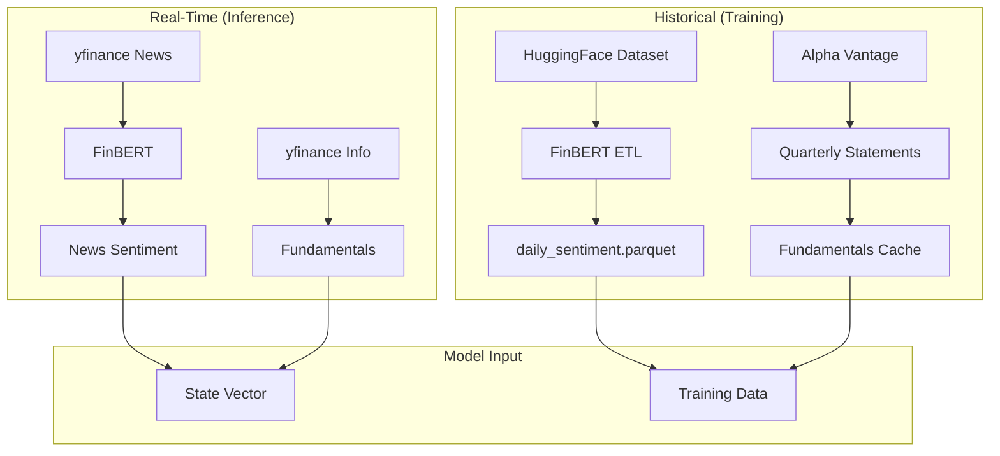

# Signals Endpoints

## Overview

The signals endpoints provide access to external market signals: news sentiment and fundamental financial ratios. These signals are inputs to the ML models.

## Endpoints

| Method | Path | Description |
|--------|------|-------------|
| POST | `/signals/news` | Get current news sentiment |
| POST | `/signals/news/historical` | Get historical news sentiment |
| POST | `/signals/fundamentals` | Get current fundamentals |
| POST | `/signals/fundamentals/historical` | Get historical fundamentals |

---

## POST /signals/news

**Get Current News Sentiment**

Fetches recent news articles and scores them with FinBERT for real-time inference.

### Flow Diagram



### FinBERT Scoring



### Request Schema

```json
{
  "symbols": ["AAPL", "MSFT", "GOOGL"],
  "run_id": "paper:2026-01-11",
  "attempt": 1,
  "as_of_date": "2026-01-11",
  "max_articles_per_symbol": 10,
  "return_top_k": 5
}
```

| Field | Type | Default | Description |
|-------|------|---------|-------------|
| `symbols` | array | required | Stock symbols to analyze |
| `run_id` | string | null | Run identifier for caching |
| `attempt` | int | 1 | Attempt number for idempotency |
| `as_of_date` | string | today | Reference date |
| `max_articles_per_symbol` | int | 10 | Max articles to fetch |
| `return_top_k` | int | 5 | Articles to return in response |

### Response Schema

```json
{
  "as_of_date": "2026-01-11",
  "per_symbol": [
    {
      "symbol": "AAPL",
      "aggregate_score": 0.25,
      "article_count": 8,
      "top_articles": [
        {
          "title": "Apple Reports Strong Quarter",
          "published": "2026-01-10T14:30:00Z",
          "sentiment_score": 0.65,
          "source": "Reuters"
        }
      ]
    }
  ]
}
```

---

## POST /signals/news/historical

**Get Historical News Sentiment**

Returns pre-computed daily sentiment from the ETL pipeline. Used for training data.

### Flow Diagram



### Request Schema

```json
{
  "symbols": ["AAPL", "MSFT"],
  "start_date": "2020-01-01",
  "end_date": "2025-12-31"
}
```

### Response Schema

```json
{
  "start_date": "2020-01-01",
  "end_date": "2025-12-31",
  "data": [
    {
      "symbol": "AAPL",
      "date": "2020-01-02",
      "sentiment_score": 0.15
    }
  ]
}
```

---

## POST /signals/fundamentals

**Get Current Fundamentals**

Fetches the most recent fundamental ratios from yfinance for real-time inference.

### Flow Diagram



### Fundamental Ratios



### Request Schema

```json
{
  "symbols": ["AAPL", "MSFT", "GOOGL"]
}
```

### Response Schema

```json
{
  "as_of_date": "2026-01-11",
  "per_symbol": [
    {
      "symbol": "AAPL",
      "ratios": {
        "gross_margin": 0.43,
        "operating_margin": 0.30,
        "net_margin": 0.25,
        "current_ratio": 1.04,
        "debt_to_equity": 1.87
      },
      "error": null
    }
  ]
}
```

---

## POST /signals/fundamentals/historical

**Get Historical Fundamentals**

Fetches quarterly fundamental data from Alpha Vantage for training data.

### Flow Diagram



### Request Schema

```json
{
  "symbols": ["AAPL", "MSFT"],
  "start_date": "2020-01-01",
  "end_date": "2025-12-31",
  "force_refresh": false
}
```

| Field | Type | Description |
|-------|------|-------------|
| `symbols` | array | Stock symbols |
| `start_date` | string | Start of date range |
| `end_date` | string | End of date range |
| `force_refresh` | bool | Bypass cache and refresh from API |

### Response Schema

```json
{
  "start_date": "2020-01-01",
  "end_date": "2025-12-31",
  "api_status": {
    "calls_today": 25,
    "calls_remaining": 475,
    "daily_limit": 500
  },
  "data": [
    {
      "symbol": "AAPL",
      "as_of_date": "2024-09-30",
      "gross_margin": 0.46,
      "operating_margin": 0.31,
      "net_margin": 0.24,
      "current_ratio": 0.99,
      "debt_to_equity": 1.72
    }
  ]
}
```

---

## Signal Data Flow



---

## Data Sources Summary

| Signal | Real-Time Source | Historical Source |
|--------|-----------------|-------------------|
| News Sentiment | yfinance + FinBERT | HuggingFace + FinBERT ETL |
| Fundamentals | yfinance ticker.info | Alpha Vantage API |
