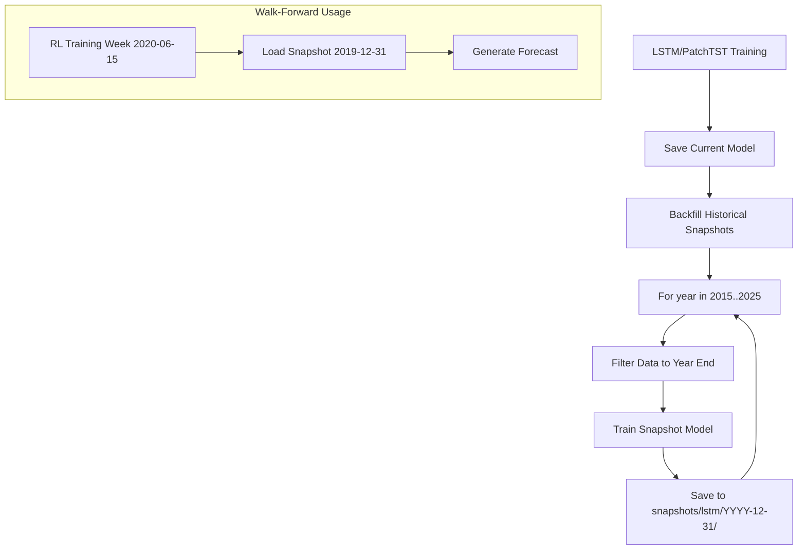

# Training Endpoints

## Overview

The training endpoints train and fine-tune ML models. Training is idempotent (same inputs = cached result) and supports automatic promotion based on evaluation metrics.

## Endpoints

| Method | Path | Description |
|--------|------|-------------|
| POST | `/train/lstm` | Train LSTM forecaster |
| POST | `/train/patchtst` | Train PatchTST forecaster |
| POST | `/train/ppo_lstm/full` | Full PPO+LSTM training |
| POST | `/train/ppo_lstm/finetune` | Fine-tune PPO+LSTM |
| POST | `/train/ppo_patchtst/full` | Full PPO+PatchTST training |
| POST | `/train/ppo_patchtst/finetune` | Fine-tune PPO+PatchTST |
| POST | `/train/sac_lstm/full` | Full SAC+LSTM training |
| POST | `/train/sac_lstm/finetune` | Fine-tune SAC+LSTM |
| POST | `/train/sac_patchtst/full` | Full SAC+PatchTST training |
| POST | `/train/sac_patchtst/finetune` | Fine-tune SAC+PatchTST |

---

## Forecaster Training

### POST /train/lstm

**Train LSTM Weekly Return Forecaster**

Trains a shared LSTM model on historical price data for the halal universe.

### Flow Diagram


### Training Pipeline Details


### Request Schema

```json
{
  "skip_snapshot": false
}
```

| Parameter | Type | Default | Description |
|-----------|------|---------|-------------|
| `skip_snapshot` | bool | false | Skip saving historical snapshots |

### Response Schema

```json
{
  "version": "v2026.01.05-abc123",
  "data_window_start": "2011-01-01",
  "data_window_end": "2026-01-05",
  "metrics": {
    "train_loss": 0.000234,
    "val_loss": 0.000312,
    "baseline_loss": 0.000456
  },
  "promoted": true,
  "prior_version": "v2025.12.29-xyz789",
  "hf_repo": "user/lstm-model",
  "hf_url": "https://huggingface.co/user/lstm-model/tree/v2026.01.05-abc123"
}
```

---

### POST /train/patchtst

**Train PatchTST Multi-Signal Forecaster**

Trains PatchTST with OHLCV + news sentiment + fundamentals.

### Flow Diagram


### PatchTST Model


---

## RL Training

### POST /train/ppo_lstm/full

**Full PPO + LSTM Training**

Trains PPO policy from scratch using LSTM forecasts.

### Flow Diagram


### PPO Training Loop


### Response Schema

```json
{
  "version": "v2026.01.05-ppo123",
  "data_window_start": "2011-01-01",
  "data_window_end": "2026-01-05",
  "metrics": {
    "policy_loss": 0.0234,
    "value_loss": 0.0456,
    "avg_episode_return": 15.23,
    "avg_episode_sharpe": 1.45,
    "eval_sharpe": 1.62,
    "eval_cagr": 0.18,
    "eval_max_drawdown": 0.12
  },
  "promoted": true,
  "prior_version": null,
  "symbols_used": ["AAPL", "MSFT", "GOOGL", "..."]
}
```

---

### POST /train/ppo_lstm/finetune

**Fine-tune PPO + LSTM**

Adapts existing model to recent market conditions using 26 weeks of data.

### Flow Diagram


### Fine-tuning Config


---

### SAC Training Endpoints

SAC (Soft Actor-Critic) training follows the same pattern as PPO but uses:
- Actor-Critic architecture with entropy bonus
- Off-policy learning with replay buffer
- Automatic temperature tuning


---

## Model Promotion Logic


---

## Snapshot System

For walk-forward forecast generation during RL training:



---

## Storage Locations

```
data/models/
├── lstm/
│   ├── current → v2026.01.05-abc123
│   └── v2026.01.05-abc123/
│       ├── model.pt
│       ├── scaler.pkl
│       ├── config.json
│       └── metadata.json
├── patchtst/
├── ppo_lstm/
├── ppo_patchtst/
├── sac_lstm/
└── sac_patchtst/

data/models/snapshots/
├── lstm/
│   ├── 2015-12-31/
│   ├── 2016-12-31/
│   └── ...
└── patchtst/
    ├── 2015-12-31/
    └── ...
```
