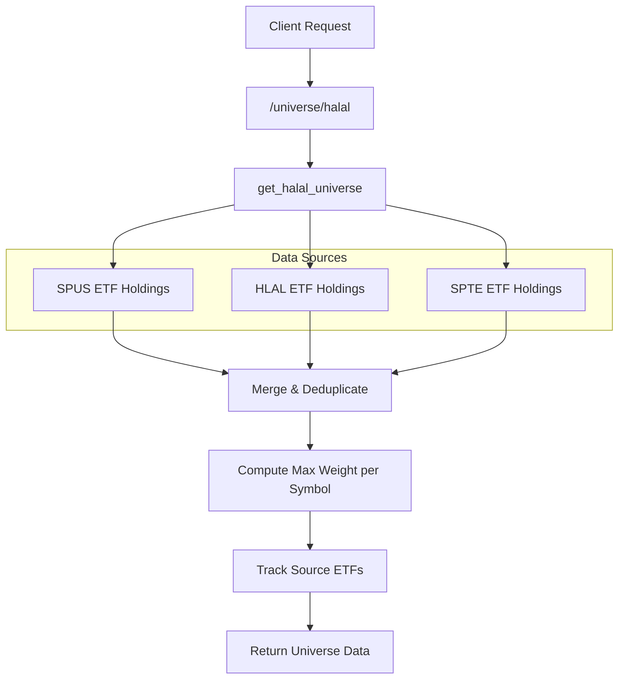
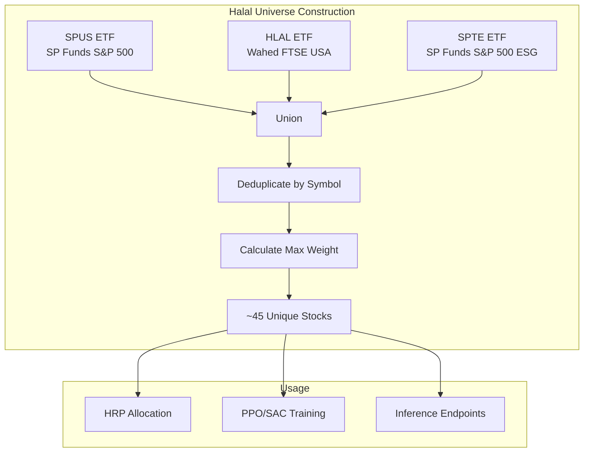

# Universe Endpoints

## Overview

The universe endpoints provide access to the stock universe used for trading. Currently supports the halal-compliant stock universe derived from Shariah-compliant ETFs.

## Endpoints

| Method | Path | Description |
|--------|------|-------------|
| GET | `/universe/halal` | Get halal stock universe |

---

## GET /universe/halal

**Get Halal Stock Universe**

Returns the deduplicated union of top holdings from halal ETFs (SPUS, HLAL, SPTE). This defines the investable universe for the portfolio allocation system.

### Flow Diagram



### Response Schema

```json
{
  "stocks": [
    {
      "symbol": "AAPL",
      "name": "Apple Inc.",
      "max_weight": 8.5,
      "etfs": ["SPUS", "HLAL", "SPTE"]
    },
    {
      "symbol": "MSFT",
      "name": "Microsoft Corporation",
      "max_weight": 7.2,
      "etfs": ["SPUS", "HLAL"]
    }
    // ... more stocks
  ],
  "total_count": 45,
  "source_etfs": ["SPUS", "HLAL", "SPTE"]
}
```

### Response Fields

| Field | Type | Description |
|-------|------|-------------|
| `stocks` | array | List of stocks in the universe |
| `stocks[].symbol` | string | Stock ticker symbol |
| `stocks[].name` | string | Company name |
| `stocks[].max_weight` | float | Maximum weight across source ETFs (%) |
| `stocks[].etfs` | array | List of ETFs holding this stock |
| `total_count` | int | Total number of unique stocks |
| `source_etfs` | array | ETFs used to build the universe |

---

## High-Level Architecture



---

## Usage

The halal universe is used throughout the system:
- **Allocation**: HRP endpoint uses this as the investment universe
- **Training**: RL models (PPO, SAC) train on top 15 symbols from this universe
- **Inference**: LSTM/PatchTST predictions cover symbols in this universe
- **Signals**: News sentiment and fundamentals are fetched for these symbols
