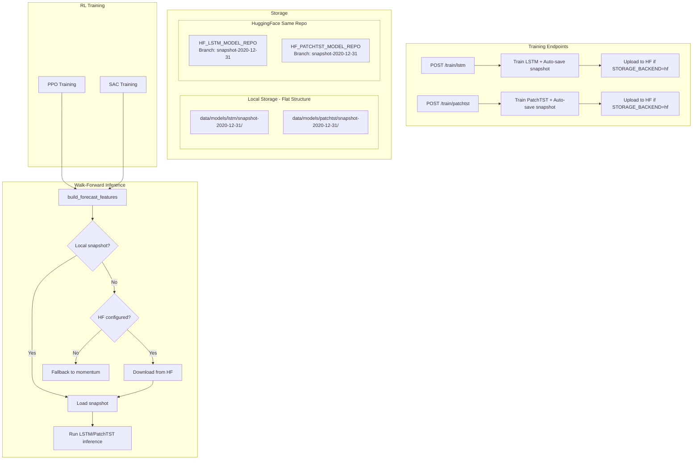

# Forecaster Snapshot Training

## Overview

This document describes the yearly LSTM and PatchTST snapshot system, enabling walk-forward forecast generation with real model inference (no look-ahead bias) for PPO and SAC training.

**Key Design Decisions:**
1. **Integrated Training**: Snapshots are created automatically during `/train/lstm` and `/train/patchtst` - no separate endpoints needed
2. **Same HF Repo**: Snapshots use the same HuggingFace repo as main models, but with different branch naming
3. **Local + HF**: Local storage is always used. When `STORAGE_BACKEND=hf`, snapshots are also uploaded to HuggingFace

## Architecture



## Data Flow for Walk-Forward Forecasts

For training data from 2016-2025:

- **Year 2016-2019**: Bootstrap period (use momentum proxy)
- **Year 2020**: Load snapshot trained on 2016-2019 data, run inference
- **Year 2021**: Load snapshot trained on 2016-2020 data, run inference
- ...and so on

This ensures **no look-ahead bias** - predictions for year N only use data up to year N-1.

---

## API Usage

### Default Behavior (Recommended)

By default, training **always saves snapshots** for both the current date and all historical years:

```bash
# Train LSTM - saves snapshot for current + all historical years (~30 min first time)
curl -X POST http://localhost:8000/train/lstm

# Train PatchTST - saves snapshot for current + all historical years (~30 min first time)
curl -X POST http://localhost:8000/train/patchtst
```

Subsequent runs are fast because existing snapshots are skipped (idempotent).

### Skip Snapshots (Optional)

To skip saving snapshots (e.g., for quick testing):

```bash
# Train LSTM without saving any snapshots
curl -X POST "http://localhost:8000/train/lstm?skip_snapshot=true"

# Train PatchTST without saving any snapshots
curl -X POST "http://localhost:8000/train/patchtst?skip_snapshot=true"
```

### Train RL Models

PPO/SAC training automatically uses snapshots if available:

```bash
# PPO training (will use LSTM snapshots if available)
curl -X POST http://localhost:8000/train/ppo_lstm/full

# SAC training (will use PatchTST snapshots if available)
curl -X POST http://localhost:8000/train/sac_patchtst/full
```

---

## Storage Structure

### Local Storage (Flat Structure)

Snapshots are stored as **siblings** to main model versions, not in a nested `snapshots/` folder:

```
data/models/
├── lstm/
│   ├── current                    # Pointer to current main version
│   ├── v2024-01-01-abc123/        # Main model version
│   │   ├── weights.pt
│   │   ├── feature_scaler.pkl
│   │   ├── config.json
│   │   └── metadata.json
│   ├── snapshot-2019-12-31/       # Snapshot (same flat structure)
│   │   ├── weights.pt
│   │   ├── feature_scaler.pkl
│   │   ├── config.json
│   │   └── metadata.json
│   ├── snapshot-2020-12-31/       # Another snapshot
│   └── ...
└── patchtst/
    ├── current
    ├── v2024-01-01-def456/
    ├── snapshot-2019-12-31/
    └── ...
```

**Pattern-based identification:**
- Main models: `v{date}-{hash}` (e.g., `v2024-01-01-abc123`)
- Snapshots: `snapshot-{date}` (e.g., `snapshot-2020-12-31`)

### HuggingFace Storage

Snapshots use the **same HF repo** as the main model with **identical branch naming**:

| Type | HF Branch | Local Folder |
|------|-----------|--------------|
| Main model | `v2024-01-01-abc123` | `v2024-01-01-abc123/` |
| Main (current) | `main` | `current` (symlink) |
| Snapshot | `snapshot-2019-12-31` | `snapshot-2019-12-31/` |
| Snapshot | `snapshot-2020-12-31` | `snapshot-2020-12-31/` |

**Key design decisions:**
- **Flat structure** - both local and HF have identical flat file layout (no subfolders)
- **Pattern-based identification** - `snapshot-*` vs `v*` distinguishes snapshots from main models
- **Same repo** - uses existing `HF_LSTM_MODEL_REPO` and `HF_PATCHTST_MODEL_REPO`
- **Clean separation** - snapshot branches are prefixed with `snapshot-`

**Benefits of this structure:**
- Main model and snapshots in same repo (easier to manage)
- Consistent structure between local and HF
- Pattern-based identification (no special metadata needed)
- Local is always populated; HF is additional sync layer

---

## Walk-Forward Integration

When PPO/SAC training endpoints are called, the `build_forecast_features()` function:

1. Checks if snapshots exist locally for the forecaster type
2. If snapshot missing locally but HF configured → downloads from HF
3. If snapshots available: loads the appropriate snapshot for each year and runs inference
4. If no snapshots anywhere: falls back to momentum proxy

### Automatic Detection & Download

```python
# In training routes
use_snapshots = _snapshots_available("lstm")  # Returns True if snapshots exist
forecasts = build_forecast_features(
    weekly_prices, weekly_dates, symbols,
    forecaster_type="lstm",
    use_model_snapshots=use_snapshots,
)

# Internally, for each year it checks:
# 1. snapshot_storage.ensure_snapshot_available(cutoff_date)
#    - Returns True if local exists
#    - Or downloads from HF and returns True
#    - Returns False if neither available
```

### HF Sync Methods

The `SnapshotLocalStorage` class provides sync methods:

```python
from brain_api.storage.forecaster_snapshots import SnapshotLocalStorage

storage = SnapshotLocalStorage("lstm")

# Upload a specific snapshot to HF
storage.upload_snapshot_to_hf(date(2020, 12, 31))

# Download a specific snapshot from HF
storage.download_snapshot_from_hf(date(2020, 12, 31))

# Ensure snapshot is available (downloads if needed)
storage.ensure_snapshot_available(date(2020, 12, 31))

# List all snapshots on HF
hf_snapshots = storage.list_hf_snapshots()

# Sync all local → HF (upload missing)
storage.sync_all_local_to_hf()

# Sync all HF → local (download missing)
storage.sync_all_hf_to_local()
```

---

## Idempotency

- Snapshots are identified by `snapshot-{cutoff_date}` (e.g., `snapshot-2019-12-31`)
- If a snapshot already exists, it will be skipped
- Re-running training only trains missing snapshots
- Safe to run multiple times without duplicating work

## Data Loading Optimization

Snapshot backfill is optimized to load data **once** and filter incrementally:

```python
# LSTM: loads prices once for full window
prices_full = load_prices_yfinance(symbols, start_date, end_date)
for cutoff_date in snapshots_needed:
    prices = _filter_prices_by_cutoff(prices_full, cutoff_date)
    # Train and save snapshot...

# PatchTST: loads prices, news sentiment, fundamentals once
prices_full = load_prices(symbols, start_date, end_date)
news_full = load_historical_news_sentiment(symbols, start_date, end_date)
fundamentals_full = load_historical_fundamentals(symbols, start_date, end_date)
for cutoff_date in snapshots_needed:
    prices = _filter_prices_by_cutoff(prices_full, cutoff_date)
    news = _filter_signals_by_cutoff(news_full, cutoff_date)
    fundamentals = _filter_signals_by_cutoff(fundamentals_full, cutoff_date)
    # Train and save snapshot...
```

This avoids re-downloading data for each snapshot year, significantly speeding up backfill.

---

## Technical Details

### Bootstrap Period

The first 4 years of data use a momentum proxy instead of model predictions:

```python
bootstrap_years = 4  # First 4 years use momentum proxy
```

This ensures we have enough training data before generating model-based forecasts.

### Momentum Proxy

During bootstrap (or when snapshots are unavailable), we use 4-week momentum:

```python
momentum = (price[t] - price[t-4]) / price[t-4]
```

### Snapshot Loading

For each prediction year, we load the appropriate snapshot:

```python
# For year 2021, load snapshot trained on data up to 2020-12-31
cutoff_date = date(year - 1, 12, 31)
artifacts = storage.load_snapshot(cutoff_date)
```

### Fallback Behavior

If a snapshot is missing for a specific year, the system:

1. First checks local storage
2. If not local and HF configured, tries to download from HF
3. If still not available, tries to find the closest earlier snapshot
4. If none exists, falls back to momentum proxy

---

## Environment Variables

No additional env vars needed. Snapshots use existing model repos:

| Variable | Used For |
|----------|----------|
| `HF_LSTM_MODEL_REPO` | LSTM main model + snapshots |
| `HF_PATCHTST_MODEL_REPO` | PatchTST main model + snapshots |
| `HF_TOKEN` | Authentication for HF operations |
| `STORAGE_BACKEND` | `local` or `hf` (if `hf`, uploads snapshots to HF) |

---

## Files

| File | Description |
|------|-------------|
| `brain_api/storage/forecaster_snapshots/__init__.py` | Package init |
| `brain_api/storage/forecaster_snapshots/local.py` | Local + HF snapshot storage |
| `brain_api/core/portfolio_rl/walkforward.py` | Walk-forward forecast generation |
| `brain_api/routes/training.py` | Training endpoints with integrated snapshots |
| `tests/test_forecaster_snapshots.py` | Tests for snapshots |

---

## Testing

Run snapshot-specific tests:

```bash
cd brain_api
uv run pytest tests/test_forecaster_snapshots.py -v
```

All snapshot tests should pass.

