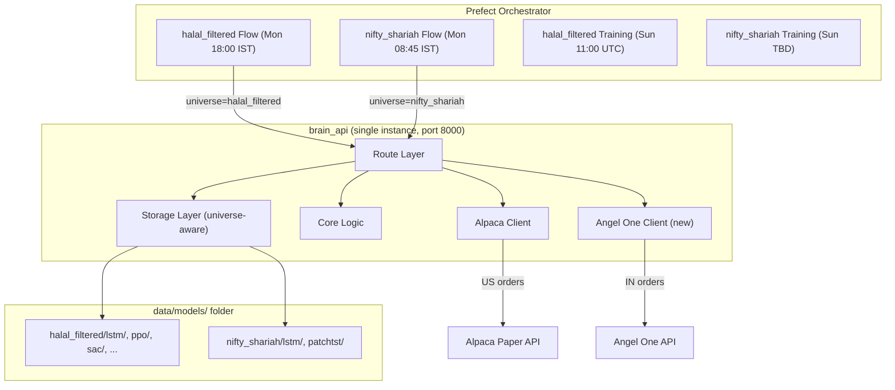
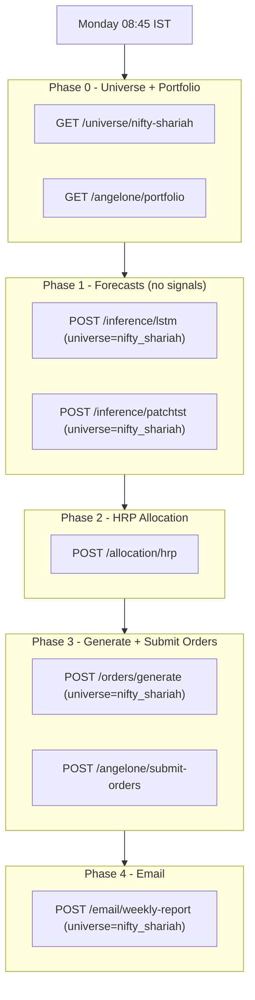

# India Multi-Market Support Plan

**Status**: Planned (Not Yet Implemented)
**Created**: 2026-02-28
**Supersedes**: `multi_market_plan.md` (earlier rough plan)

---

## Goal

Extend the single brain_api instance to support both US (Nasdaq) and India (NSE) markets with complete isolation of models, promotions, and order execution.

**India pipeline scope:**

- LSTM + PatchTST forecasters (pure price, no signals)
- HRP allocation (math baseline only)
- Angel One order execution
- Weekly email report (INR, HRP-only)

**Not in scope for India:**

- PPO/SAC (no RL allocators)
- News sentiment signals
- Fundamentals signals

---

## Key Architectural Decision: Universe vs Market

### Option A: Market as top-level partition

Storage: `data/{market}/models/{model_type}/`

```
data/
├── us/models/lstm/current
├── us/models/ppo/current
├── in/models/lstm/current
```

Pros:
- Clean conceptual grouping (market bundles broker + calendar + currency)
- No config duplication if multiple universes share a market
- Intuitive for humans ("US models" and "India models")

Cons:
- Does NOT solve universe isolation within a market. If you retrain US LSTM on `halal` instead of `halal_filtered`, they fight over the same `data/us/models/lstm/current` pointer
- Over-engineered for 1 universe per market
- Prefect flows are per-universe anyway (each universe has its own schedule, symbols, skip logic)

### Option B: Universe as the partition (RECOMMENDED)

Storage: `data/models/{universe}/{model_type}/`

```
data/models/
├── halal_filtered/
│   ├── lstm/current
│   ├── patchtst/current
│   ├── ppo/current
│   └── sac/current
├── nifty_shariah/
│   ├── lstm/current
│   └── patchtst/current
├── halal/                    # (future) own models
│   └── lstm/current
└── sp500/                    # (future) own models
    └── lstm/current
```

Pros:
- **Fixes a latent bug** -- today, retraining on `halal` vs `halal_filtered` clobbers the same `current` pointer. Universe partitioning eliminates this
- Flatter hierarchy (2 levels: universe/model_type vs 3 levels: market/universe/model_type)
- Natural extension of existing `UniverseType` enum
- Self-contained: promoting `halal_filtered` LSTM cannot touch `nifty_shariah` LSTM or a future `sp500` LSTM
- More descriptive identifiers: `run_id = paper:nifty_shariah:2026-02-28`
- Adding US SP500 with its own separate models just works

Cons:
- Minor config duplication if two Indian universes share broker/calendar/currency
- "Universe" name becomes slightly overloaded (stock selection AND market context)
- Broker routing is indirect: universe -> config -> market -> broker

### Resolution: Universe partition with market config lookup

Universe owns the model partition. Market owns the infrastructure config. Universe points to its market.

```python
MARKET_DEFAULTS = {
    "us": {"broker": "alpaca", "calendar": "XNYS", "currency": "USD", "fractional": True},
    "in": {"broker": "angelone", "calendar": "XNSE", "currency": "INR", "fractional": False},
}

UNIVERSE_CONFIG = {
    "halal_filtered": {"market": "us", "stock_count": 15, "models": ["lstm", "patchtst", "ppo", "sac", "hrp"]},
    "nifty_shariah":  {"market": "in", "stock_count": 25, "models": ["lstm", "patchtst", "hrp"]},
    "sp500":          {"market": "us", "stock_count": 500, "models": ["lstm", "patchtst", "hrp"]},
}
```

No duplication, 2-level storage, full isolation for free.

### Side-by-side comparison

| Concern | Option A (Market) | Option B (Universe) |
|---|---|---|
| Storage path | `data/{market}/models/{model}/` | `data/models/{universe}/{model}/` |
| Promotion isolation (US vs IN) | Isolated | Isolated |
| Promotion isolation (halal vs halal_filtered) | NOT isolated (same market) | Isolated |
| Adding a 2nd Indian universe | Easy (shares market config) | Small config duplication |
| Adding a US SP500 universe | Needs 3rd level or shares models | Just works |
| HF repos | Per market | Per universe |
| run_id | `paper:us:2026-02-28` | `paper:halal_filtered:2026-02-28` |
| Hierarchy depth | 3 levels (market/universe/model) | 2 levels (universe/model) |
| Existing `UniverseType` enum | Mostly unchanged, add `MarketRegion` | Extend naturally |

---

## Model Folder Structure (Universe Partitioned)

```
data/models/
├── halal_filtered/                   # US halal filtered (current default)
│   ├── lstm/
│   │   ├── current                   # promotion pointer
│   │   ├── v2026-01-09-a4fecab1bdcc/
│   │   │   ├── weights.pt
│   │   │   ├── feature_scaler.pkl
│   │   │   ├── config.json
│   │   │   └── metadata.json
│   │   └── snapshot-2025-12-31/
│   ├── patchtst/
│   │   ├── current
│   │   └── v2026-01-09-xyz/
│   ├── ppo/
│   │   ├── current
│   │   └── v2026-01-09-ppo/
│   └── sac/
│       ├── current
│       └── v2026-01-09-sac/
├── nifty_shariah/                    # India Nifty Shariah (new)
│   ├── lstm/
│   │   ├── current
│   │   └── v2026-03-15-abc/
│   └── patchtst/
│       ├── current
│       └── v2026-03-15-def/
```

Other data follows the same pattern:

```
data/
├── models/{universe}/{model_type}/   # model artifacts (as above)
├── raw/{universe}/{run_id}/          # raw evidence snapshots
├── features/{universe}/{run_id}/     # derived features
├── experience/{universe}/            # RL experience (US only)
└── output/{universe}/                # parquet files, etc.
```

**One-time migration**: move existing flat `data/models/lstm/` into `data/models/halal_filtered/lstm/`, etc.

---

## HuggingFace Handling

Separate HF repos per universe:

| Universe | LSTM Repo | PatchTST Repo |
|----------|-----------|---------------|
| `halal_filtered` | `HF_LSTM_MODEL_REPO` (existing) | `HF_PATCHTST_MODEL_REPO` (existing) |
| `nifty_shariah` | `HF_LSTM_MODEL_REPO_NIFTY_SHARIAH` | `HF_PATCHTST_MODEL_REPO_NIFTY_SHARIAH` |

Config resolves the correct repo from universe:

```python
def get_hf_lstm_model_repo(universe: str = "halal_filtered") -> str | None:
    repo_env = HF_REPO_MAP.get(universe, {}).get("lstm")
    return os.environ.get(repo_env) if repo_env else None
```

---

## Promotion Isolation

Each universe has its own `current` pointer file:

- `data/models/halal_filtered/lstm/current` -> `v2026-01-09-abc`
- `data/models/nifty_shariah/lstm/current` -> `v2026-03-15-xyz`

`promote_version()` writes to the universe-specific path. Promoting `halal_filtered` LSTM is physically impossible to affect `nifty_shariah` LSTM -- different files on disk.

---

## Things to Not Forget

1. **No fractional shares in India** -- NSE equity segment is whole shares only. Order sizing logic must change (currently assumes Alpaca fractional support).

2. **Trading calendar** -- `inference_utils.py` hardcodes `XNYS` (NYSE). India needs `XNSE`. The `compute_week_boundaries()` and `compute_week_from_cutoff()` functions must accept a calendar parameter. Resolved via: `UNIVERSE_CONFIG[universe]["market"] -> MARKET_DEFAULTS[market]["calendar"]`.

3. **Market timing** -- NSE opens 9:15 AM IST, closes 3:30 PM IST. India Prefect flow should run before NSE open (e.g., Monday 8:45 AM IST), not 18:00 IST (which is the US timing).

4. **run_id format** -- Currently `paper:YYYY-MM-DD`. Both universes running on the same Monday would collide. New format: `paper:{universe}:YYYY-MM-DD` (e.g., `paper:nifty_shariah:2026-02-28`).

5. **client_order_id format** -- Same collision risk. New format: `paper:{universe}:YYYY-MM-DD:attempt-N:SYMBOL:SIDE`.

6. **Angel One auth complexity** -- Requires API key + client ID + password + TOTP (authenticator app). Daily token expiry at midnight IST. More complex than Alpaca's key+secret.

7. **SEBI static IP rule** -- Angel One requires registered static IPs for order execution (Aug 2025 SEBI mandate). Home server IP may change; consider DDNS or static IP from ISP.

8. **Currency in email/reports** -- INR vs USD display.

9. **Price data** -- yfinance works for NSE with `.NS` suffix (e.g., `RELIANCE.NS`). Universe config includes `symbol_suffix`.

10. **No RL experience for India** -- Since no PPO/SAC, no experience buffer needed.

11. **Data migration** -- Existing flat `data/models/lstm/` must move to `data/models/halal_filtered/lstm/`. Run during maintenance window.

12. **PatchTST works without signals** -- PatchTST is OHLCV 5-channel only (open, high, low, close, volume log returns). No fundamentals or news needed. Confirmed suitable for India.

---

## Architecture: Single brain_api, Universe-Aware



### Endpoint design

Existing endpoints gain a `universe` field (backward-compatible, default `halal_filtered`):

```python
class LSTMInferenceRequest(BaseModel):
    symbols: list[str] | None = None
    as_of_date: str | None = None
    universe: str = "halal_filtered"  # NEW: determines model path + market config
```

Market-specific broker endpoints remain separate (different APIs entirely):

- `/alpaca/portfolio` (US, existing)
- `/alpaca/submit-orders` (US, existing)
- `/angelone/portfolio` (IN, new)
- `/angelone/submit-orders` (IN, new)

Universe-specific endpoints:

- `/universe/halal_filtered` (US, existing)
- `/universe/nifty-shariah` (IN, new)

### India pipeline (end-to-end)



---

## Reuse Inventory

- `BaseLocalModelStorage` (`storage/base_local.py`) -- extend `__init__` to accept `universe` param, path becomes `base/models/{universe}/{type}`
- `resolve_cutoff_date()` (`core/config.py`) -- reuse as-is (Friday anchor works for both markets)
- `compute_week_boundaries()` (`core/inference_utils.py`) -- extend to accept exchange calendar name
- HRP allocation (`core/hrp.py`) -- reuse as-is (math is market-agnostic)
- `generate_client_order_id()` (`core/orders.py`) -- extend to include universe prefix
- LSTM inference pipeline (`routes/inference/lstm.py`) -- reuse, just pass universe to storage
- PatchTST inference pipeline (`routes/inference/patchtst.py`) -- reuse, just pass universe to storage
- Prefect task structure (`tasks/client.py`, `tasks/inference.py`, etc.) -- reuse HTTP client and task patterns
- (genuinely new: Angel One client, Nifty Shariah universe provider, India Prefect flows, data migration script)

---

## Impact Analysis

### Files affected

**Config:**

- `brain_api/brain_api/core/config.py` -- add `MARKET_DEFAULTS`, `UNIVERSE_CONFIG`, India universe types, universe-aware HF repo getters

**Storage layer (universe-aware base path):**

- `brain_api/brain_api/storage/base.py` -- add `get_universe_data_path(universe)`
- `brain_api/brain_api/storage/base_local.py` -- accept `universe` param in `__init__`, path becomes `base/models/{universe}/{type}`
- `brain_api/brain_api/storage/lstm/local.py` -- pass universe through
- `brain_api/brain_api/storage/patchtst/local.py` -- pass universe through
- All HF storage files -- pass universe to resolve repo name
- `brain_api/brain_api/routes/inference/dependencies.py` -- universe-aware factory functions

**Calendar/dates:**

- `brain_api/brain_api/core/inference_utils.py` -- parameterize exchange calendar (XNYS vs XNSE)

**Orders:**

- `brain_api/brain_api/core/orders.py` -- universe in `client_order_id`, whole-share sizing for India

**New files:**

- `brain_api/brain_api/core/angelone_client.py` -- Angel One SmartAPI wrapper
- `brain_api/brain_api/routes/angelone.py` -- Angel One route handlers
- `brain_api/brain_api/universe/nifty_shariah.py` -- Nifty Shariah universe provider
- `prefect/flows/india_inference.py` -- India Monday flow
- `prefect/flows/india_training.py` -- India training flow
- `scripts/migrate_us_data.sh` -- one-time data migration

### APIs affected

- All inference endpoints gain `universe` field (backward-compatible, default `halal_filtered`)
- `/allocation/hrp` gains `universe` field
- `/orders/generate` gains `universe` field (for pricing source + whole-share logic)
- New: `/angelone/portfolio`, `/angelone/submit-orders`, `/angelone/order-history`
- New: `/universe/nifty-shariah`

### Data/storage affected

- One-time migration: `data/models/lstm/` -> `data/models/halal_filtered/lstm/`, etc.
- New: `data/models/nifty_shariah/lstm/`, `data/models/nifty_shariah/patchtst/`

---

## Tasks (Execution Order)

### Phase 1: Foundation (no breaking changes)

1. **Add `MARKET_DEFAULTS`, `UNIVERSE_CONFIG` to config** -- file: `core/config.py`
   - New: `MARKET_DEFAULTS` dict (broker, calendar, currency, fractional per market)
   - New: `UNIVERSE_CONFIG` dict (market, stock_count, models per universe)
   - New: India universe type `NIFTY_SHARIAH` in `UniverseType` enum
   - New: universe-aware HF repo getters
   - New: helper `get_exchange_calendar(universe)` that resolves universe -> market -> calendar

2. **Parameterize exchange calendar in inference_utils** -- file: `core/inference_utils.py`
   - Change: add `exchange: str = "XNYS"` parameter to `compute_week_boundaries()` and `compute_week_from_cutoff()`
   - Pass through to `xcals.get_calendar()`

3. **Universe-aware storage base** -- files: `storage/base.py`, `storage/base_local.py`
   - Change: `BaseLocalModelStorage.__init__` accepts `universe: str = "halal_filtered"`
   - Path becomes `base/models/{universe}/{model_type}`
   - All subclasses (LSTM, PatchTST) pass `universe` through

4. **Universe-aware HF storage** -- files: `storage/lstm/huggingface.py`, `storage/patchtst/huggingface.py`
   - Change: resolve HF repo from universe-aware config getter

5. **Data migration script** -- file: `scripts/migrate_us_data.sh`
   - Move `data/models/lstm/` to `data/models/halal_filtered/lstm/`
   - Move `data/models/patchtst/` to `data/models/halal_filtered/patchtst/`
   - Move `data/models/ppo/` to `data/models/halal_filtered/ppo/`
   - Move `data/models/sac/` to `data/models/halal_filtered/sac/`
   - Move `data/raw/` to `data/raw/halal_filtered/` (or `data/halal_filtered/raw/`)
   - Move `data/experience/` to `data/experience/halal_filtered/`

### Phase 2: India Universe + Price Data

6. **Nifty Shariah universe provider** -- file: `brain_api/brain_api/universe/nifty_shariah.py`
   - New: fetch Nifty Shariah 25 constituents (CSV or scrape from niftyindices.com)
   - New: `GET /universe/nifty-shariah` endpoint in `routes/universe.py`
   - Cache monthly (reuse caching pattern from `halal_new.py`)

7. **yfinance `.NS` suffix handling** -- in price loading functions
   - Universe config includes `symbol_suffix: ".NS"` for India
   - Price loader appends suffix when fetching from yfinance
   - OR: universe provider returns symbols WITH `.NS` suffix (simpler)

### Phase 3: Universe-Aware Inference + Training

8. **Add `universe` field to inference request schemas** -- file: `routes/inference/models.py`
   - Add `universe: str = "halal_filtered"` to `LSTMInferenceRequest`, `PatchTSTInferenceRequest`, `HRPAllocationRequest`
   - Backward-compatible (default "halal_filtered")

9. **Universe-aware dependency injection** -- file: `routes/inference/dependencies.py`
   - Change: factory functions accept universe param
   - `get_storage(universe)` returns `LocalModelStorage(universe=universe)`
   - `get_patchtst_storage(universe)` returns `PatchTSTModelStorage(universe=universe)`

10. **Universe-aware inference routes** -- files: `routes/inference/lstm.py`, `routes/inference/patchtst.py`
    - Pass `request.universe` to storage and calendar functions
    - Resolve calendar from `UNIVERSE_CONFIG -> MARKET_DEFAULTS`

11. **Universe-aware training routes** -- files: `routes/training/lstm.py`, `routes/training/patchtst.py`
    - Same pattern: pass universe to storage
    - India training writes to `data/models/nifty_shariah/lstm/`

### Phase 4: Angel One Broker Integration

12. **Angel One client** -- file: `brain_api/brain_api/core/angelone_client.py`
    - New: SmartAPI wrapper (login with TOTP, portfolio, order placement)
    - Auth: `ANGELONE_API_KEY`, `ANGELONE_CLIENT_ID`, `ANGELONE_PASSWORD`, `ANGELONE_TOTP_SECRET`
    - Handle daily token expiry (re-auth at midnight IST)

13. **Angel One routes** -- file: `brain_api/brain_api/routes/angelone.py`
    - `GET /angelone/portfolio` -- holdings, positions, cash
    - `POST /angelone/submit-orders` -- submit orders
    - `GET /angelone/order-history` -- order history

14. **India order generation** -- file: `core/orders.py`
    - Extend `generate_client_order_id()`: `paper:{universe}:YYYY-MM-DD:attempt-N:SYMBOL:SIDE`
    - Whole-share sizing (no fractional for India)
    - Price from yfinance `.NS` or Angel One quotes
    - Min trade value in INR (e.g., 500 INR)

### Phase 5: Prefect India Flows

15. **India inference flow** -- file: `prefect/flows/india_inference.py`
    - Schedule: Monday 08:45 AM IST (before NSE 9:15 AM open)
    - Phases: Universe -> LSTM + PatchTST -> HRP -> Generate Orders -> Submit via Angel One -> Email
    - No PPO/SAC, no signals, no experience collection
    - `run_id = paper:nifty_shariah:YYYY-MM-DD`

16. **India training flow** -- file: `prefect/flows/india_training.py`
    - Schedule: Sunday (time TBD)
    - Train LSTM + PatchTST only (no PPO/SAC)
    - No ETL refresh (no news/fundamentals for India)

### Phase 6: Email + Docs

17. **India email template** -- extend existing email templates
    - INR currency display
    - Only HRP allocation (no PPO/SAC comparison tables)
    - Different market context in LLM summary

18. **Update AGENTS.md, README.md** -- reflect multi-market architecture, universe-partitioned storage, new endpoints

### Phase 7: Cleanup

19. Fix all ruff linting issues (related and unrelated to the change)
20. Run and fix all tests (related and unrelated to the change)

---

## Test Plan

- **Storage layer**: unit tests for universe-aware path resolution (`data/models/halal_filtered/lstm/` vs `data/models/nifty_shariah/lstm/`)
- **Calendar**: unit tests for `compute_week_boundaries(exchange="XNSE")` with NSE holidays
- **Order generation**: unit tests for India `client_order_id` format with universe prefix, whole-share sizing
- **Promotion isolation**: test that promoting `halal_filtered` LSTM does not affect `nifty_shariah` LSTM `current` pointer
- **Angel One client**: integration tests with mock SmartAPI responses
- **Angel One routes**: API tests calling `/angelone/portfolio`, `/angelone/submit-orders`
- **Nifty Shariah universe**: unit test for symbol parsing, API test for endpoint
- **Inference with universe param**: API tests calling `/inference/lstm` with `universe=nifty_shariah`, verify it loads from `data/models/nifty_shariah/lstm/`

---

## Risks

| Risk | Impact | Mitigation |
|------|--------|------------|
| Angel One TOTP auth daily expiry | Orders fail if token expired | Auto-refresh before each operation, cache token with TTL |
| SEBI static IP requirement | Orders rejected from unknown IP | Use DDNS or get static IP from ISP |
| yfinance `.NS` data gaps | Incomplete price data for training/inference | Validate completeness before inference, fall back to Angel One `getCandleData()` |
| Nifty Shariah constituent changes | Universe becomes stale | Quarterly manual CSV update, or scrape niftyindices.com |
| Data migration breaks running flows | US pipeline fails during migration | Run during maintenance window, test migration script on copy first |
| Backward compatibility | Existing US Prefect flows break | Default `universe="halal_filtered"`, so existing calls work unchanged |

---

## References

- [Angel One SmartAPI Documentation](https://smartapi.angelbroking.com/docs)
- [Nifty Shariah 25 Index](https://www.niftyindices.com/indices/equity/thematic-indices/nifty-shariah25)
- [Nifty 50 Shariah Index](https://www.niftyindices.com/indices/equity/thematic-indices/nifty-50-shariah)
- Earlier plan: `brain_api/docs/multi_market_plan.md`
