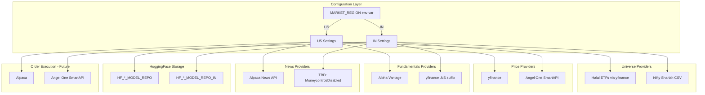

# Multi-Market Configuration Plan (Nasdaq + NSE)

**Status**: Planned (Not Yet Implemented)  
**Created**: 2026-01-25

This document outlines the plan to make the repository configurable to support both **Nasdaq (US)** and **NSE (India)** markets by abstracting data providers, universe definitions, and model storage.

---

## Overview

The current implementation is hardcoded for US/Nasdaq halal stocks. This plan describes how to extend support for NSE (India) while keeping the US implementation intact.

## Architecture Diagram



---

## 1. Configuration & Environment

Add `MARKET_REGION` environment variable (values: `US`, `IN`, default: `US`).

Update `brain_api/brain_api/core/config.py` to:
- Read `MARKET_REGION`
- Load region-specific env vars (separate HF repos per region)
- Load region-specific settings (currency, timezone, trading calendar)

---

## 2. Universe Abstraction

| Task | File |
|------|------|
| Create `UniverseProvider` protocol | `brain_api/brain_api/universe/protocols.py` |
| Refactor existing code | `brain_api/brain_api/universe/halal.py` → `USHalalUniverseProvider` |
| Implement IN provider | `brain_api/brain_api/universe/nifty_shariah.py` |
| Update route | `brain_api/brain_api/routes/universe.py` |

**IN Universe Source**: Nifty Shariah 25/50 index constituents
- Maintain a CSV or scrape from [NSE Nifty Shariah](https://www.niftyindices.com/indices/equity/thematic-indices/nifty-shariah25)

---

## 3. Data Provider Abstraction

### Prices

| Region | Provider | Notes |
|--------|----------|-------|
| US | yfinance | Current implementation |
| IN | Angel One SmartAPI | Historical candles via `getCandleData()` |

### Fundamentals

| Region | Provider | Notes |
|--------|----------|-------|
| US | Alpha Vantage | Current implementation |
| IN | yfinance | Use `.NS` suffix (e.g., `RELIANCE.NS`) |

**Tasks**:
- Abstract `AlphaVantageClient` in `brain_api/brain_api/core/fundamentals/fetcher.py`
- Create `FundamentalsProvider` protocol
- Implement `YahooFundamentalsProvider` for IN region

### News (Research Required)

| Region | Provider | Notes |
|--------|----------|-------|
| US | Alpaca News API | Current implementation |
| IN | TBD | Options below |

**Options to research for IN news**:
1. **Barchart Moneycontrol API** - Paid, professional
2. **moneycontrol-api (PyPI)** - Free Python library (scraping-based, may break)
3. **Global DataFeeds** - Paid Indian market data

**Tasks**:
- Create `NewsProvider` protocol in `brain_api/brain_api/core/news_api/`
- Make news signals optional/gracefully degraded for IN until provider is chosen

### Orders/Trading (Future)

| Region | Provider | Notes |
|--------|----------|-------|
| US | Alpaca | Current (if implemented) |
| IN | Angel One SmartAPI | Full order management |

---

## 4. Trading Calendar & Timezones

- Update `brain_api/brain_api/core/utils/dates.py`
- Use `pandas_market_calendars` with `XNSE` for NSE holidays
- Handle IST (UTC+5:30) vs EST timezones

---

## 5. HuggingFace Storage

**Decision**: Use **separate repositories** per region.

| Model | US Repo | IN Repo |
|-------|---------|---------|
| LSTM | `HF_LSTM_MODEL_REPO` | `HF_LSTM_MODEL_REPO_IN` |
| PatchTST | `HF_PATCHTST_MODEL_REPO` | `HF_PATCHTST_MODEL_REPO_IN` |
| PPO-LSTM | `HF_PPO_LSTM_MODEL_REPO` | `HF_PPO_LSTM_MODEL_REPO_IN` |
| PPO-PatchTST | `HF_PPO_PATCHTST_MODEL_REPO` | `HF_PPO_PATCHTST_MODEL_REPO_IN` |
| SAC-LSTM | `HF_SAC_LSTM_MODEL_REPO` | `HF_SAC_LSTM_MODEL_REPO_IN` |
| SAC-PatchTST | `HF_SAC_PATCHTST_MODEL_REPO` | `HF_SAC_PATCHTST_MODEL_REPO_IN` |
| News Sentiment | `HF_NEWS_SENTIMENT_REPO` | `HF_NEWS_SENTIMENT_REPO_IN` |

**Tasks**:
- Update `brain_api/brain_api/core/config.py` to read region-specific repo env vars
- No changes needed in `storage/` modules if config resolves correctly

---

## 6. Endpoints Impact Analysis

| Endpoint | Impact | Changes Needed |
|----------|--------|----------------|
| `GET /universe/halal` | High | Provider factory based on region |
| `POST /signals/news` | High | Provider abstraction, graceful degradation |
| `POST /signals/news/historical` | High | Provider abstraction |
| `POST /signals/fundamentals` | Medium | Provider abstraction |
| `POST /signals/fundamentals/historical` | Medium | Provider abstraction |
| `POST /training/lstm` | Low | Config passes correct HF repo |
| `POST /training/patchtst` | Low | Config passes correct HF repo |
| `POST /training/ppo_lstm/*` | Low | Config passes correct HF repo |
| `POST /training/ppo_patchtst/*` | Low | Config passes correct HF repo |
| `POST /training/sac_lstm/*` | Low | Config passes correct HF repo |
| `POST /training/sac_patchtst/*` | Low | Config passes correct HF repo |
| `POST /inference/lstm` | Low | Config passes correct HF repo |
| `POST /inference/patchtst` | Low | Config passes correct HF repo |
| `POST /inference/ppo_lstm` | Low | Config passes correct HF repo |
| `POST /inference/ppo_patchtst` | Low | Config passes correct HF repo |
| `POST /inference/sac_lstm` | Low | Config passes correct HF repo |
| `POST /inference/sac_patchtst` | Low | Config passes correct HF repo |
| `POST /etl/news-sentiment` | High | Provider abstraction |
| `POST /etl/sentiment-gaps` | High | Provider abstraction |
| `GET /health/*` | None | No changes |
| `POST /allocation/hrp` | None | No changes |
| `POST /orders/generate` | Future | Angel One integration |
| `POST /experience/*` | None | No changes |
| `GET /experience/list` | None | No changes |

---

## 7. Angel One SmartAPI Details

### Capabilities

| Feature | Available | Notes |
|---------|-----------|-------|
| Historical Prices | Yes | OHLCV candle data via `getCandleData()` |
| Order Management | Yes | Place, modify, cancel orders |
| Portfolio | Yes | Holdings, positions, conversions |
| Real-time Streaming | Yes | WebSocket 2.0 |
| Option Greeks | Yes | Built-in |
| GTT Orders | Yes | Good-Till-Triggered rules |
| Historical News | **No** | Not available |
| Fundamentals | **No** | Not available |

### SEBI Compliance (August 2025)

- **Static IP Requirement**: Users must register static IP addresses; only orders from registered IPs will execute
- **Multiple IP Support**: Up to five static IPs can be linked to a single API key
- **Order Throttling**: Rate limit of 10 orders per second on order APIs
- **OAuth Authentication**: Updated security authentication process
- **Token Expiration**: Authentication tokens expire daily at 00:00 hours

### SDK

```bash
pip install smartapi-python pyotp
```

---

## 8. Key Concerns & Risks

1. **Data Quality**: NSE data via yfinance can have gaps/delays. Angel One SmartAPI is more reliable for prices.

2. **News Gap**: No clear free equivalent to Alpaca for India. May need paid service or degraded signals.

3. **Timezones**: All date logic must respect IST (UTC+5:30) for IN region.

4. **Rate Limits**: Angel One has 10 orders/sec limit and requires static IP registration.

5. **Testing**: Need separate test fixtures for IN region data.

6. **Nifty Shariah Maintenance**: NSE doesn't provide a public API for index constituents. Manual CSV updates required.

---

## 9. Recommended Execution Order

1. **Config + Calendar** - Foundational, no breaking changes
2. **Universe abstraction** - US keeps working, IN added
3. **Fundamentals abstraction** - yfinance for IN
4. **Prices abstraction** - Angel One for IN
5. **News** - Research first, then implement or defer
6. **Orders** - Future phase

---

## 10. Difficulty Assessment

| Aspect | Difficulty | Reason |
|--------|------------|--------|
| Config changes | Easy | Just env vars and getters |
| Universe (Nifty Shariah) | Easy-Medium | CSV maintenance or light scraping |
| Fundamentals | Medium | yfinance works for `.NS` symbols, need abstraction |
| Prices | Medium | Angel One SmartAPI integration |
| News | Hard | No clear free provider; needs research |
| Calendar/Timezone | Easy | `pandas_market_calendars` handles it |
| HF Storage | Easy | Just different env vars |
| Orders (Future) | Medium | Angel One has good SDK, but SEBI compliance |

---

## References

- [Angel One SmartAPI Documentation](https://smartapi.angelbroking.com/docs)
- [Nifty Shariah 25 Index](https://www.niftyindices.com/indices/equity/thematic-indices/nifty-shariah25)
- [Nifty 50 Shariah Index](https://www.niftyindices.com/indices/equity/thematic-indices/nifty-50-shariah)
- [moneycontrol-api PyPI](https://pypi.org/project/moneycontrol-api/)
- [Global DataFeeds APIs](https://globaldatafeeds.in/apis/)
