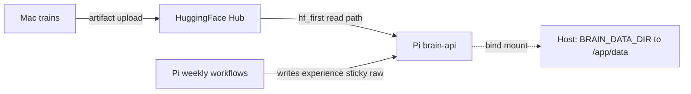

# Brain API `data/` on the Raspberry Pi: bind mount only, no image bake, no Mac sync

This document explains why the Pi deployment **does not** ship `brain_api/data/` inside the Docker image, **does not** rsync the Mac `data/` folder onto the Pi, and instead uses a **host bind mount** plus **Hugging Face** for model artifacts.

Operator steps live in [README.md](../README.md) (Quick Start) and [AGENTS.md](../AGENTS.md) (Host topology). Compose wiring is in [docker-compose.yml](../docker-compose.yml) (`brain-api.volumes`, `BRAIN_DATA_DIR`).

---

## Problems we were solving

1. **Ephemeral container layer.** With no volume, anything under `/app/data` in the brain-api container is lost whenever the container is **recreated** (for example after `docker compose up -d --build`). Plain `restart` survives; **rebuild** does not.

2. **Wrong mental model:** “Bake `data/` into the image like we ship models.” That tied **code deploys** to **data blobs**, bloated images, and still did not persist **Pi-written** artifacts (experience, sticky DB rows, audit snapshots).

3. **Wrong mental model:** “One-way rsync Mac `data/` → Pi.” The Mac and Pi **do not share the same writers** for most paths. Blind rsync either **overwrites Pi-only state** (dangerous) or copies **Mac-only** trees the Pi never reads (waste).

---

## Why `data/` is not in the Docker image

- **Size and churn.** Model trees, caches, raw evidence, and experience files change independently of application code. Shipping them in the image makes every deploy heavy and implies “data is immutable at build time,” which is false for runtime state.

- **Correct layering.** The container image should hold **code + pinned dependencies**. Durable state belongs on **host disk** ([brain_api/.dockerignore](../brain_api/.dockerignore) ignores `data/` so `COPY . .` in the Dockerfile does not pack the folder).

- **Models are loaded per request** ([AGENTS.md](../AGENTS.md) “Stateless”). The Pi keeps a **local cache** under the bind-mounted `data/models/` when present; cold or stale cache is refreshed per storage policy (`STORAGE_BACKEND=hf_first` on the Pi recommended).

---

## Why we do not sync Mac `data/` to Pi

Rough split:

| Principle | Meaning |
|-----------|---------|
| **Pi-owned paths** | Written only on the Pi during inference / weekly workflows. Mac must never overwrite these with rsync. |
| **Mac-owned paths** | Written during training / ETL on the Mac. The Pi inference stack does **not** read most of these. |
| **Shared concern: model artifacts** | Training pushes to Hugging Face; the Pi pulls under `hf_first`. No file copy from Mac disk required. |

A naive `rsync` of the whole `data/` tree risks clobbering Pi-only databases and JSON (for example **`data/allocation/sticky_history.db`** `stage1_weight_history` partitions, **`data/ibkr/submitted_orders.db`**, **`data/experience/`**, **`data/raw/`** snapshots). Conversely, copying Mac **`data/output/daily_sentiment.parquet`** or training **`data/input/`** to the Pi is unnecessary—the Pi workloads do not use them.

So: **no full-folder sync.** If you ever need a targeted sync (for example SAC finetune reading Pi `experience/` on the Mac), that is a **separate, explicit** pipeline—not “copy everything.”

---

## Full `data/` folder scan (writer / reader / Pi relevance)

Verified by tracing [`temporal/workflows/`](../temporal/workflows/) and storage modules under [`brain_api/brain_api/`](../brain_api/brain_api/).

### Critical on Pi (loss = production or safety issue)

| Path | Writer | Reader | Why it matters |
|------|--------|--------|----------------|
| `data/allocation/sticky_history.db` → **`stage1_weight_history`** (`halal_new`, `halal_new_alpha`, `halal_india_alpha`) | Pi (weekly HRP / Alpha-HRP / Double-HRP) | Pi (next week sticky) | Lose carry-set → unnecessary churn vs K_hold retention |
| `data/ibkr/submitted_orders.db` | Pi (IBKR submit path) | Pi (pre-submit dedup) | IBKR lacks Alpaca-style server-side `client_order_id` dedup; DB is the guardrail |
| `data/experience/*.json` | Pi (Monday SAC experience store) | Mac (SAC finetune, when scheduled) | RL feedback; finetune not on regular schedule today |
| `data/raw/<run_id>/...` (e.g. news snapshots, inference dumps) | Pi | Pi (audit) | Audit-friendly runs |
| `data/features/<run_id>/` | Pi | Pi (audit) | Same |
| `data/output/<run_id>/` (run reports) | Pi | Pi (audit) | Same |

### Nice-to-have on Pi (loss = slower or more API calls, not wrong answers)

| Path | Writer | Recovery |
|------|--------|----------|
| `data/models/<bucket>/...` | Mac (train + HF push) | Lazy download from HF (`hf_first`) |
| `data/cache/universe/halal_new_<YYYY-MM>.json` | Pi | Re-scrape ETFs on cache miss |
| `data/cache/universe/nifty_shariah_500_<YYYY-MM>.json` | Pi | Re-scrape NSE on cache miss |
| `data/cache/fundamentals.db`, `data/raw/fundamentals/...` | Pi (signals) | Re-fetch Alpha Vantage (rate limits) |
| `data/cache/sentiment_cache.db` | Pi (FinBERT cache) | Re-score text |

### N/A on Pi (Mac-only; Pi does not read)

| Path | Writer | Note |
|------|--------|------|
| `data/allocation/sticky_history.db` → **`screening_history`** (`halal_filtered_alpha`, `halal_india_filtered_alpha`) | Mac (training-time universe builders) | Pi SAC reads symbol list from **SAC artifact / active-symbols**, not from this table |
| `data/cache/universe/halal_filtered_*.json`, `halal_india_*.json` | Mac | Pi does not build those universes |
| `data/output/daily_sentiment.parquet` | Mac ETL | Training / ETL only |
| `data/checkpoints/` | Mac ETL | Resume long jobs |
| `data/input/financial-news-multisource/` | Mac | Large training input; not in image |

---

## Three facts that replace “sync the DB” or “split the SQLite file”

1. **Pi does not write `screening_history`.** Builders that populate `halal_filtered_alpha` / `halal_india_filtered_alpha` run from **training** workflows on the Mac. Weekly Pi allocation uses **`/models/active-symbols`** for SAC, grounded in **`metadata.json`** on the SAC bucket.

2. **Pi weekly alpha strategies write `stage1_weight_history` only.** Partitions like `halal_new_alpha` and `halal_india_alpha` are **Pi-only**. Mac does not write that table.

3. **Universe cache is self-invalidating by calendar month.** Files are named `data/cache/universe/<name>_<YYYY-MM>.json`. Lookups use `date.today()` ([`brain_api/brain_api/universe/cache.py`](../brain_api/brain_api/universe/cache.py)); a new month ⇒ new filename ⇒ cache miss ⇒ rebuild ⇒ old month file cleaned up after save. **No cross-host sync** is required for “May vs April.”

Together: one SQLite file on disk can hold both tables, but **each table’s writer is a single host** in production; the scary “dual-writer same file” scenario does not apply to your actual Temporal call graph.

---

## Intended design (short)

- **Bind mount:** Pi runtime state and optional local model cache survive `docker compose up -d --build`.
- **`STORAGE_BACKEND=hf_first` on the Pi:** empty or stale `data/models/` pulls from HF instead of failing inference (see [`brain_api/brain_api/storage/policy.py`](../brain_api/brain_api/storage/policy.py)).
- **Mac:** keep default `local_first` for ergonomic local training reads.

---

## Out of scope (explicit)

- **Pi → Mac sync of `data/experience/`** when SAC finetune becomes a scheduled Mac activity (today deferred per [AGENTS.md](../AGENTS.md) known limitations).
- **IBKR gateway container persistence:** session/token churn is handled by operator re-auth; separate from brain-api `data/`.

---

## Related files

| File | Role |
|------|------|
| [docker-compose.yml](../docker-compose.yml) | `brain-api` `volumes`, `BRAIN_DATA_DIR` |
| [brain_api/.dockerignore](../brain_api/.dockerignore) | Excludes `data/` from image |
| [brain_api/.env.example](../brain_api/.env.example) | `STORAGE_BACKEND`, HF repos, Pi note |
| [brain_api/brain_api/storage/base.py](../brain_api/brain_api/storage/base.py) | `DEFAULT_DATA_PATH = Path("data")` |
| [brain_api/brain_api/universe/cache.py](../brain_api/brain_api/universe/cache.py) | Monthly universe cache keys |
